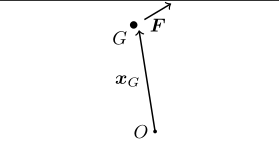

#+TITLE:  Appendix 1: Methods of Analysis
#+AUTHOR: Fethi Okyar
#+DATE: 2026-02-25
#+SUBTITLE: Reading: [Fung/94] [[../textbook_excerpts/1_TensorAlgebra.pdf][Chapter 1]]
#+STARTUP: overview
#+REVEAL_THEME: simple
#+REVEAL_INIT_OPTIONS: slideNumber:"c/t", width:1920, height:1080
#+REVEAL_TITLE_SLIDE: <h2>%t</h2> <h3>%s</h3> <h4>%d</h4>
#+OPTIONS: timestamp:nil toc:1 num:nil
#+REVEAL_EXTRA_CSS: ../style.css
#+REVEAL_ROOT: https://cdn.jsdelivr.net/npm/reveal.js
#+HTML_HEAD_EXTRA: 

* ($\S 1.11$)  (Session 1)
#+ATTR_REVEAL: :frag (appear appear appear ...)
- To emphasize the formulation of problems in mechanics,
- To reduce vague ideas into precise mathematical statements,
- To cultivate the habit of questioning, analyzing, and designing,
- To observe nature, think of previous problems, write down a possible set of governing equations and boundary conditions.

*** What is /mechanics/ concerned with?
#+ATTR_REVEAL: :frag (appear)
- Motion
- Deformation
- Flow
- Force
- Energy
- Interactions
- Internal changes
- temporarily or permanently
- reversibly or irreversibly

#+REVEAL: split
#+ATTR_REVEAL: :frag (appear)
- These changes (deformation, etc.) together with axioms of continuum mechanics, can be expressed as boundary value problems
  $$ \frac{\partial \sigma_{ij}}{\partial x_i} + f_j = \frac{\partial v_j}{\partial t}, \hspace{1em} \forall x \in \Omega $$
  \begin{align}
   n_i \sigma_{ij} = \bar{t_j} \hspace{1em} & \forall x \in \partial\Omega_n \\
   u_i = \bar{u}_i \hspace{1em} & \forall x \in \partial\Omega - \partial\Omega_n
  \end{align}

- We will be dealing with fundamental principles that underlie these differential equations and their boundary conditions
  
*** Mechanics (definition)
#+ATTR_HTML: :width 1400px
[[./images/FU94-SS-1.png]]

** Fundamentals
- Let a body $B$ occupy a region $\mathcal{V}$ in space. We bring in calculus to calculate certain quantities such as the volume $V$ enclosed in space $\mathcal{V}$ as
  $$ V = \int_\mathcal{B} dV $$
  where the integral is taken over the entire body which implies that $\int$ is synonymous with a triple integral, and $dV$ represents a three-dimensional volume element (e.g. $dV=dx\,dy\,dz$ in cartesian coordinates).
- The notion of a coordinate system enters into our treatment as a tool for locating points in space. We need as many rulers in a sense as the number of dimensions, $n$,  in encapsulated by $\mathcal{V}$. A three-dimensional coordinate system, for example, is set up by establishing its' origin $O$ and three independent directions for measurement (i.e. $x$, $y$ and $z$ directions, and their unit vectors $\boldsymbol{i}$, $\boldsymbol{j}$, and $\boldsymbol{k}$).
- Note that there always is a reference of a reference, including our newly formed coordinate system $O-xyz$.

#+REVEAL: split  
- An important property of volume, as a geometric entity, is that it possesses a centroid, $G$. The location of $G$ can be determined by making use of the first moments of the volume integral with respect to three independent planes.
- By the first moment we mean appending the differential element with its distance to a particular plane, for example, the first moment of the volume integral with respect to the $x$ plane (i.e. the plane perpendicular to $x$, or the $y-z$ plane) would be
  $$ \mathbb{1}_x(V) = \int_\mathcal{B} x dV $$
- For example, the $x$ coordinate of the centroid can then be determined by evaluating
  $$ x_G = \frac{\mathbb{1}_x(V)}{V} $$
  The other two coordinates can be found by applying a similar procedure for the $y$ and $z$ planes.
  $$ y_G = \mathbb{1}_y(V)/V,\hspace{1em} z_G = \mathbb{1}_z(V)/V $$

#+REVEAL: split  
- If the mass density of matter filling this space is given as $\rho(\boldsymbol{x})$, where it is assumed that the density field is a function of the location, we can use it to calculate the mass $m$ of $\mathcal{B}$ by introducing density into the above integral,
  $$ m = \int_\mathcal{B} \rho(\boldsymbol{x}) dV $$
  Here the location symbol $\boldsymbol{x}$ represents the three coordinates of the differential element grouped in a vector form (a list of ordered numbers) as $\boldsymbol{x} = \{x,\,y,\,z\}$. Usually the functional dependence of $\rho$ on $\boldsymbol{x}$ is not indicated explicitly for the purpose of mathematical brevity, i.e. we write
  $$ m = \int_\mathcal{B} \rho dV $$
  
** Law's of Motion
#+ATTR_REVEAL: :frag (appear appear appear ...)
- We accept that the axioms of the /balance of momentum/ and /balance of moment of momentum/ govern motion of bodies under forces. (Tested positive against experimental findings for almost about the past 400 years.)
- Bodies reduce to particles when their scale is dominated by the effect of the force acting upon them. Then we simply call the body as a /point mass/ or a /particle/.
- In that case, the body becomes distant and its /shape/ and /orientation/ becomes immaterial to the problem at hand. Its effectively treated by tracking its centoid, $G$.
- Having left its "cover and shape", a body is only able to receive external forces from its centroid, whence the concept of /moment of a force/ acting upon this body also becomes immaterial.
  #+ATTR_HTML: :width 450px
  
- Remember that the moment, $\boldsymbol{M}^O$, produced by a force, $\boldsymbol{F}$, about point $O$ can be determined by
  $$ \boldsymbol{M}^O = \boldsymbol{r} \times \boldsymbol{F} $$
  where $\times$ denotes the vector (cross) product operation and $O$ can be any arbitrary point in the theater.

*** Equilibrium
#+ATTR_REVEAL: :frag (appear appear appear ...)
- Describes the condition or state of motionlessness (have a zero net velocity). When a free-body or a group of bodies that are under the action of external forces in equilibrium, the time rate of change of momentum vanishes and /equations of motion/ are called as */equations of equilibrium/*.
  $$ \boldsymbol{0} = \overset{\mathrm{(e)}}{\boldsymbol{F}^I} + \sum_{J=1}^K \boldsymbol{F}^{IJ}, \hspace{1.5em} (I = 1,2,\ldots,K) $$
- Upon summing this equation for all particles over $I$ from 1 to $K$, we obtain
  $$ \sum_{I=1}^K \overset{\mathrm{(e)}}{\boldsymbol{F}^I} + \sum_{I=1}^K  \sum_{J=1}^K \boldsymbol{F}^{IJ} =  \boldsymbol{0} $$
- The second term on the left hand side drops due to Newton's third law (internal forces are equal and opposite to one another) and we get the equation of equilibrium
  $$ \sum_{I=1}^K \overset{\mathrm{(e)}}{\boldsymbol{F}^I} =  \boldsymbol{0} $$
  which can be read as, /for a body in equilibrium, the summation of all external forces acting on it is zero/.
  
END OF UNIT 1
