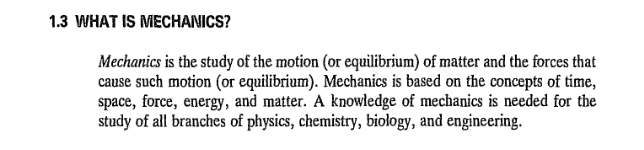
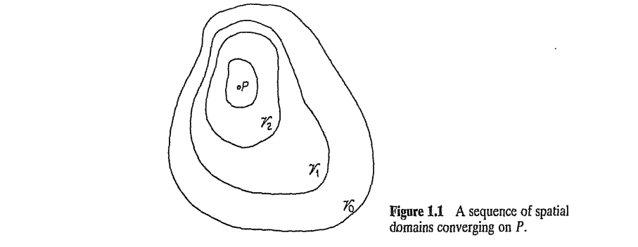
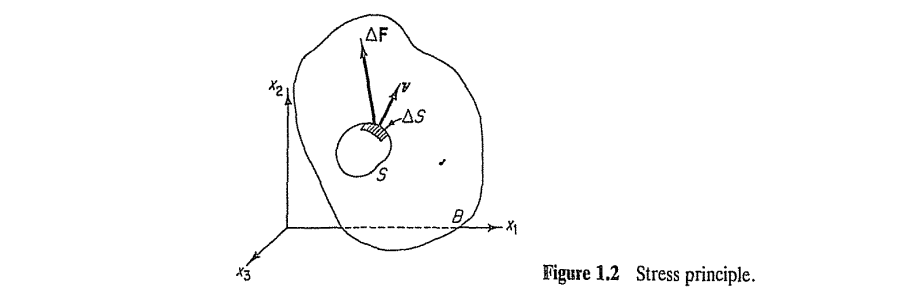
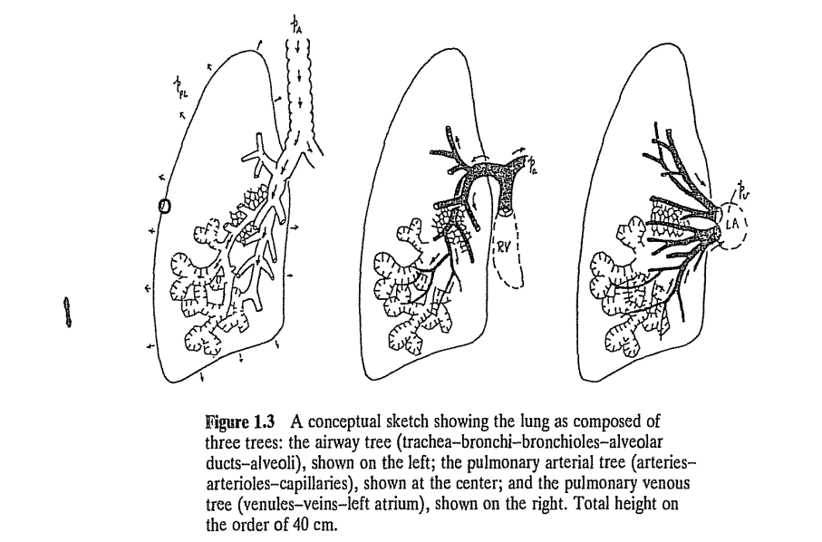
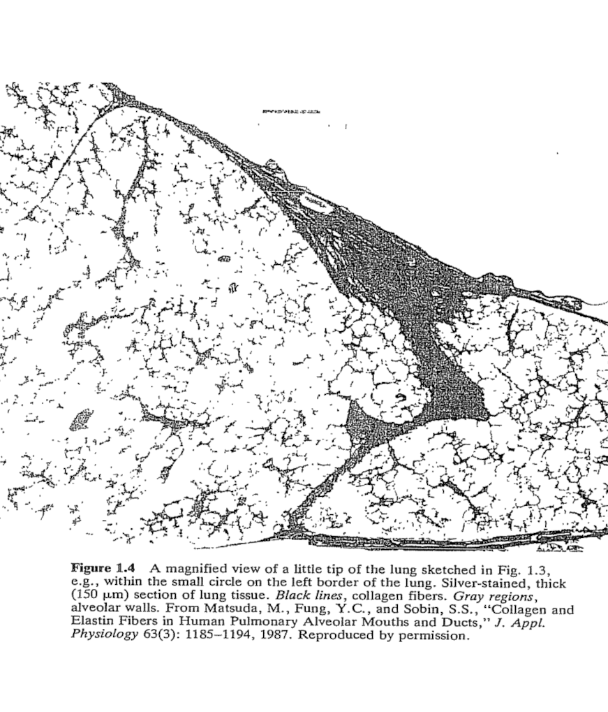
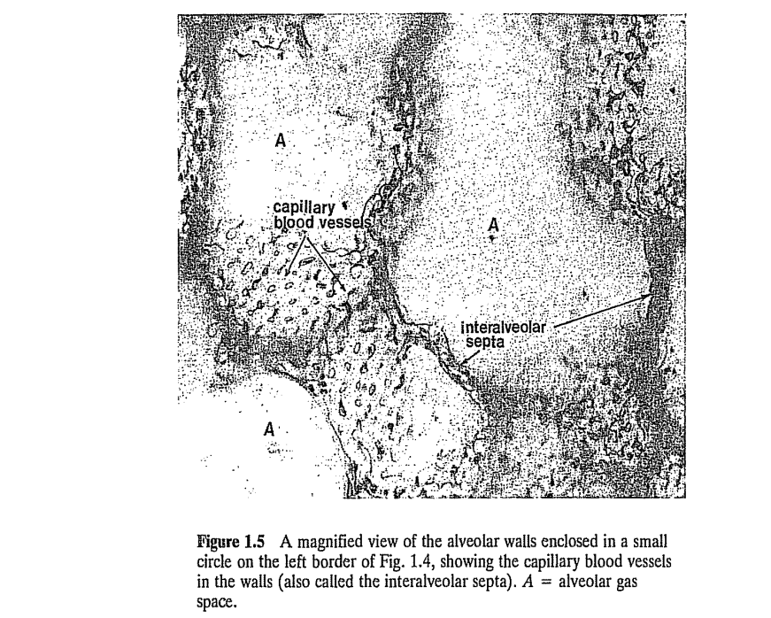
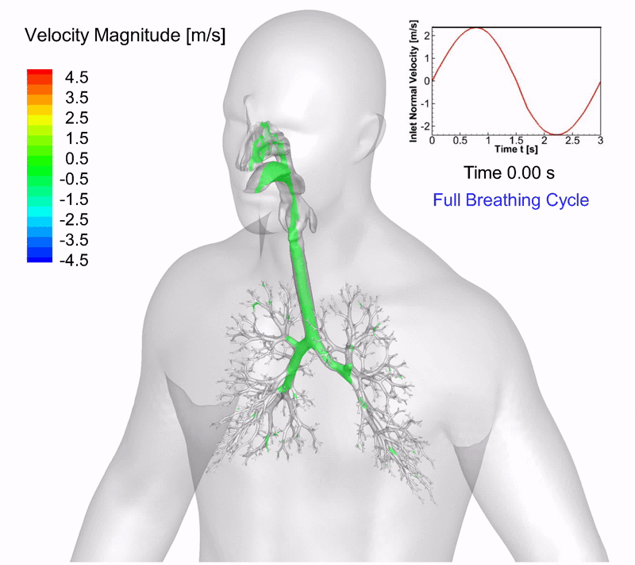
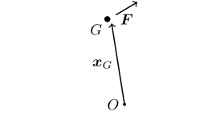
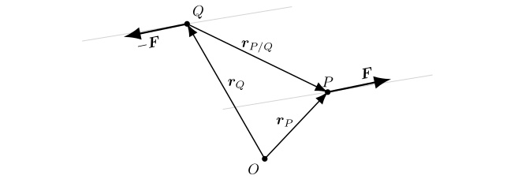
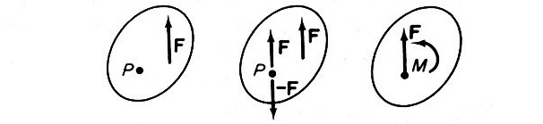

#+TITLE:  Chapter 1: Introduction
#+AUTHOR: Fethi Okyar
#+DATE: 2026-02-18
#+SUBTITLE: Reading: [Fung/94] [[../textbook_excerpts/1_TensorAlgebra.pdf][Chapter 1]]
#+STARTUP: overview
#+REVEAL_THEME: simple
#+REVEAL_INIT_OPTIONS: slideNumber:"c/t", width:1920, height:1080
#+REVEAL_TITLE_SLIDE: <h2>%t</h2> <h3>%s</h3> <h4>%d</h4>
#+OPTIONS: timestamp:nil toc:1 num:nil
#+REVEAL_EXTRA_CSS: ../style.css
#+REVEAL_ROOT: https://cdn.jsdelivr.net/npm/reveal.js
#+HTML_HEAD_EXTRA: 

* ($\S 1.1$) Objectives (Session 1)
#+ATTR_REVEAL: :frag (appear appear appear ...)
- To emphasize the formulation of problems in mechanics,
- To reduce vague ideas into precise mathematical statements,
- To cultivate the habit of questioning, analyzing, and designing,
- To observe nature, think of previous problems, write down a possible set of governing equations and boundary conditions.

*** What is /mechanics/ concerned with?
#+ATTR_REVEAL: :frag (appear)
- Motion
- Deformation
- Flow
- Force
- Energy
- Interactions
- Internal changes
- temporarily or permanently
- reversibly or irreversibly

#+REVEAL: split
#+ATTR_REVEAL: :frag (appear)
- These changes (deformation, etc.) together with axioms of continuum mechanics, can be expressed as boundary value problems
  $$ \frac{\partial \sigma_{ij}}{\partial x_i} + f_j = \frac{\partial v_j}{\partial t}, \hspace{1em} \forall x \in \Omega $$
  \begin{align}
   n_i \sigma_{ij} = \bar{t_j} \hspace{1em} & \forall x \in \partial\Omega_n \\
   u_i = \bar{u}_i \hspace{1em} & \forall x \in \partial\Omega - \partial\Omega_n
  \end{align}

- We will be dealing with fundamental principles that underlie these differential equations and their boundary conditions
  
*** Mechanics (definition)
#+ATTR_HTML: :width 1400px

* ($\S 1.4$) Prototype of a Continuum
What is a /Continuum/?
#+ATTR_REVEAL: :frag (appear appear appear ...)
- good question... ask chatGPT\\
  _PROMPT:_ we are a group of undergraduate students enrolled in the biomedical engineering program. we are taking the biomechanics course, and it is the first time that we encounter the notion of a continuum. How could you give an everyday description of this cohort?
- Is the real number system a /continuum/? 
- What about matter occupying a volume in 3D space? What is the most obvious reason for not being able to call *matter* as a continuum? 

#+REVEAL: split
#+ATTR_HTML: :width 1200px

#+ATTR_REVEAL: :frag (appear appear appear ...)
- We let the amount of matter be measured by /mass/ and assume matter permeates a certain space $\mathcal{V}_0$ 
- We consider a point $P$ in $\mathcal{V}_0$ and a sequence of subspaces $\mathcal{V}_1,\, \mathcal{V}_2,\, \ldots$, converging on $P$:
  $$ \mathcal{V}_n \in \mathcal{V}_{n-1}, \hspace{1em} P \in \mathcal{V}_n, \hspace{1em} \mathrm{(n=1,2,...)}. $$
  
** Notion of Density, $\rho$
#+ATTR_REVEAL: :frag (appear appear appear ...)
- Let the volume encapsulated in $\mathcal{V}_n$ be denoted by $V_n$ and the mass of the matter contained in $\mathcal{V}_n$ be denoted by $M_n$.
- If the limit of $m_n/V_n$ exists as $n \to \infty$ and $V_n \to 0$, the limiting value is defined as the /density of the mass distribution/ at the point $P$, and is denoted by $\rho(P)$:
  $$ \rho(P) = \lim_{V_n \to 0} \frac{m_n}{V_n} $$
- /An ideal material continuum is a/ definition for which /the densities of mass, momentum and energy exist in this strict mathematical sense/.
- But unfortunately no such materials exists!!

** Modifying the Limit to fit Reality
#+ATTR_REVEAL: :frag (appear appear appear ...)
- As $n \to \infty$, the limit of $V_n$ tends to a finite positive number $\omega$.
- The volume is not let to vanish but tends to a non-zero value controlled by a characteristic size, e.g. on the order of $\mathcal{O}(\mu m)$, below which the continuity and homogeneity of the distribution is disrupted.
- The quantity $\rho$ is then said to be the /density of material at $P$ with an  acceptable variability $\epsilon$ in a defining limit volume $\omega$/.
- This is "/our definition of a continuum/".

* ($\S 1.6$) Notion of Stress
The Scene:
#+ATTR_REVEAL: :frag (appear appear appear ...)
- Consider a material $B$ occupying a spatial region $V$.
- Imagine a closed surface $S$ within $B$ and consider the interaction between material separated by $S$.
- At a point $P$ on $S$, let the outward unit normal be $\boldsymbol{n}$.
- Consider a limited area on $S$ around $P$, called $\Delta S$.
- Material on the outer region are labeled as $+$, while the opposite ones are $-$.
- Consider the total force exerted by the $+$ side on the $-$ side be represented by the force vector, $\Delta \boldsymbol{F}$.
- We define a limit (in the modified sense described above) of the ratio
  $$\lim_{\Delta S \to 0} \frac{\Delta \boldsymbol{F}}{\Delta S} \triangleq \overset{(\boldsymbol{n})}{\boldsymbol{t}}$$
  as the traction at point $P$ over a plane with normal $\boldsymbol{n}$.
- Traction is also known as the stress vector, and is a measure of the amount of force passing thru a unit area.
   
#+REVEAL: split
#+ATTR_HTML: :width 1400px

$$ \overset{(\boldsymbol{n})}{\boldsymbol{t}} = \frac{d \boldsymbol{F}}{d S} $$

The stress principle of Euler and Cauchy.

* ($\S 1.7$) Abstract Copy of a Real Continuum
#+ATTR_REVEAL: :frag (appear appear appear ...)
- Imagine we obtain the material properties (e.g. density, etc.) of a matter (real continuum).
- To make useful calculations we need a mathematical model that uses these properties.
- We say we clone the real material and produce an abstract copy of it.
- This abstract copy is isomorphic with the real number system, it is an idealization.
- Whereas the real material would have a limitation on the lower bound of sizes, the calculus of the idealized system can be carried out.
- There may be a need to use more than one abstraction of the real material in a different range of sizes. The behaviour of a material in millimeter scale may be different from its behaviour in micron scale. This depends on the /hierarchy/ of material constitution.
- More about hierarcy of the making of biological tissues in $\S 1.10$.

* ($\S 1.9$) Axioms of Continuum Mechanics
#+ATTR_REVEAL: :frag (appear appear appear ...)
- First, the axioms of physics, i.e. the balance of momentum, the balance of moment of momentum, and the first and second laws of thermostatics are copied as axioms of continuum mechanics,
- Second, /a material continuum remains as a continuum under the action of forces/, i.e., the /axiom of continuity/. This does not limit the opening of new surfaces due to fracturing or tearing, but these have to be accounted for in a thermodynamic sense. Also, growth (increase or migration of cells) or resorption (reduction) of matter is allowed,
- Third, the stress and strain can be determined everywhere, which is the /axiom of determinism/.
- Fourth, the stress at a point depends on the strain at and around that point, the /axiom of neighborhood/,
- Fifth, the stress at a given moment depends on the strain at that moment and and previous moments, the /axiom of memory/. The stress-strain relation may be influenced by other parameters such as temperature, electrical change, ion transport, etc., that is the problem is of a multi-physics nature.

* ($\S 1.10$) A Biological Example of Hierarchy of Continua
The change of microstructure by shifting the scale of observation (i.e. switching the scale of magnification of a microscope, x100, x10$^4$, x10$^6$, etc.). 

#+REVEAL: split
One example is the human lung. Three consecutive trees, an airway tree, an arterial three and a venous tree.
#+ATTR_HTML: :width 1200px

#+REVEAL: split
#+ATTR_HTML: :width 1000px

#+REVEAL: split
#+ATTR_HTML: :width 1200px

** Questions for next session
Ask AI:
- Discuss the meaning of a free-body diagram in the context of mechanics.

** Motivation
A recent post in Linkedin reveals the computational simulation of breathing.
#+ATTR_HTML: :width 800px

* ($\S 1.11$) Equations of Motion and Equilibrium
** Fundamentals
- Let a body $B$ occupy a region $\mathcal{V}$ in space. We bring in calculus to calculate certain quantities such as the volume $V$ enclosed in space $\mathcal{V}$ as
  $$ V = \int_\mathcal{B} dV $$
  where the integral is taken over the entire body which implies that $\int$ is synonymous with a triple integral, and $dV$ represents a three-dimensional volume element (e.g. $dV=dx\,dy\,dz$ in cartesian coordinates).
- The notion of a coordinate system enters into our treatment as a tool for locating points in space. We need as many rulers in a sense as the number of dimensions, $n$,  in encapsulated by $\mathcal{V}$. A three-dimensional coordinate system, for example, is set up by establishing its' origin $O$ and three independent directions for measurement (i.e. $x$, $y$ and $z$ directions, and their unit vectors $\boldsymbol{i}$, $\boldsymbol{j}$, and $\boldsymbol{k}$).
- Note that there always is a reference of a reference, including our newly formed coordinate system $O-xyz$.

#+REVEAL: split  
- An important property of volume, as a geometric entity, is that it possesses a centroid, $G$. The location of $G$ can be determined by making use of the first moments of the volume integral with respect to three independent planes.
- By the first moment we mean appending the differential element with its distance to a particular plane, for example, the first moment of the volume integral with respect to the $x$ plane (i.e. the plane perpendicular to $x$, or the $y-z$ plane) would be
  $$ \mathbb{1}_x(V) = \int_\mathcal{B} x dV $$
- For example, the $x$ coordinate of the centroid can then be determined by evaluating
  $$ x_G = \frac{\mathbb{1}_x(V)}{V} $$
  The other two coordinates can be found by applying a similar procedure for the $y$ and $z$ planes.
  $$ y_G = \mathbb{1}_y(V)/V,\hspace{1em} z_G = \mathbb{1}_z(V)/V $$

#+REVEAL: split  
- If the mass density of matter filling this space is given as $\rho(\boldsymbol{x})$, where it is assumed that the density field is a function of the location, we can use it to calculate the mass $m$ of $\mathcal{B}$ by introducing density into the above integral,
  $$ m = \int_\mathcal{B} \rho(\boldsymbol{x}) dV $$
  Here the location symbol $\boldsymbol{x}$ represents the three coordinates of the differential element grouped in a vector form (a list of ordered numbers) as $\boldsymbol{x} = \{x,\,y,\,z\}$. Usually the functional dependence of $\rho$ on $\boldsymbol{x}$ is not indicated explicitly for the purpose of mathematical brevity, i.e. we write
  $$ m = \int_\mathcal{B} \rho dV $$
  
#+REVEAL: split
- We accept that the axioms of the /balance of momentum/ and /balance of moment of momentum/ govern motion of bodies under forces. (Tested positive against experimental findings for almost about the past 400 years.)
- Bodies reduce to particles when their scale is dominated by the effect of the force acting upon them. Then we simply call the body as a /point mass/ or a /particle/.
- In that case, the body becomes distant and its /shape/ and /orientation/ becomes immaterial to the problem at hand. Its effectively treated by tracking its centoid, $G$.
- Having left its "cover and shape", a body is only able to receive external forces from its centroid, whence the concept of /moment of a force/ acting upon this body also becomes immaterial.
  #+ATTR_HTML: :width 450px
  
- Remember that the moment, $\boldsymbol{M}^O$, produced by a force, $\boldsymbol{F}$, about point $O$ can be determined by
  $$ \boldsymbol{M}^O = \boldsymbol{r} \times \boldsymbol{F} $$
  where $\times$ denotes the vector (cross) product operation and $O$ can be any arbitrary point in the theater.

*** Motion of a Body
#+ATTR_REVEAL: :frag (appear appear appear ...)
- Let the body $\mathcal{B}$ be traveling in curvilinear motion (without rotation) in space $\mathcal{V}$. In this case, the time rate of change of point locations, $\boldsymbol{x}$, in $\mathcal{B}$ measured from an /inertial frame of reference/
  $$ \frac{d \boldsymbol{x}}{dt} \triangleq \boldsymbol{v} $$
  are uniform, i.e. all points within are traveling with the same velocity,  $\boldsymbol{v}$.

  Freehand depiction of a body in curvilinear motion (i.e. moving with uniform velocity without rotation).
  
- The time rate of change of velocity
  $$ \frac{d \boldsymbol{v}}{dt} \triangleq \boldsymbol{a} $$
  is called the acceleration of point $\boldsymbol{x}$.

- An inertial frame of reference is one which has no motion or one that moves with a constant velocity (zero acceleration).

*** Momentum of a Body (*24.02 mark*)
#+ATTR_REVEAL: :frag (appear appear appear ...)
- The momentum of a body can be found by using a procedure similar to that used in determining its mass, i.e. integration
  $$ \mathcal{P} = \int_\mathcal{B} \boldsymbol{v} \rho dV .$$
  Here, $\mathcal{P}$ is known as the /linear momentum/ or simply the /momentum/ of $\mathcal{B}$. 
- For bodies in curvilinear translation, the velocity can be taken out of the integral due to its uniform nature (i.e. does not depend on the location in $\mathcal{B}$). Hence,
  $$  \mathcal{P} = \boldsymbol{v} \int_\mathcal{B} \rho dV = m \boldsymbol{v}. $$
- The moment of momentum (a.k.a /angular momentum/) of the body can be expressed by introducing the moment operation into integration in the form of the vector product with the position vector from the point about which moment is taken, $O$ for example
  $$ \mathcal{H}^O = \int_\mathcal{B} \boldsymbol{r} \times \boldsymbol{v} \rho dV $$
  
** Newton's, Euler's and/or Cauchy's Equations of Motion
#+ATTR_REVEAL: :frag (appear appear appear ...)
- States that: For "the free-body or group of bodies" isolated by replacing the effect received from their surroundings with corresponding force vectors, the net resultant of all external forces is equalized by the time rate of change of the group's momentum.
- This can be interpreted in various ways. For example, the momentum will be preserved (it will not change) if the net resultant of the external forces is null (zero). (Newton's first law)
- Another way to interpret this is by writing the mathematical statement
  $$ \frac{d}{dt}m\boldsymbol{v} = \boldsymbol{F} $$
  where $\boldsymbol{F}$ is the net resultant force. This can be rewritten as
  $$ m\boldsymbol{a} = \boldsymbol{F}. $$
- Or still another way to write it is
  $$  \boldsymbol{F} + (-m\boldsymbol{a}) = \boldsymbol{0}. $$
  The paranthesized quantity is known as the /inertial force/ of D'alambert.

*** A Group of Particles
#+ATTR_REVEAL: :frag (appear appear appear ...)
- Whether it is a single particle or a group (system) of particles, we can isolate the mechanical effect of their surroundings by using the force hypothesis. We hypothesize that the external effect of the surroundings can be replaced with force vectors.
- Say we have a group of $K$ particles, and the superscript index $I$ denotes the $I$ th particle, $m^I$ having an instantaneous velocity $\boldsymbol{v}^I$.
- We may establish the following set of logical rules about forces:
  #+ATTR_REVEAL: :frag (appear appear appear ...)
  + Let $\boldsymbol{F}^{IJ}$ denote the force of interaction exerted by $J$ on $I$, and $\boldsymbol{F}^{JI}$ denote that of $I$ on $J$.
  + According to Newton's third, we can write
    $$ \boldsymbol{F}^{IJ} = -\boldsymbol{F}^{JI} $$
  + When $I==J$, i.e., the self-effected force onto itself $\boldsymbol{F}^{II} = 0$.
  + The net force on particle $I$, $\boldsymbol{F}^{I}$ consists of the resultant force member $I$ receives from other members $J$, $\sum_{J=1}^K \boldsymbol{F}^{IJ}$, and the force it directly receives from the surroundings, $\overset{\mathrm{ex}}{\boldsymbol{F}^I}$.
    
*** The Equations of Motion for a Particle Group
#+ATTR_REVEAL: :frag (appear appear appear ...)
- Thus the net force on particle $I$ becomes
  $$ \boldsymbol{F}^{I} = \overset{\mathrm{ex}}{\boldsymbol{F}^I} + \sum_{J=1}^K \boldsymbol{F}^{IJ} $$
- The equation of motion of the $I$ th particle becomes
  $$ \frac{d}{dt} m^I\boldsymbol{v}^{I} = \overset{\mathrm{ex}}{\boldsymbol{F}^I} + \sum_{J=1}^K \boldsymbol{F}^{IJ}, \hspace{1.5em} (I = 1,2,\ldots,K) $$
- If each particle has such an equation, $K$ equations can be written corresponding to $K$ particles in order to describe the motion of the group.
- To be able to proceed with the solution, something about the nature of the mutual forces ($\boldsymbol{F}^{IJ}$) has to be known. This will be called as the /constitutive properties/ of the material system.

*** Equilibrium of Forces
#+ATTR_REVEAL: :frag (appear appear appear ...)
- Describes the condition or state of motionlessness (have a zero net velocity). When a free-body or a group of bodies that are under the action of external forces is in equilibrium, the time rate of change of momentum vanishes and /equations of motion/ are renamed as */equations of equilibrium/*.
  $$ \boldsymbol{0} = \overset{\mathrm{ex}}{\boldsymbol{F}^I} + \sum_{J=1}^K \boldsymbol{F}^{IJ}, \hspace{1.5em} (I = 1,2,\ldots,K) $$
- Upon summing this equation over all particles $I$ from 1 to $K$, we obtain
  $$ \sum_{I=1}^K \overset{\mathrm{ex}}{\boldsymbol{F}^I} + \sum_{I=1}^K  \sum_{J=1}^K \boldsymbol{F}^{IJ} =  \boldsymbol{0} $$
- But the second term on the left hand side drops due to Newton's third law (internal forces are equal and opposite to one another) and we get the equation of equilibrium
  $$ \sum_{I=1}^K \overset{\mathrm{ex}}{\boldsymbol{F}^I} =  \boldsymbol{0} $$
  which states that /for a body to be in equilibrium, the summation of all external forces acting on it is zero/.

#+REVEAL: split
- Equilibrium of forces is necessary and sufficient for the centroid of the body (or group of bodies) to remain steady (motionless), but does it guarantee total motionlessness?
#+ATTR_REVEAL: :frag (appear appear appear ...)
- The answer is in the below figure. The external forces on a body (or group of bodies) may add up to a zero resultant force, however, the given force system may have a non-zero resultant moment.
- The two forces, $\boldsymbol{F}$ and $\boldsymbol{-F}$ in the below figure form a "couple". A couple is a moment, $\boldsymbol{M}$, formed by the system of two equal and opposite forces that are not collinear. The magnitude, $M$, of the moment is equal to $FD$, where $F$ is the magnitude of $\boldsymbol{F}$ and $D$ is the shortest distance between their lines of action.

  #+ATTR_HTML: :width 800px
  

#+REVEAL: split
#+ATTR_HTML: :width 900px

- The couple (moment) vector can be obtained by taking the summation of the moments of the couple about an arbitrary point $O$. This results in
  $$ \boldsymbol{M} = \boldsymbol{r}^{P/Q} \times \boldsymbol{F} $$
- The system of couple force vectors are said to be equivalent to their couple moment vector in terms of the mechanical effect produced on the body.

*** Equivalence of Force Systems
#+ATTR_REVEAL: :frag (appear appear appear ...)
- We may be interested to simplify the force system acting on a body without changing the mechanical effect it produces.
- For example, the forces may be repositioned to a common location in order to reduce them to a single force.
- However, the repositioning of a force away from its line of action requires a careful process in order to maintain the overall mechanical effect produced by that force. See the figure below.
  
  #+ATTR_HTML: :width 800px
  

*** Equilibrium of Moments
#+ATTR_REVEAL: :frag (appear appear appear ...)
- The second condition of equilibrium of a free-body or group of bodies is derived based on the equilibrium of moments.
- This requires that in addition to the equilibrium of forces derived previously, the resultant moment of external forces acting on the body should obey
   $$ \sum_{I=1}^K \boldsymbol{r}^I \times \overset{\mathrm{ex}}{\boldsymbol{F}^I} =  \boldsymbol{0} $$
   where $\boldsymbol{r}^I$ denotes the position vector of particle $I$ with respect to the origin $O$ or any arbitrary location, $Q$, for that matter.
- The two equilibrium conditions are necessary and sufficient for a rigid body to remain steady or motionless.

#+REVEAL: split
Example:
https://emweb.unl.edu/negahban/em223/note11/note11.htm

write an example script in [[https://www.mathworks.com][Matlab online]] that calculates the resultant force and resultant moment of three external forces applied to a free-body

#+REVEAL: split
END OF UNIT 1

