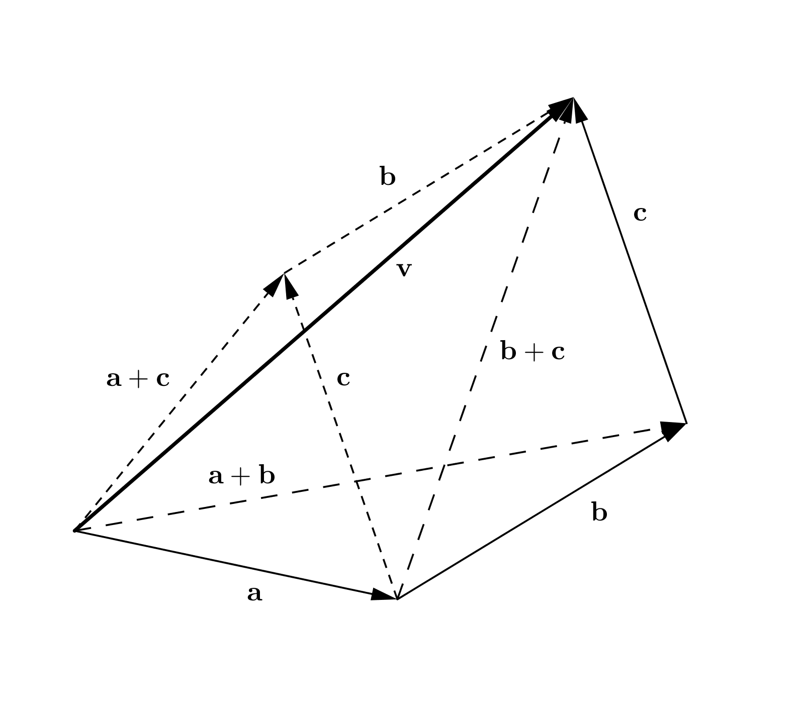
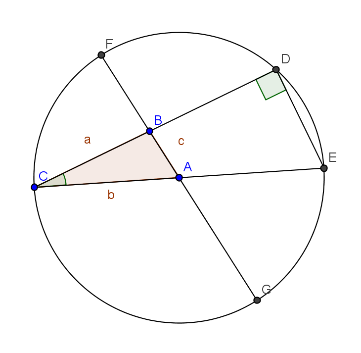
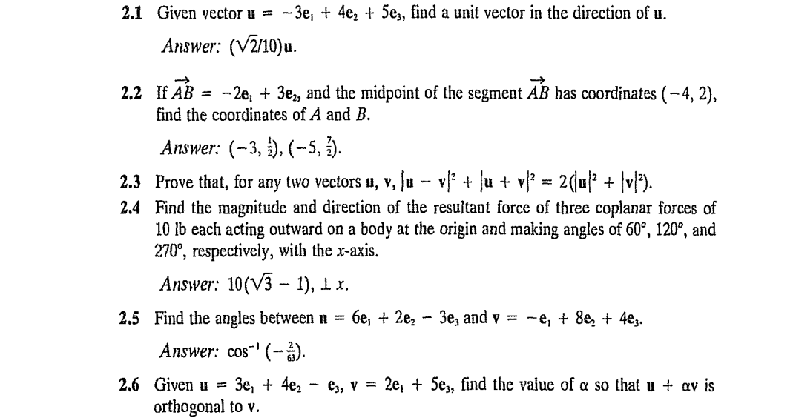
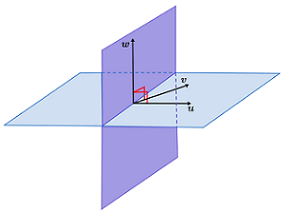
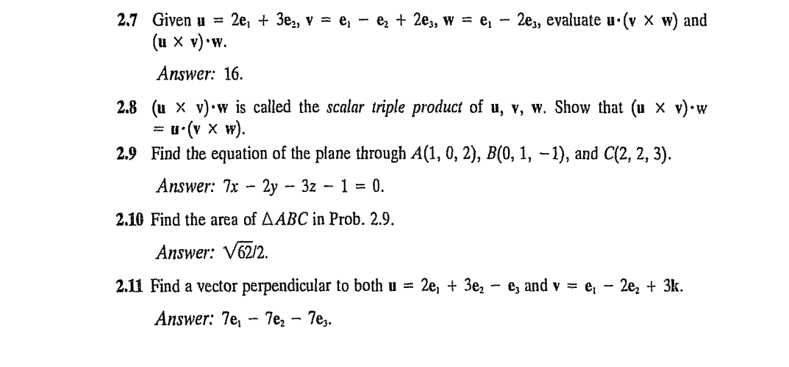
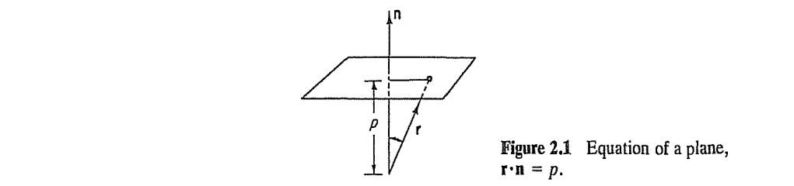
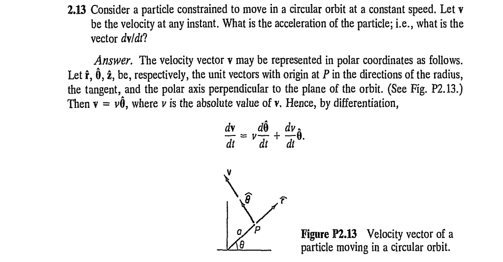

#+TITLE:  Chapter 2: Vectors and Tensors
#+AUTHOR: Fethi Okyar
#+DATE: 2026-02-28
#+SUBTITLE: Reading: [Fung/94] [[../textbook_excerpts/1_TensorAlgebra.pdf][Chapter 1]]
#+STARTUP: overview
#+REVEAL_THEME: simple
#+REVEAL_INIT_OPTIONS: slideNumber:"c/t", width:1920, height:1080
#+REVEAL_TITLE_SLIDE: <h2>%t</h2> <h3>%s</h3> <h4>%d</h4>
#+OPTIONS: timestamp:nil toc:1 num:nil
#+REVEAL_EXTRA_CSS: ../style.css
#+REVEAL_ROOT: https://cdn.jsdelivr.net/npm/reveal.js
#+HTML_HEAD_EXTRA: 

* ($\S 2.1$) Vector Algebra
** Objectives
#+ATTR_REVEAL: :frag (appear appear appear ...)
- To review the basic operations in vector algebra

** Definition
- A directed line segment with a given magnitude and direction
- In reference with a coordinate system of measurement, a vector is an ordered list of triple (three-dimensional) or double (two-dimensional) numbers
  $$ \{ 1, -1, 3\}   \hspace{1.5em} \{ \cos\theta, \sin\theta \} $$
  @@html:Freehand depiction of the scene@@
** Notation
#+ATTR_REVEAL: :frag (appear appear appear ...)
- In printed form, either the overline, $\vec{AB}$, or lowercase *boldface* /italic/ font will be used to denote vectors.
  $$ \boldsymbol{u}=\vec{AB}, \hspace{1em} \boldsymbol{e}_2, \hspace{1em} \boldsymbol{f} $$
- A zero vector $\boldsymbol{0}$ has zero magnitude.
- Vector magnitudes are indicated by the symbols $|\boldsymbol{u}|$, or simply as $u$, using the same letter without *boldface* /italic/.
- Multiplying a vector by a scalar scales the vector magnitude but has no effect on it's magnitude, e.g., multiplying $\boldsymbol{u}$ with the reciprocal of its magnitude, i.e.
  $$ \left( \frac{1}{|\boldsymbol{u}|} \right) \boldsymbol{u} = \frac{\boldsymbol{u}}{|\boldsymbol{u}|} = \frac{\boldsymbol{u}}{u} = \boldsymbol{e}_u $$
  gives a vector of length unity. Note that, $\boldsymbol{e}_u$ is a /base vector/.
- A unit vector is a vector of magnitude unity (1). In this course (and in many others), the letter $\boldsymbol{e}$ is reserved to denote unit vectors, e.g.
  $$ \boldsymbol{e}_1,\; \boldsymbol{e}_u,\; \boldsymbol{e}_\theta,\ldots $$
  
#+REVEAL: split
- We can add two or more vectors using the $+$ operator
  $$ \boldsymbol{a} + \boldsymbol{b} $$
  which is known as the parallelogram rule.

  #+ATTR_HTML: :width 600px
  
  - Subtraction can be formulated by combining negation and summation
  $$ \boldsymbol{a} - \boldsymbol{b} = \boldsymbol{a} + (-\boldsymbol{b}) $$

*** The Law of Sines and Cosines
- The vectors: $\boldsymbol{a} = \vec{BC}$, $\quad \boldsymbol{b} = \vec{CA}$, $\quad\boldsymbol{c} = \vec{BA} = \boldsymbol{a} + \boldsymbol{b}$
- the corner angles $C = (\boldsymbol{a},\boldsymbol{b})$ , $A = (\boldsymbol{b},\boldsymbol{c})$ , $B = (\boldsymbol{a},\boldsymbol{c})$ 
- The *Law of Cosines* reads
  $$ c^2 = a^2 + b^2 - 2 a b \cos C $$
- The *Law of Sines* reads
  $$ \frac{a}{\sin A} = \frac{b}{\sin B} =\frac{c}{\sin C} $$ 
  #+ATTR_HTML: :width 600px
  
  
** Scalar (dot) Product
#+ATTR_REVEAL: :frag (appear appear appear ...)
- The /scalar/ (or /dot/) /product/ of $\boldsymbol{u}$ and $\boldsymbol{v}$, denoted $\boldsymbol{u} \cdot \boldsymbol{v}$, is defined by the formula
  $$ \boldsymbol{u} \cdot \boldsymbol{v} = |\boldsymbol{u}| |\boldsymbol{v}| \cos\theta \hspace{1em} (0\leq \theta \leq \pi), $$
  where $\theta = (\boldsymbol{u},\boldsymbol{v})$ is the angle between the given vectors.
- One of the major uses of this operation is to determine the projected length, $u_{\parallel a}$, of a vector, $\boldsymbol{u}$, along an axis, $a-a$ in space.
  
  @@html:Freehand depiction of the scene@@
  #+ATTR_REVEAL: :frag (appear appear appear ...)
  + A unit vector along the axis $a-a$ is constructed by locating two points $C$ and $D$ on $a-a$, constructing the vector $\vec{CD}$, and then dividing it to its length $|\vec{CD}|$
    $$ \boldsymbol{e}_a = \vec{CD}/|\vec{CD}| $$

  + The dot product between $\boldsymbol{u}$ and the unit vector yields the projection, also called /component/ $\boldsymbol{u}_{\parallel a}$
    $$ \boldsymbol{u} \cdot \boldsymbol{e}_a = u_{\parallel a} $$

#+REVEAL: split
- Introducing a coordinate system $O-x_1 x_2 x_3$, using the indices {1,2,3} to denote the first, second and third coordinate directions having a set of unit *base vectors* $\boldsymbol{e}_1$, $\boldsymbol{e}_2$, and $\boldsymbol{e}_3$, respectively.

  A freehand depiction of the scene

#+ATTR_REVEAL: :frag (appear appear appear ...)
- We can obtain a representation of the vector, $\boldsymbol{u}$, in terms of its components by using the /dot product/ operation
  $$ u_1 = \boldsymbol{u}\cdot \boldsymbol{e}_1, \quad u_2 = \boldsymbol{u}\cdot \boldsymbol{e}_2, \quad u_3 = \boldsymbol{u}\cdot \boldsymbol{e}_3, $$
  which can be written in shorthand (indicial) notation by the use of a /free-index/ $i$
  $$ u_i = \boldsymbol{u}\cdot \boldsymbol{e}_i, \quad i={1,2,3} $$

- In this way, the representation of the vector in the $O-x_1 x_2 x_3$ system can be written as
  $$ \boldsymbol{u} = u_1 \boldsymbol{e}_1 + u_2 \boldsymbol{e}_2 + u_3 \boldsymbol{e}_3 = \sum_{i=1}^3 u_i \boldsymbol{e}_i  $$
  where summation occurs over a /repeated index/ $i$.

#+REVEAL: split
- Note from it's definition the  /dot product/ of two perpendicular vectors $(\boldsymbol{u},\boldsymbol{v}) = \pi/2$ yields
  $$ \boldsymbol{u} \cdot \boldsymbol{v} = |\boldsymbol{u}| |\boldsymbol{v}| \cos(\pi/2) = 0 $$
#+ATTR_REVEAL: :frag (appear appear appear ...)
- This can be used to obtain the well-known relation between the base vectors
  \begin{align}
   & \boldsymbol{e}_1 \cdot \boldsymbol{e}_1 = 1, \quad \boldsymbol{e}_1 \cdot \boldsymbol{e}_2 = 0, \quad \boldsymbol{e}_1 \cdot \boldsymbol{e}_3 = 0 &\\
   & \boldsymbol{e}_2 \cdot \boldsymbol{e}_1 = 0, \quad \boldsymbol{e}_2 \cdot \boldsymbol{e}_2 = 1, \quad \ldots, & \mathrm{etc.}
  \end{align}
- A shorthand of the nine equations above is provided by introducing the /free-indices/ $i,j$ as
  \begin{align}
  \boldsymbol{e}_i \cdot \boldsymbol{e}_j = \left\{ \begin{array} 01, \quad i=j \\ 0, \quad i\neq j \end{array} \right.
  \end{align}
  where $i,j$ can freely take any values from the set of coordinate numbers ${1,2,3}$. 
- This above gives rise to the definition of the /Kroenecker's delta/, $\delta_{ij}$
  $$ \delta_{ij} =  \boldsymbol{e}_i \cdot \boldsymbol{e}_j $$
  which is an /identity matrix/ in a sense.

*** Review Problems
#+ATTR_HTML: :width 1600px

** Vector (cross) Product
#+ATTR_REVEAL: :frag (appear appear appear ...)
- Whereas the scalar product of two vectors is a scalar quantity, the /vector/ (or /cross/) /product/ of two vectors $\boldsymbol{u}$ and $\boldsymbol{v}$ produces another vector $\boldsymbol{w}$; and we write $\boldsymbol{w} = \boldsymbol{u} \times \boldsymbol{v}$. The magnitude of $\boldsymbol{w}$ is defined as
  $$ |\boldsymbol{w}| = |\boldsymbol{u}| |\boldsymbol{v}| \sin\theta \quad (0\leq\theta\leq\pi) $$
  where $\theta=(\boldsymbol{u}, \boldsymbol{v})$, and the vector $\boldsymbol{w}$ is directed perpendicular to the plane formed by $\boldsymbol{u}$ and $\boldsymbol{v}$, in such a way that $\boldsymbol{u}$, $\boldsymbol{v}$, $\boldsymbol{w}$ form a right-handed screw.

  #+ATTR_HTML: :width 600px
  

#+REVEAL: split  
- Vector products satisfy the following relations:
  \begin{align}
  \boldsymbol{u} \times \boldsymbol{v} & = - (\boldsymbol{v} \times \boldsymbol{u}) \\
  \boldsymbol{u} \times (\boldsymbol{v} + \boldsymbol{w}) & = \boldsymbol{u} \times \boldsymbol{v} + \boldsymbol{u} \times \boldsymbol{w}  \\
  \boldsymbol{u} \times \boldsymbol{u} & = \boldsymbol{0}
  \end{align}
- Very useful in finding the moment of physical variables, such as /moment of a force/, or the /moment of momentum about a point/.
- Calculations become possible upon designation of a set of inertial or relative coordinates.

#+REVEAL: split
The vector product can be expressed in terms of the vector components in  a coordinate system $O-x_1 x_2 x_3$ as
  $$ \boldsymbol{u} \times \boldsymbol{v} =  (u_1 \boldsymbol{e}_1 + u_2 \boldsymbol{e}_2 + u_3 \boldsymbol{e}_3) \times (v_1 \boldsymbol{e}_1 + v_2 \boldsymbol{e}_2 + v_3 \boldsymbol{e}_3) $$  
#+ATTR_REVEAL: :frag (appear appear appear ...)
- This can be expanded into nine terms (on the board) ...
- which finally yield 
  $$ \boldsymbol{u} \times \boldsymbol{v} =  (u_2 v_3 - u_3 v_2) \boldsymbol{e}_1 + (u_3 v_1 - u_1 v_3) \boldsymbol{e}_2 + (u_1 v_2 - u_2 v_1) \boldsymbol{e}_3 $$
- The expression can be written in a compacted for by using the concept of a /determinant/
  $$ \boldsymbol{u} \times \boldsymbol{v} = \left| \begin{array} d u_1 & u_2 & u_3 \\ v_1 & v_2 & v_3 \\  \boldsymbol{e}_1 & \boldsymbol{e}_2 & \boldsymbol{e}_3 \end{array} \right| $$

#+REVEAL: split
It may be instructive to revisit the ideas of /combinations/ and /permutations/
#+ATTR_REVEAL: :frag (appear appear appear ...)
- Game theory?
- Ask GPT:
  #+BEGIN_QUOTE
  can you summarize the notions of combination and permutation in the context of set logic? can you demonstrate this definition by applying it to the notion of a determinant of a matrix, for example?
  #+END_QUOTE
  
#+REVEAL: split
- It is interesting to discover certain symmetries in the how the triplets $u_i$, $v_j$ and $\boldsymbol{e}_k$ permute and combine with each other.
#+ATTR_REVEAL: :frag (appear)
- For example, looking at the first paranthesis, the term $u_2 v_3 \boldsymbol{e}_1$ has an index triplet 231 with a $+$ sign while the next term $u_3 v_2 \boldsymbol{e}_1$ with an index triplet 321 has a $-$ sign.
- We notice that positive $\circlearrowleft$ cyclic permutations (123, 231, 312) yield positive coefficients, while negative $\circlearrowright$ cyclic permutations (321, 213, 132) yield the opposite sign (negative).
- Also, none of the triplets that appear in the result contain a repeating index (e.g. 221,333, etc.)
- In this way, a novel apparatus called the /alternating symbol/ was invented (by Levi-Civita) to give the sign of permuting triplets
  \begin{align}
  \boldsymbol{\epsilon}_{ijk} = \left\{ \begin{array} 0+1, \quad \circlearrowleft\; \mathrm{cycles} \quad  (123, 231, 312) \\ -1, \quad \circlearrowright\; \mathrm{cycles} \quad  (321, 213, 132) \\ 0 \quad \mathrm{otherwise (repeating)} \end{array} \right.
  \end{align}

#+REVEAL: split  
- The result of the cross product operation can be written in shorthand (indicial) notation by multiplying the free-triple-index term $u_i v_j \boldsymbol{e}_k$ with the alternating symbol and summing over all the free indices
  $$ \boldsymbol{u} \times \boldsymbol{v} = \sum_k \sum_j \sum_i \epsilon_{ijk} u_i v_j \boldsymbol{e}_k $$
#+ATTR_REVEAL: :frag (appear)
- The resulting sum has 27 terms, only six of which are non-zero. Three of these (the $\circlearrowleft$ cycles) appear with a $+$ sign while the other three (the $\circlearrowright$ cycles)  with a $-$ sign.
- Note that, similar to the expression in the dot product, summations take place over three pairs of /repeated indices/ again.
*** Review Problems
#+ATTR_HTML: :width 1600px

* ($\S 2.2$) Vector Calculus
** Vector Equations
#+ATTR_REVEAL: :frag (appear)
- An important difference between an equation in terms of /scalars/ and an equation in terms of /vectors/ is the amount of information within.
- For example, in order to establish the identity of two vectors
  $$ \boldsymbol{M} = \boldsymbol{r} \times \boldsymbol{F} $$
  has to be satisfied with respect to each and every one of the components of the resulting vectors on each side (i.e. two for a 2-D space, of three for a 3-D space)
- Consider the conservation of momentum
  $$ \frac{d}{dt}m\boldsymbol{v} = \sum_i \boldsymbol{F}^i $$
  essentially provides three equations in a 3-D space

#+REVEAL: split
Or consider describing a plane with normal $\boldsymbol{n}$ that is at a distance $p$ from a point $O$.
#+ATTR_REVEAL: :frag (appear)
- We can show that the position vector $\boldsymbol{r}$ for any point $P$ that starts from $O$ and end up in this plane satisfies $\boldsymbol{r} \cdot \boldsymbol{n} = p$.
  #+ATTR_HTML: :width 1200px
  
- The vector equation above can be expressed in terms of the vector components with respect to a fixed frame of reference $O-x_1 x_2 x_3$.
  $$ n_1 x_1 + n_2 x_2 + n_3 x_3 - p = 0 $$
- Yet this eqaution can further be simplified by relying on the notion of a /free-index/
  $$ \sum_i n_i x_i - p = 0 $$

*** Time derivative of a vector
#+ATTR_HTML: :width 1600px

