#+TITLE:  Chapter 2: Vectors and Tensors
#+AUTHOR: Fethi Okyar
#+DATE: 2026-02-28
#+SUBTITLE: Reading: [Fung/94] [[../textbook_excerpts/1_TensorAlgebra.pdf][Chapter 1]]
#+STARTUP: overview
#+REVEAL_THEME: simple
#+REVEAL_INIT_OPTIONS: slideNumber:"c/t", width:1920, height:1080
#+REVEAL_TITLE_SLIDE: <h2>%t</h2> <h3>%s</h3> <h4>%d</h4>
#+OPTIONS: timestamp:nil toc:1 num:nil
#+REVEAL_EXTRA_CSS: ../style.css
#+REVEAL_ROOT: https://cdn.jsdelivr.net/npm/reveal.js
#+HTML_HEAD_EXTRA: 

* ($\S 2.1$) Vector Algebra
** Objectives
#+ATTR_REVEAL: :frag (appear appear appear ...)
- To review the basic operations in vector algebra

** Definition
- A directed line segment with a given magnitude and direction
- In reference with a coordinate system of measurement, a vector is an ordered list of triple (three-dimensional) or double (two-dimensional) numbers
  $$ \{ 1, -1, 3\}   \hspace{1.5em} \{ \cos\theta, \sin\theta \} $$
  @@html:Freehand depiction of the scene@@
** Notation
#+ATTR_REVEAL: :frag (appear appear appear ...)
- In printed form, either the overline, $\vec{AB}$, or lowercase *boldface* /italic/ font will be used to denote vectors.
  $$ \boldsymbol{u}=\vec{AB}, \hspace{1em} \boldsymbol{e}_2, \hspace{1em} \boldsymbol{f} $$
- A zero vector $\boldsymbol{0}$ has zero magnitude.
- Vector magnitudes are indicated by the symbols $|\boldsymbol{u}|$, or simply as $u$, using the same letter without *boldface* /italic/.
- Multiplying a vector by a scalar scales the vector magnitude but has no effect on it's magnitude, e.g., multiplying $\boldsymbol{u}$ with the reciprocal of its magnitude, i.e.
  $$ \left( \frac{1}{|\boldsymbol{u}|} \right) \boldsymbol{u} = \frac{\boldsymbol{u}}{|\boldsymbol{u}|} = \frac{\boldsymbol{u}}{u} = \boldsymbol{e}_u $$
  gives a vector of length unity. Note that, $\boldsymbol{e}_u$ is a /base vector/.
- A unit vector is a vector of magnitude unity (1). In this course (and in many others), the letter $\boldsymbol{e}$ is reserved to denote unit vectors, e.g.
  $$ \boldsymbol{e}_1,\; \boldsymbol{e}_u,\; \boldsymbol{e}_\theta,\ldots $$
  
#+REVEAL: split
- We can add two or more vectors using the $+$ operator
  $$ \boldsymbol{a} + \boldsymbol{b} $$
  which is known as the parallelogram rule.

  #+ATTR_HTML: :width 600px
  [[./images/fig2.1.1.png]]
  - Subtraction can be formulated by combining negation and summation
  $$ \boldsymbol{a} - \boldsymbol{b} = \boldsymbol{a} + (-\boldsymbol{b}) $$

*** The Law of Sines and Cosines
- The vectors: $\boldsymbol{a} = \vec{BC}$, $\quad \boldsymbol{b} = \vec{CA}$, $\quad\boldsymbol{c} = \vec{BA} = \boldsymbol{a} + \boldsymbol{b}$
- the corner angles $C = (\boldsymbol{a},\boldsymbol{b})$ , $A = (\boldsymbol{b},\boldsymbol{c})$ , $B = (\boldsymbol{a},\boldsymbol{c})$ 
- The *Law of Cosines* reads
  $$ c^2 = a^2 + b^2 - 2 a b \cos C $$
- The *Law of Sines* reads
  $$ \frac{a}{\sin A} = \frac{b}{\sin B} =\frac{c}{\sin C} $$ 
  #+ATTR_HTML: :width 600px
  [[./images/fig2.1.2.png]]
  
** Scalar (dot) Product
:PROPERTIES:
:CUSTOM_ID: scalar-product
:END:
#+ATTR_REVEAL: :frag (appear appear appear ...)
- The /scalar/ (or /dot/) /product/ of $\boldsymbol{u}$ and $\boldsymbol{v}$, denoted $\boldsymbol{u} \cdot \boldsymbol{v}$, is defined by the formula
  $$ \boldsymbol{u} \cdot \boldsymbol{v} = |\boldsymbol{u}| |\boldsymbol{v}| \cos\theta \hspace{1em} (0\leq \theta \leq \pi), $$
  where $\theta = (\boldsymbol{u},\boldsymbol{v})$ is the angle between the given vectors.
- One of the major uses of this operation is to determine the projected length, $u_{\parallel a}$, of a vector, $\boldsymbol{u}$, along an axis, $a-a$ in space.
  
  @@html:Freehand depiction of the scene@@
  #+ATTR_REVEAL: :frag (appear appear appear ...)
  + A unit vector along the axis $a-a$ is constructed by locating two points $C$ and $D$ on $a-a$, constructing the vector $\vec{CD}$, and then dividing it to its length $|\vec{CD}|$
    $$ \boldsymbol{e}_a = \vec{CD}/|\vec{CD}| $$

  + The dot product between $\boldsymbol{u}$ and the unit vector yields the projection, also called /component/ $\boldsymbol{u}_{\parallel a}$
    $$ \boldsymbol{u} \cdot \boldsymbol{e}_a = u_{\parallel a} $$

#+REVEAL: split
- Introducing a coordinate system $O-x_1 x_2 x_3$, using the indices {1,2,3} to denote the first, second and third coordinate directions having a set of unit *base vectors* $\boldsymbol{e}_1$, $\boldsymbol{e}_2$, and $\boldsymbol{e}_3$, respectively.

  @@html:Freehand depiction of the scene@@

#+ATTR_REVEAL: :frag (appear appear appear ...)
- We can obtain a representation of the vector, $\boldsymbol{u}$, in terms of its components by using the /dot product/ operation
  $$ u_1 = \boldsymbol{u}\cdot \boldsymbol{e}_1, \quad u_2 = \boldsymbol{u}\cdot \boldsymbol{e}_2, \quad u_3 = \boldsymbol{u}\cdot \boldsymbol{e}_3, $$
  which can be written in shorthand (indicial) notation by the use of a /free-index/ $i$
  $$ u_i = \boldsymbol{u}\cdot \boldsymbol{e}_i, \quad i={1,2,3} $$

- In this way, the representation of the vector in the $O-x_1 x_2 x_3$ system can be written as
  $$ \boldsymbol{u} = u_1 \boldsymbol{e}_1 + u_2 \boldsymbol{e}_2 + u_3 \boldsymbol{e}_3 = \sum_{i=1}^3 u_i \boldsymbol{e}_i  $$
  where summation occurs over a /repeated index/ $i$.

#+REVEAL: split
- Note from it's definition the  /dot product/ of two perpendicular vectors $(\boldsymbol{u},\boldsymbol{v}) = \pi/2$ yields
  $$ \boldsymbol{u} \cdot \boldsymbol{v} = |\boldsymbol{u}| |\boldsymbol{v}| \cos(\pi/2) = 0 $$
#+ATTR_REVEAL: :frag (appear appear appear ...)
- This can be used to obtain the well-known relation between the base vectors
  \begin{align}
   & \boldsymbol{e}_1 \cdot \boldsymbol{e}_1 = 1, \quad \boldsymbol{e}_1 \cdot \boldsymbol{e}_2 = 0, \quad \boldsymbol{e}_1 \cdot \boldsymbol{e}_3 = 0 &\\
   & \boldsymbol{e}_2 \cdot \boldsymbol{e}_1 = 0, \quad \boldsymbol{e}_2 \cdot \boldsymbol{e}_2 = 1, \quad \ldots, & \mathrm{etc.}
  \end{align}
- A shorthand of the nine equations above is provided by introducing the /free-indices/ $i,j$ as
  \begin{align}
  \boldsymbol{e}_i \cdot \boldsymbol{e}_j = \left\{ \begin{array}{c} 1, \quad i=j \\ 0, \quad i\neq j \end{array} \right.
  \end{align}
  where $i,j$ can freely take any values from the set of coordinate numbers ${1,2,3}$. 
- This above gives rise to the definition of the /Kroenecker's delta/, $\delta_{ij}$
  $$ \delta_{ij} =  \boldsymbol{e}_i \cdot \boldsymbol{e}_j $$
  which is an /identity matrix/ in a sense.

*** Review Problems
#+ATTR_HTML: :width 1600px
[[./images/FU94_2.1problems1.png]]

** Vector (cross) Product
#+ATTR_REVEAL: :frag (appear appear appear ...)
- Whereas the scalar product of two vectors is a scalar quantity, the /vector/ (or /cross/) /product/ of two vectors $\boldsymbol{u}$ and $\boldsymbol{v}$ produces another vector $\boldsymbol{w}$; and we write $\boldsymbol{w} = \boldsymbol{u} \times \boldsymbol{v}$. The magnitude of $\boldsymbol{w}$ is defined as
  $$ |\boldsymbol{w}| = |\boldsymbol{u}| |\boldsymbol{v}| \sin\theta \quad (0\leq\theta\leq\pi) $$
  where $\theta=(\boldsymbol{u}, \boldsymbol{v})$, and the vector $\boldsymbol{w}$ is directed perpendicular to the plane formed by $\boldsymbol{u}$ and $\boldsymbol{v}$, in such a way that $\boldsymbol{u}$, $\boldsymbol{v}$, $\boldsymbol{w}$ form a right-handed screw.

  #+ATTR_HTML: :width 600px
  [[./images/fig2.1.3.png]]

#+REVEAL: split  
- Vector products satisfy the following relations:
  \begin{align}
  \boldsymbol{u} \times \boldsymbol{v} & = - (\boldsymbol{v} \times \boldsymbol{u}) \\
  \boldsymbol{u} \times (\boldsymbol{v} + \boldsymbol{w}) & = \boldsymbol{u} \times \boldsymbol{v} + \boldsymbol{u} \times \boldsymbol{w}  \\
  \boldsymbol{u} \times \boldsymbol{u} & = \boldsymbol{0}
  \end{align}
- Very useful in finding the moment of physical variables, such as /moment of a force/, or the /moment of momentum about a point/.
- Calculations become possible upon designation of a set of inertial or relative coordinates.

#+REVEAL: split
The vector product can be expressed in terms of the vector components in  a coordinate system $O-x_1 x_2 x_3$ as
  $$ \boldsymbol{u} \times \boldsymbol{v} =  (u_1 \boldsymbol{e}_1 + u_2 \boldsymbol{e}_2 + u_3 \boldsymbol{e}_3) \times (v_1 \boldsymbol{e}_1 + v_2 \boldsymbol{e}_2 + v_3 \boldsymbol{e}_3) $$  
#+ATTR_REVEAL: :frag (appear appear appear ...)
- This can be expanded into nine terms (on the board) ...
- which finally yield 
  $$ \boldsymbol{u} \times \boldsymbol{v} =  (u_2 v_3 - u_3 v_2) \boldsymbol{e}_1 + (u_3 v_1 - u_1 v_3) \boldsymbol{e}_2 + (u_1 v_2 - u_2 v_1) \boldsymbol{e}_3 $$
- The expression can be written in a compacted for by using the concept of a /determinant/
  $$ \boldsymbol{u} \times \boldsymbol{v} = \left| \begin{matrix} u_1 & u_2 & u_3 \\ v_1 & v_2 & v_3 \\ \boldsymbol{e}_1 & \boldsymbol{e}_2 & \boldsymbol{e}_3 \end{matrix} \right| $$

#+REVEAL: split
It may be instructive to revisit the ideas of /combinations/ and /permutations/
#+ATTR_REVEAL: :frag (appear appear appear ...)
- Game theory?
- Ask GPT:
  #+BEGIN_QUOTE
  can you summarize the notions of combination and permutation in the context of set logic? can you demonstrate this definition by applying it to the notion of a determinant of a matrix, for example?
  #+END_QUOTE
  
#+REVEAL: split
- It is interesting to discover certain symmetries in the determinant that govern how the triplets $u_i$, $v_j$ and $\boldsymbol{e}_k$ permute and combine with each other.
#+ATTR_REVEAL: :frag (appear)
- For example, looking at the first paranthesis, the term $u_2 v_3 \boldsymbol{e}_1$ has an index triplet 231 with a $+$ sign while the next term $u_3 v_2 \boldsymbol{e}_1$ with an index triplet 321 has a $-$ sign.
- We notice that positive $\circlearrowleft$ cyclic permutations (123, 231, 312) yield positive coefficients, while negative $\circlearrowright$ cyclic permutations (321, 213, 132) yield the opposite sign (negative).
- Also, none of the triplets that appear in the result contain a repeating index (e.g. 221,333, etc.)
- In this way, a novel apparatus called the /alternating symbol/ was invented (by Levi-Civita) to give the sign of permuting triplets
  \begin{align}
  \boldsymbol{\epsilon}_{ijk} = \left\{ \begin{array}{c} +1, \quad \circlearrowleft\; \mathrm{cycles} \quad  (123, 231, 312) \\ -1, \quad \circlearrowright\; \mathrm{cycles} \quad  (321, 213, 132) \\ 0 \quad \mathrm{otherwise (repeating)} \end{array} \right.
  \end{align}

#+REVEAL: split  
- The result of the cross product operation can be written in shorthand (indicial) notation by multiplying the free-triple-index term $u_i v_j \boldsymbol{e}_k$ with the alternating symbol and summing over all the free indices
  $$ \boldsymbol{u} \times \boldsymbol{v} = \sum_k \sum_j \sum_i \epsilon_{ijk} u_i v_j \boldsymbol{e}_k $$
#+ATTR_REVEAL: :frag (appear)
- The resulting sum has 27 terms, only six of which are non-zero. Three of these (the $\circlearrowleft$ cycles) appear with a $+$ sign while the other three (the $\circlearrowright$ cycles)  with a $-$ sign.
- Note that, similar to the expression in the dot product, summations take place over three pairs of /repeated indices/ again.
*** Review Problems
#+ATTR_HTML: :width 1600px
[[./images/FU94_2.1problems2.png]]

* ($\S 2.2$) Vector Calculus
** Vector Equations
#+ATTR_REVEAL: :frag (appear)
- An important difference between an equation in terms of /scalars/ and an equation in terms of /vectors/ is the amount of information within.
- For example, in order to establish the identity of two vectors
  $$ \boldsymbol{M} = \boldsymbol{r} \times \boldsymbol{F} $$
  has to be satisfied with respect to each and every one of the components of the resulting vectors on each side (i.e. two for a 2-D space, of three for a 3-D space)
- Consider the conservation of momentum
  $$ \frac{d}{dt}m\boldsymbol{v} = \sum_i \boldsymbol{F}^i $$
  essentially provides three equations in a 3-D space

#+REVEAL: split
Or consider describing a plane with normal $\boldsymbol{n}$ that is at a distance $p$ from a point $O$.
#+ATTR_REVEAL: :frag (appear)
- We can show that the position vector $\boldsymbol{r}$ for any point $P$ that starts from $O$ and end up in this plane satisfies $\boldsymbol{r} \cdot \boldsymbol{n} = p$.
  #+ATTR_HTML: :width 1200px
  [[./images/FU94-fig2.1.png]]
- The vector equation above can be expressed in terms of the vector components with respect to a fixed frame of reference $O-x_1 x_2 x_3$.
  $$ n_1 x_1 + n_2 x_2 + n_3 x_3 - p = 0 $$
- Yet this eqaution can further be simplified by relying on the notion of a /free-index/
  $$ \sum_i n_i x_i - p = 0 $$

** Definition of a Vector Field
:PROPERTIES:
:CUSTOM_ID: def-vector-field
:END:
- Say a physical variable $\boldsymbol{v}$ measured at points of space exhibits changes as a function of the point coordinates, $\boldsymbol{x}$, as well as time, $t$.
#+ATTR_REVEAL: :frag (appear)
- Consider the atmospheric current visualization provided by an app (such as [[https://windy.com]])
  #+BEGIN_EXPORT html
  

  <video width="700" controls>
    <source src="./images/windy.mp4" type="video/mp4">
  </video>
  

  #+END_EXPORT
(link to [[#def-gradient][gradient]])
*** Derivatives of a Vector Field
#+ATTR_REVEAL: :frag (appear appear appear ...)
- A vector field of the air current velocities is defined by
  $$ \boldsymbol{v} = \boldsymbol{v}(\boldsymbol{x},t) $$
- This implies the existence of derivatives with respect to the vector arguments (position and time)
- For example, the time derivative of the vector field would be like
  $$ \frac{\partial \boldsymbol{v}}{\partial t} $$
- The derivative with respect to spatial coordinates, $x_i$, would be like
  $$ \frac{\partial \boldsymbol{v}}{\partial x_i} $$
  called the /spatial derivative/. Here $i$ represents the /free-index/.

** Curvilinear Coordinate Systems
#+ATTR_REVEAL: :frag (appear appear appear ...)
- Apart from *linear* rectangular coordinates (such as Cartesian), other ways of measuring location of points exist, such as, the spherical, /cylindrical/, parabolic, elliptic, etc. systems. These are known, in general, as *curvilinear* coordinates.

- The *cylindrical* coordinate system, for example, is defined by an axis of revolution, usually labeled with $z$, an origin $O$, and a fixed plane through the $z$ axes used in measuring the angular orientations of points in space. 

  @@html:Freehand depiction of the scene@@
  
- The measurements in the cylindrical coordinates are labeled as $\{r,\,\theta,\,z\}$ which correspond with bases vectors $\{\boldsymbol{e}_r,\,\boldsymbol{e}_\theta,\, \boldsymbol{e}_z\}$.

- The *polar* coordinate system is a reduced version of the cylindrical system, obtained by eliminating the axial ($z$) coordinate. Hence, the coordinates and their base vectors in the polar system are  $\{r,\,\theta\}$ and $\{\boldsymbol{e}_r,\, \boldsymbol{e}_\theta\}$, respectively. 

*** Another Application of the Cross Product  
#+ATTR_REVEAL: :frag (appear appear appear ...)
- The orbital plane motion of a particle, $P$, located at a fixed distance $r$ away from an axis, $z-z$, about which $P$ rotates with an angular velocity, $\omega$.
  
  @@html:Freehand depiction of the scene@@

- This problem is of special and crucial interest in understanding the geometry of orbital motion.  The velocity of $P$ is provided by taking the cross product between it's position vector, $\boldsymbol{r}$, and the angular velocity vector, $\boldsymbol{\omega}$.
  $$ \boldsymbol{v} = \boldsymbol{\omega} \times \boldsymbol{r} $$

- Due to the planar nature of motion, a *polar* representation of variables will suffice. In that case, the position vector of $P$ is $\boldsymbol{r} = r \boldsymbol{e}_r$ and the angular velocity vector is $\boldsymbol{\omega} = \omega \boldsymbol{e}_z$

- The velocity of $P$ can then be determined by applying the cross product as
  \begin{align}
   \boldsymbol{v} & = \omega \boldsymbol{e}_z \times r \boldsymbol{e}_r \\
                  & = \omega r (\boldsymbol{e}_z \times \boldsymbol{e}_r) \\
                  & = \omega r \boldsymbol{e}_\theta
  \end{align}

*** Derivatives of Polar Base Vectors  
- By setting $\boldsymbol{v} = \dot{\boldsymbol{r}} = \frac{d (r \boldsymbol{e}_r)}{dt}$ into the above problem (where $r$ remains constant) we obtain important relations about the time derivatives of the *polar* base vectors.
#+ATTR_REVEAL: :frag (appear appear appear ...)
- For example, the time derivative of the *radial* base vector is found as
  $$ \dot{\boldsymbol{e}}_r = \frac{d (r \boldsymbol{e}_r)}{dt} = r\frac{d \boldsymbol{e}_r}{dt} $$
  which yields
  $$ \dot{\boldsymbol{e}}_r  = \omega \boldsymbol{e}_\theta. $$
- Similarly, an expression for the time derivative of the *circumferential* base vector can be obtained by using analogy with the above derivation
  \begin{align}
    \dot{\boldsymbol{e}}_\theta  & = \frac{d \boldsymbol{e}_\theta}{dt} \\
                                 & = \boldsymbol{\omega} \times \boldsymbol{e}_\theta \\
                                 & = \omega (\boldsymbol{e}_z \times \boldsymbol{e}_\theta) \\
                                 & = - \omega \boldsymbol{e}_r
  \end{align}
                                       
*** Example: Orbital Motion of a Projectile
#+ATTR_HTML: :width 1600px
[[./images/FU94_2.2problem13.png]]

* ($\S 2.3$) The Summation Convention
Inquire GPT about the use and history of the topic.
  #+BEGIN_QUOTE
  To whom is the summation convention attributed? What is it's relation with the contraction operation with some background about the latter?
  #+END_QUOTE

#+REVEAL: split
- The summation convention is closely related with the *index contraction* operation in tensor algebra.
#+ATTR_REVEAL: :frag (appear appear appear ...)
- For example, take the inner product between two vectors, $\boldsymbol{u} \cdot \boldsymbol{v}$. Written in it's matrix form this reads
  $$ \boldsymbol{u} \cdot \boldsymbol{v} = \{ u_1 \; u_2 \; u_3 \} \left\{ \begin{array}{c} v_1 \\ v_2 \\ v_3 \end{array} \right\} = u_1 v_1 + u_2 v_2 + u_3 v_3 = \sum_{i=1}^3 u_i v_i $$
  which is essentially identical with the /scalar product/ operation. The summation over a repeated pair of indices represents an /inner product/ over those indices. 

#+REVEAL: split
- Even when writing the vector as a sum over it's components and corresponding bases vectors, we use the index contraction process
  $$ \boldsymbol{u} = u_1 \boldsymbol{e}_1 +  u_2 \boldsymbol{e}_2 +  u_3 \boldsymbol{e}_3 = \sum_{i=1}^3 u_i \boldsymbol{e}_i $$
#+ATTR_REVEAL: :frag (appear appear appear ...)
- The expression on the right hand of the second equal sign is said to be in /indicial notation/.
- Because contractions of indices occur very frequently in mechanics, Albert Einstein introduced the *summation convention*, whereby a summation sign is omitted and it is understood that whenever an index appears twice in a term, summation over that index is implied.
- Using the summation convention, the above equation simplifies to
  $$ \boldsymbol{u} =  u_i \boldsymbol{e}_i $$
- In reading an expression written in indicial notation, the non-repeating indices are called as /free/, while the twice repeating ones are called as /dummy/ indices.
- Note that, repetition of an index more than twice is *invalid* according to the summation convention.

** Examples
*** Direction Cosines of a Vector
#+ATTR_REVEAL: :frag (appear appear appear ...)
- Let $\boldsymbol{n}$ be a unit vector. It's components can be evaluated by using the single equation in indicial notation
  $$ n_i = \boldsymbol{n} \cdot \boldsymbol{e}_i = \cos(\boldsymbol{n}, \boldsymbol{e}_i) $$
  where $(\boldsymbol{n}, \boldsymbol{e}_i) = \alpha_i$ are the angles that $\boldsymbol{n}$ makes with each coordinate axis.
  
  @@html:Freehand depiction of the scene@@
  
- Using the fact that a unit vector has a magnitude equal to unity, we write
  $$ |\boldsymbol{n}|^2 = \boldsymbol{n} \cdot \boldsymbol{n} = n_i n_i = n_1 n_1 + n_2 n_2 + n_3 n_3 = 1 $$
- Based on this expression a relation between the direction cosines can be obtained by expanding the dummy index 
  $$ \cos\alpha_i \cos\alpha_i = \cos^2\alpha_1 + \cos^2\alpha_2 + \cos^2\alpha_3 = 1 $$
  
*** Length of a fiber, $d\boldsymbol{x}$
#+ATTR_REVEAL: :frag (appear appear appear ...)
- Consider a short fiber with components $dx_1,\, dx_2,\, dx_3$ in a three-dimensional Eucidean space with rectangular components $x_1,\, x_2,\, x_3$.
- The square of its length can be found by
  $$ ds^2 = dx_1^2 + dx_2^2 + dx_3^2 $$
- In terms of its component representation the same result can be achieved by taking the scalar product of the vector by itself, as
  \begin{align}
   ds^2 & = d\boldsymbol{x} \cdot d\boldsymbol{x} \\
        & = (dx_i \boldsymbol{e}_i) \cdot (dx_j \boldsymbol{e}_j) \\
        & = dx_i dx_j (\boldsymbol{e}_i \cdot \boldsymbol{e}_j) \\
        & = dx_i \underbrace{dx_j \delta_{ij}}_{dx_i}
  \end{align}
  where the definition of the Kroenecker's delta ([[#scalar-product][$\S 2.1$]]) was used to convert the last line.
- In the above, the role of Kroenecker's delta is sometimes referred to be an *index shifter*.
  
*** The Cross Product in Indicial Notation
#+ATTR_REVEAL: :frag (appear appear appear ...)
- Previously we saw the arisal of the alternator symbol in representing the vector product $\boldsymbol{u} \times \boldsymbol{v}$ as
  $$  \sum_k \sum_j \sum_i \epsilon_{ijk} u_i v_j \boldsymbol{e}_k $$
- But according to the summation convention there is no need to display the summation symbols and the cross product in indicial notation reads
  $$ \boldsymbol{u} \times \boldsymbol{v} = \epsilon_{ijk} u_i v_j \boldsymbol{e}_k $$
** Higher (Second) Order Tensors
#+ATTR_REVEAL: :frag (appear appear appear ...)
- The multiplication of a second order tensor with a vector also involves an inner product between the second (column) index of the second-order tensor and the index of the vector, reading
  $$ \boldsymbol{A} \boldsymbol{u} = \begin{bmatrix} A_{11} & A_{12} & A_{13} \\ A_{21} & A_{22} & A_{23} \\ A_{31} & A_{32} & A_{33} \end{bmatrix} \begin{Bmatrix} u_1 \\ u_2 \\ u_3 \end{Bmatrix} = \begin{Bmatrix} A_{11} u_1 + A_{12} u_2 + A_{13} u_3 \\ A_{21} u_1 + A_{22} u_2 + A_{23} u_3 \\ A_{31} u_1 + A_{32} u_2 + A_{33} u_3 \end{Bmatrix} =  A_{ij} u_j$$
- Note the placement of the /free/ index ($i$), and the /repeated/ indices ($j$). The repeated (/summation/) indices are also called as /dummy indices/.

*** About the Notation
#+ATTR_REVEAL: :frag (appear appear appear ...)
- So far, we have seen two types of notations:
  1. Vector Notation, $\boldsymbol{f}, \boldsymbol{B},\, \mathrm{etc.}$
  2. Indicial Notation, $f_i,\, B_{jk}, \, \mathrm{etc.}$
- There is another type of notation with which you (undergrads) are more familiar with, that is
  3. Matrix Notation, $\{f\}, [B],\, \mathrm{etc.}$
- All three types can be used to express (in other words 'to code') the axioms and equations of mechanics.     

*** A Second Order Tensor in its *Matrix Form*
#+ATTR_HTML: :width 1600px
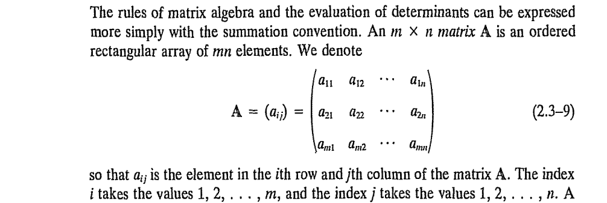

*** The Transpose Operator
#+ATTR_HTML: :width 1600px
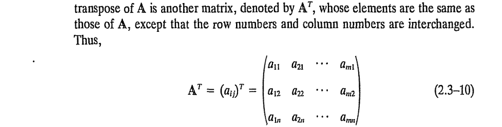

*** The Matrix Product
#+ATTR_HTML: :width 1600px
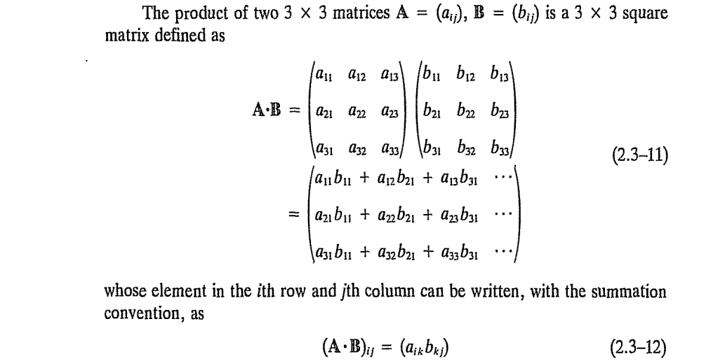

*** The Determinant
#+ATTR_REVEAL: :frag (appear appear appear ...)
- The determinant of a second order tensor is the difference between the sum of triple products of components from each row/column having cyclic permutation with the sum having a reverse cyclic permutation:
  \begin{align}
   \det \boldsymbol{A} = \det [A] & = \left| \begin{matrix} a_{11} & a_{12} & a_{13} \\ a_{21} & a_{22} & a_{23} \\ a_{31} & a_{32} & a_{33} \end{matrix} \right|  \\ & = \epsilon_{rst} A_{r1} A_{s2} A_{t3} \\ & = \epsilon_{rst} A_{1r} A_{2s} A_{3t}
  \end{align}
  
** The $\epsilon-\delta$ Identity
#+ATTR_HTML: :width 1600px
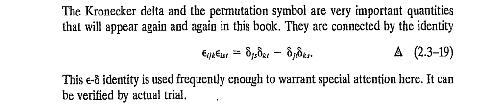

** Study Problems
#+ATTR_HTML: :width 1600px
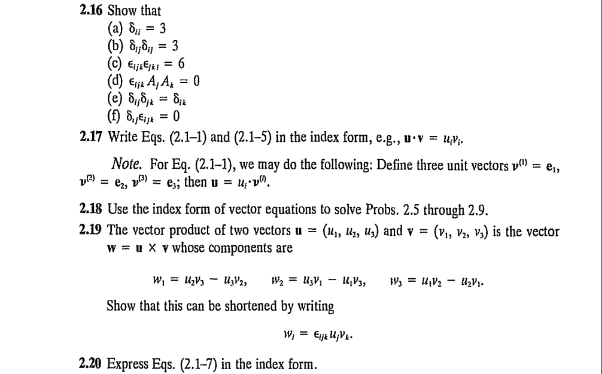

#+REVEAL: split
Problem 2.22
- Derive the vector identity connecting three arbitrary vectors, $\boldsymbol{a}$, $\boldsymbol{b}$, and $\boldsymbol{c}$
  $$ \boldsymbol{a} \times (\boldsymbol{b} \times \boldsymbol{c}) = (\boldsymbol{a} \cdot \boldsymbol{c}) \boldsymbol{b}  - (\boldsymbol{a} \cdot \boldsymbol{b}) \boldsymbol{c} $$
  by using the method of indicial notation.

* ($\S 2.4$) Transformations in Time and Space
- The frame of reference used to record the space-time measurements may be subject to motion. In this case the measurements obtained from two frames (one stationary and the other moving) may be related to one another by appropriate transformations of the time and space variables.
- This section starts by considering two-dimensional frames of reference that are in
  + translation, and,
  + rotation,
  with respect to each other.
- Then we look at the properties of the transformation.
- Finally, rotation in three-dimensional space will be considered.
** Translations in Space-Time in 2-D
#+ATTR_REVEAL: :frag (appear appear appear ...)
- Consider two space-time frames of reference, $Ox_1x_2,t$ and $O'x_{1'}x_{2'},t'$ in a two-dimensional space. The goal is to record the geometry of motion of a body.
  
  @@html:Freehand depiction of the scene@@
  
- Let the unprimed be called as the /initial/ frame and the primed be called as the /current/ frame.
- Let the watch of the /initial/ frame reflect the world clock, while the watch of the primed frame reflects the /process/ time. That is, as the /process/ begins, the time $t$ of the /initial/ frame is at some non-zero number, i.e. $t_0 = c$, where $c \in [0,\infty)$, while the time of the  /current/ frame, $t'$ is reset to zero, i.e. $t'_0 = 0$.
- Let the origins $O$ and $O'$ of both frames be coincident at $t_0$, and the /initial/ frame is kept stationary, while the /current/ frame is allowed to translate away from $O$ during the process.
- The location of an arbitrary point $P$ in two-dimensional space will be $(x_1,x_2)$ with respect to the /initial/ frame, while with respect to the /current/ frame it is $(x_{1'},x_{2'})$.
- The records $(x_1,x_2,t)$ and $(x_{1'},x_{2'},t')$ of the two frames will be related to each other as
  $$ \begin{array}{c} x_1 = x_{1'} + d_1 \\ x_2 = x_{2'} + d_2 \\ t = t' + c \end{array} \quad \mathrm{or} \quad \begin{array}{c} x_{1'} = x_1 - d_1 \\ x_{2'} = x_2 - d_2 \\ t' = t - c \end{array} $$
** Rotating Frame Transformations in 2-D
#+ATTR_REVEAL: :frag (appear appear appear ...)
- Apart from the translation of $O'$, a /current/ frame may also rotate about it's origin during the process.
- Let there be no translation of $O'$ for the sake of clarity. The rotation of the /current/ frame with respect to the /initial/ is measured by the angle between the $x_1$ and $x_{1'}$ axes.
  #+ATTR_HTML: :width 600px
  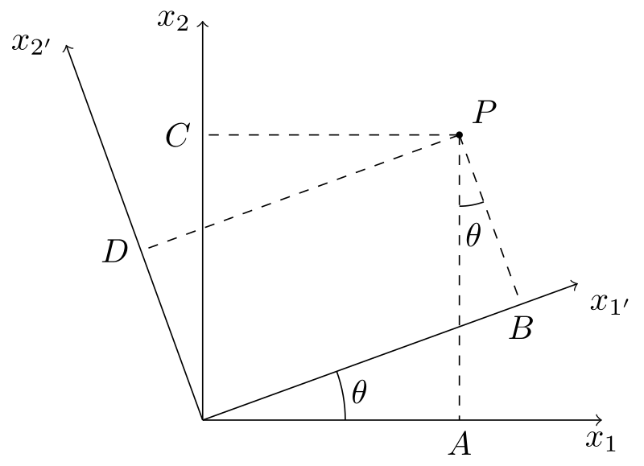
- From the geometry of motion, the components of $P$ in the two frames can be related to each other as a function of $\theta$ as
  $$ \begin{array}{c} x_1 = x_{1'} \cos\theta - x_{2'} \sin\theta \\ x_2 = x_{1'} \sin\theta + x_{2'} \cos\theta \end{array} \quad \mathrm{and} \quad \begin{array}{c} x_{1'} = x_1 \cos\theta + x_2 \sin\theta \\ x_{2'} = -x_1 \sin\theta + x_2 \cos\theta \end{array} $$

*** Under the Matrix Form
- This seems to suggest that, the transformation results from a matrix-vector product as in:
  $$ \begin{Bmatrix} x_{1'} \\ x_{2'} \end{Bmatrix} = \begin{bmatrix} \cos\theta & \sin\theta \\ -\sin\theta & \cos\theta \end{bmatrix} \begin{Bmatrix} x_1 \\ x_2 \end{Bmatrix} $$
#+ATTR_REVEAL: :frag (appear appear appear ...)
- A careful investigation shows that the trigonometric functions of $\theta$ in the matrix are equal to the cosines of the angles between pair of basis vectors.
  #+ATTR_HTML: :width 600px
  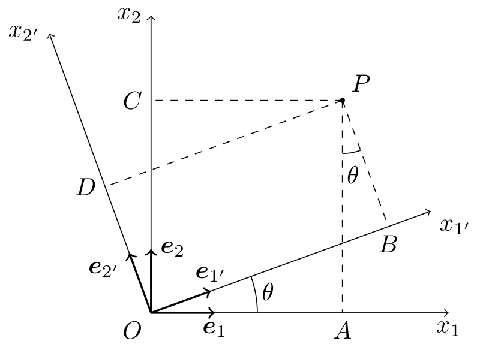
- For example, in the equation for $x_{1'}$, the coefficient of $x_1$ is $\cos\theta = \boldsymbol{e}_{1'} \cdot \boldsymbol{e}_1$.

*** Terms of the Rotation Tensor
- The other terms also reveal a similar pattern.
  \begin{align}
   \boldsymbol{e}_{1'} \cdot \boldsymbol{e}_1 & = \cos\theta \\
   \boldsymbol{e}_{1'} \cdot \boldsymbol{e}_2 & = \cos(90-\theta) = \sin\theta \\
   \boldsymbol{e}_{2'} \cdot \boldsymbol{e}_1 & = \cos(90+\theta) = -\sin\theta \\
   \boldsymbol{e}_{2'} \cdot \boldsymbol{e}_2 & = \cos\theta \\
  \end{align}
#+ATTR_REVEAL: :frag (appear appear appear ...)
- The four equations above can be *compiled* (or /contracted/) into a single indicial equation as
  $$ \beta_{i'j} = \boldsymbol{e}_{i'} \cdot \boldsymbol{e}_j $$
  where $\boldsymbol\beta$ is called the *rotation tensor*.
- Note the similarity and difference between $\beta_{i'j}$ and $\delta_{ij}$.
  
*** Expanded, Indicial and Matrix Forms Revealed
- It is worth noting the equivalence between the *expanded*, /indicial/ (contracted) and *matrix* forms of the transformation side-by-side as
  $$ \begin{array}{c} x_{1'} = \beta_{1'1} x_1 + \beta_{1'2} x_2 \\ x_{2'} = \beta_{2'1} x_1 + \beta_{2'2} x_2 \end{array} \hspace{2em} \mathrm{or} \hspace{2em} x_{i'} = \beta_{i'j} x_j \hspace{2em} \mathrm{or} \hspace{2em} \{x'\} = [\beta] \{x\} $$
#+ATTR_REVEAL: :frag (appear appear appear ...)
- And the reverse transformation reads 
  $$ \begin{array}{c} x_1 = \beta_{1'1} x_{1'} + \beta_{2'1} x_{2'} \\ x_2 = \beta_{1'2} x_{1'} + \beta_{2'2} x_{2'} \end{array} \hspace{2em} \mathrm{or} \hspace{2em} x_j = \beta_{i'j} x_{i'}  \hspace{2em} \mathrm{or} \hspace{2em} \{x\} = [\beta]^T \{x'\}$$
- Note how transposition is implied by a pair of _non-adjacent_ repeating indices. 
- Substitution of one of the transformations above into the other reveals very interesting properties of the *rotation tensor*, and provides good practice about indicial operations, in general.

*** Back-substitution Shows the Identity
- The second set of transformation equations can now be substituted into the first, yielding,
  $$ \begin{array}{c}
   x_{1'} = \beta_{1'1} (\beta_{1'1} x_{1'} + \beta_{2'1} x_{2'}) + \beta_{1'2} (\beta_{1'2} x_{1'} + \beta_{2'2} x_{2'}) \\
   x_{2'} = \beta_{2'1} (\beta_{1'1} x_{1'} + \beta_{2'1} x_{2'}) + \beta_{2'2} (\beta_{1'2} x_{1'} + \beta_{2'2} x_{2'})
  \end{array}. $$
#+ATTR_REVEAL: :frag (appear appear appear ...)
- Upon collecting terms we get,
  $$ \begin{array}{c}
   x_{1'} = (\beta_{1'1} \beta_{1'1} + \beta_{1'2} \beta_{1'2}) x_{1'} + (\beta_{1'1} \beta_{2'1} + \beta_{1'2} \beta_{2'2}) x_{2'} \\
   x_{2'} = (\beta_{2'1} \beta_{1'1} + \beta_{2'2} \beta_{1'2}) x_{1'} + (\beta_{2'1} \beta_{2'1} + \beta_{2'2} \beta_{2'2}) x_{2'}
  \end{array}. $$
- Placing these two equations into their matrix form,
  $$ \begin{Bmatrix} x_{1'} \\ x_{2'} \end{Bmatrix} = \begin{bmatrix}  \beta_{1'1} \beta_{1'1} + \beta_{1'2} \beta_{1'2} & \beta_{1'1} \beta_{2'1} + \beta_{1'2} \beta_{2'2} \\ \beta_{2'1} \beta_{1'1} + \beta_{2'2} \beta_{1'2} & \beta_{2'1} \beta_{2'1} + \beta_{2'2} \beta_{2'2} \end{bmatrix} \begin{Bmatrix} x_{1'} \\ x_{2'} \end{Bmatrix}. $$
- A careful investigation of the summations and free indices shows that the above can be expressed in indicial notation as
  $$ x_{i'} = \beta_{i'k} \beta_{j'k} x_{j'} $$

*** From the Identity to the Inverse
- Reminding that the Kroenecker's symbol has the property of shifting indices of it's argument as in
  $$ x_i = \delta_{ij} x_j, \hspace{1.5em} x_{i'} = \delta_{i'j'} x_{j'}. $$
#+ATTR_REVEAL: :frag (appear appear appear ...)
- This suggests a striking similarity with the last equation $x_{i'} = \beta_{i'k} \beta_{j'k} x_{j'}$. We state that the coefficient of $x_{j'}$ should be equal to a Kroenecker's symbol for the above equation to be valid, i.e.,
  $$ \beta_{i'k} \beta_{j'k} = \delta_{i'j'}. $$
- Recast this into it's matrix form,
  $$ [\beta][\beta]^T = [I] $$
  where $I$ is the *identity matrix*.
  
*** Orthogonality of the Rotation Matrix
#+ATTR_REVEAL: :frag (appear appear appear ...)
- The last equation
  $$ [\beta][\beta]^T = [I], $$
  deserves further attention because the product of two matrices are equal to the identity matrix if only if the matrices are the inverses of each other, i.e.,
  $$ [\beta]^T = [\beta]^{-1}. $$
- Matrices having the above property (their transpose being equal to their inverse) are said to be *orthogonal*, which is proof that the *rotation* matrix is orthogonal.
  
** Rotating Frame Transformations in 3-D
#+ATTR_REVEAL: :frag (appear appear appear ...)
- The coordinate transformation relations that were derived for 2-D
  $$ x_{i'} = \beta_{i'j} x_j, \quad x_{j} = \beta_{i'j} x_{i'}, \quad i={1,2} $$
- are readily available and valid in 3-D as well!
  $$ x_{i'} = \beta_{i'j} x_j, \quad x_{j} = \beta_{i'j} x_{i'}, \quad i={1,2,3} $$
  #+ATTR_HTML: :width 1100px
  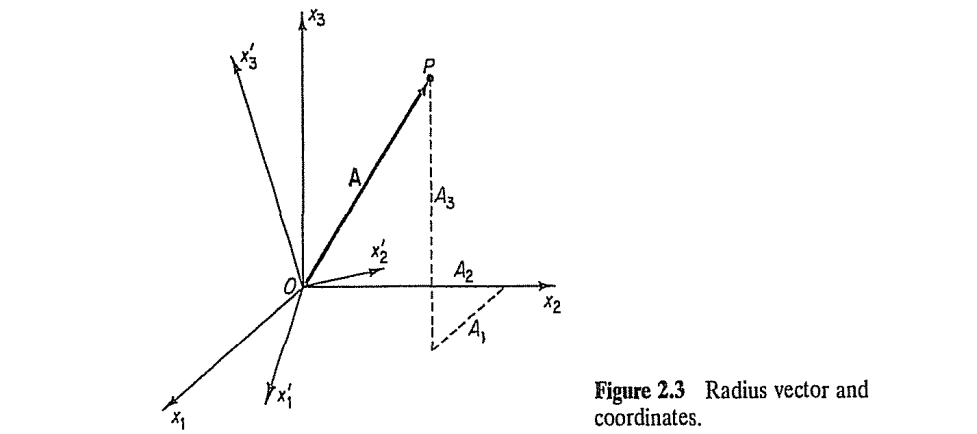

* ($\S 2.10$) The Gradient Operator, $\nabla$
Or partial derivative of a field variable with respect to spatial coordinates.

*** Differential of a single variable function
- Change in a physical variable, $\phi$, is usually denoted by $d$ or $\partial$, is called a *differential* of $\phi$, such as $d\phi$ or $\partial\phi$.
#+ATTR_REVEAL: :frag (appear appear appear ...)
- The choice of correct representation depends on how many other variables it depends on, e.g. if it depends on a single variable such as $\phi(t)$ then the *differential change in variable* $\phi$ with respect to a *differential change in time*, $dt$, is denoted as $$\frac{d\phi}{dt}$$

  #+ATTR_HTML: :width 800px
  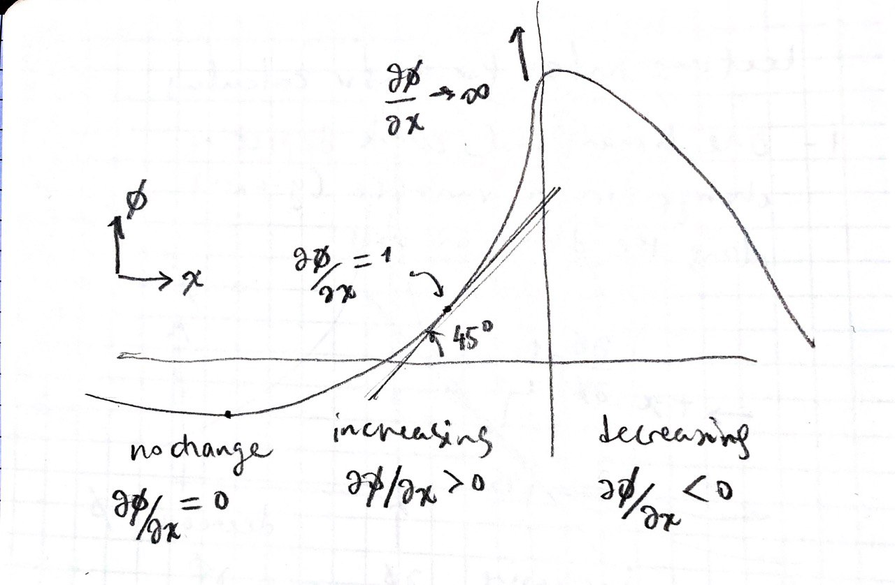

*** Differential of a multi-variable function
- When the physical variable depends on more than one independent variables such as $\phi(x_1, x_2)$, then the *differential change in* $\phi$ with respect to each variable $x_1$ and $x_2$ needs to be considered separately.
#+ATTR_REVEAL: :frag (appear appear appear ...)
- The partial derivatives with respect to each variable are expressed as
  $$ \frac{\partial}{\partial x_1}, \quad \frac{\partial}{\partial x_2}, \quad \mathrm{etc.} $$
- We consider each term as one component of the gradient operator, and define $\nabla$ in a two-dimensional space as:
  $$  \boldsymbol{e}_1 {{\partial}\over{\partial x_1}} + \boldsymbol{e}_2 {{\partial}\over{\partial x_2}} \triangleq \nabla, \quad \mathrm{or} \quad \nabla  = \boldsymbol{e}_i {{\partial}\over{\partial x_i}}, \quad i=1,2$$
- whereas in a three-dimensional space it reads
    $$ \nabla = \boldsymbol{e}_i {{\partial}\over{\partial x_i}}, \quad i=1,2,3$$
    
#+REVEAL: split
- Consider a scalar field variable, $f$, in a two-dimensional domain:
  #+ATTR_HTML: :width 600px
  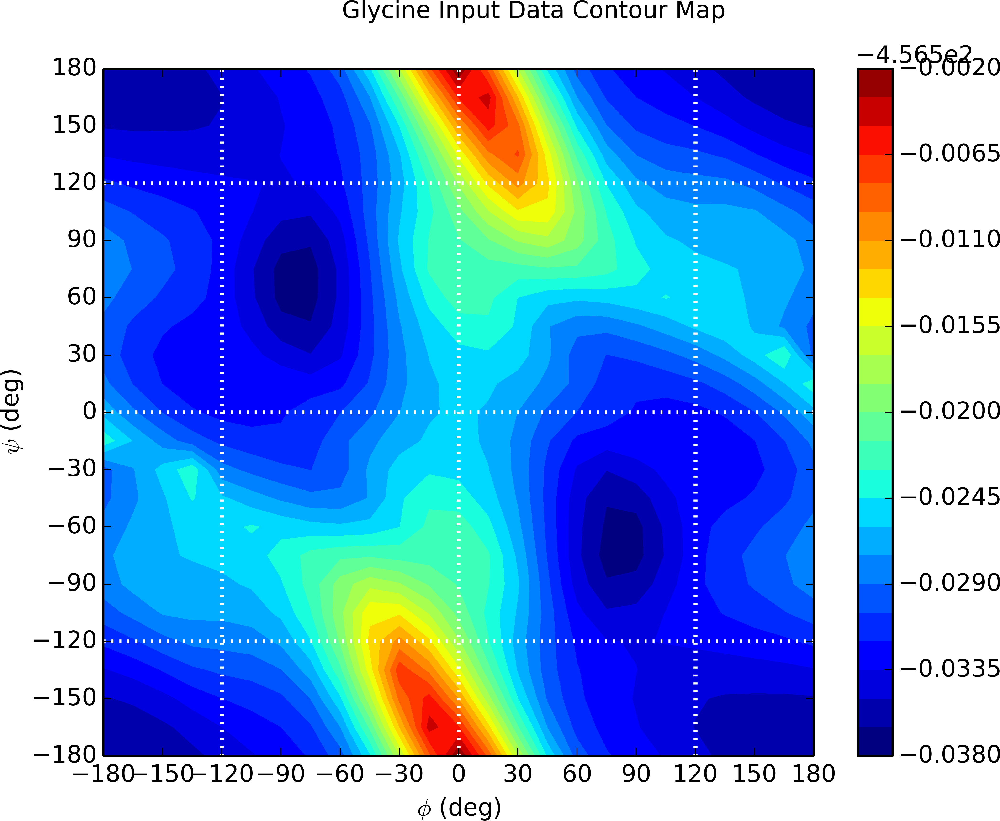
#+ATTR_REVEAL: :frag (appear appear appear ...)
- To find the isocontours, i.e. $df=0$, we invoke the chain rule
  $$ df = {{\partial f}\over{\partial x_1}} d x_1 + {{\partial f}\over{\partial x_2}} d x_2. $$
- where the inner product of the gradient $\nabla$ and a fiber element $d\boldsymbol{x}$ is taken. 

** Gradient of a Scalar Field 
#+ATTR_HTML: :width 1600px

#+REVEAL: split
- Let $\{\boldsymbol{e}_i\}$ be an arbitrary frame. Then, the *gradient*  of a scalar field $\phi = \phi(\boldsymbol{x})$, can be written as
  $$ \nabla \phi = \frac{\partial \phi}{\partial x_i} \boldsymbol{e}_i.$$

#+ATTR_REVEAL: :frag (appear)
- The gradient of a scalar field yields a vector field,
- The partial derivatives may be replaced with shorthand alternatives
  $$ \frac{\partial \Box}{\partial x_i} \equiv \partial_i \Box \equiv \Box_{,i} $$
- e.g. find the gradient of $\phi = y^2 \ln x/\sin(xz)$?
** Gradient of a Vector Field
:PROPERTIES:
:CUSTOM_ID: def-gradient
:END:

Remember the application (https://windy.com) that shows the variation of the atmospheric currents ([[#def-vector-field][Definition of a Vector Field]]).

#+REVEAL: split
- Let $\{\boldsymbol{e}_i\}$ be an arbitrary (Cartesian) frame and let $\boldsymbol{v} = v_i \boldsymbol{e}_i$ denote a vector field. The application of the gradient operator on the vector field is known as a *tensor product* which uses the symbol $\otimes$ as
  \begin{align}
   \nabla \boldsymbol{v} & = \left(\boldsymbol{e}_i \frac{\partial}{\partial x_i}\right) \otimes (v_j \boldsymbol{e}_j) \\
                        & = \frac{\partial v_j}{\partial x_i} \boldsymbol{e}_i \otimes  \boldsymbol{e}_j \\
                        & = v_{j,i} \boldsymbol{e}_i \otimes  \boldsymbol{e}_j 
  \end{align}
#+ATTR_REVEAL: :frag (appear)
- The tensor product operator $\otimes$ is known as the dyadic symbol.
- The resulting vector field derivative $\partial v_j/\partial x_i$ is a second-order tensor.
- The gradient in indicial form can be written in a variety of ways including $$\frac{\partial v_j}{\partial x_i} \equiv \partial_i v_j \equiv v_{j,i}$$
- Confusion related with the ordering of indices and bases prevails.
- e.g. the gradient of vector field $v = 3x^2y \boldsymbol{e}_1 + z\log(y) \boldsymbol{e}_2 - \cos(x^2+z) \boldsymbol{e}_3$.

** Divergence Operator
- The divergence is defined by appyling the gradient operator via a scalar product as in
  $$ \nabla \cdot \Box $$
#+ATTR_REVEAL: :frag (appear)
- For example, by taking the gradient of a vector field $\boldsymbol{v}$ we get
  \begin{align}
  \nabla \cdot \boldsymbol{v} & = \left(\boldsymbol{e}_i \frac{\partial}{\partial x_i}\right) \cdot (v_j \boldsymbol{e}_j) \\
                        & = \frac{\partial v_j}{\partial x_i} \boldsymbol{e}_i \cdot  \boldsymbol{e}_j \\
                        & = v_{j,i} \delta_{ij} \\
                        & = v_{i,i} \\
                        & = v_{1,1} + v_{2,2} + v_{3,3}
  \end{align}                        

#+REVEAL: split
- Physical Context: Incompressible Fluid Flow
  #+BEGIN_QUOTE
  Consider a fluid with velocity field \(\boldsymbol{v}(\boldsymbol{x}, t)\). The divergence \(\nabla \cdot \boldsymbol{v}\) measures the *net volume flux* per unit volume at a point.
  #+END_QUOTE
  
*** Examples from Mechanics
#+ATTR_REVEAL: :frag (appear)
- Conservation of Mass: $$\frac{\partial \rho}{\partial t} + \nabla \cdot (\rho \boldsymbol{v} ) = 0$$
- Conservation of Linear Momentum: $$\rho \dot{\boldsymbol{v}} = \nabla \cdot \boldsymbol{S} + \rho \boldsymbol{b}$$
  
** Curl Operator
- The *curl* is defined by appyling the gradient operator via a vector product as in
  $$ \nabla \times \Box $$
#+ATTR_REVEAL: :frag (appear)
- For example, by taking the gradient of a vector field $\boldsymbol{v}$ we get
  \begin{align}
  \nabla \times \boldsymbol{v} & = \left(\boldsymbol{e}_i \frac{\partial}{\partial x_i}\right) \times (v_j \boldsymbol{e}_j) \\
                        & = \frac{\partial v_j}{\partial x_i} \boldsymbol{e}_i \times  \boldsymbol{e}_j \\
                        & = \epsilon_{ijk} v_{j,i} \boldsymbol{e}_k 
  \end{align}
- Curl provides a measure of *vorticity* of a vector field.

** Summary
#+ATTR_HTML: :width 1600px
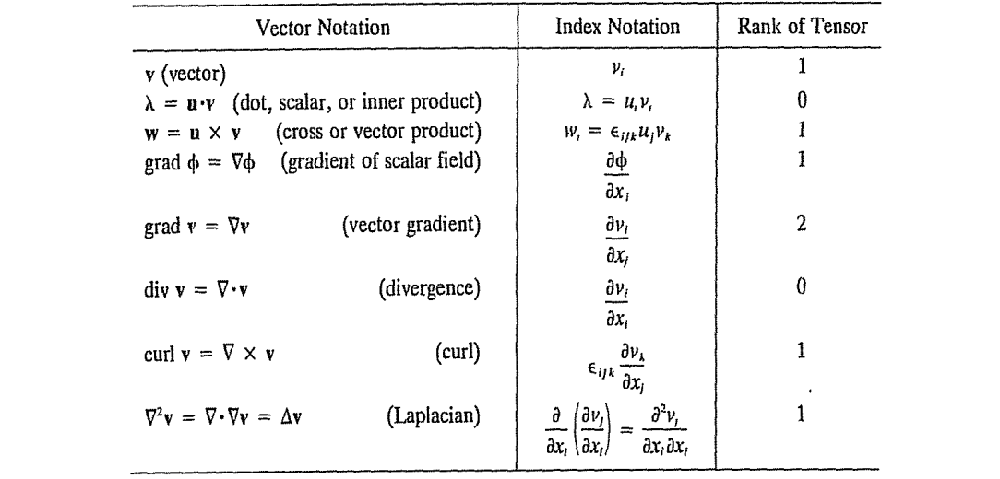

** Study Problems
Use the index notation and summation convention to prove the following relations:
- (a) $\boldsymbol{u} \times \boldsymbol{v} = - \boldsymbol{v} \times \boldsymbol{u}$
- (b) $(\boldsymbol{s} \times \boldsymbol{t}) \cdot (\boldsymbol{u} \times \boldsymbol{v}) = (\boldsymbol{s} \cdot \boldsymbol{u}) (\boldsymbol{t} \cdot \boldsymbol{v}) - (\boldsymbol{s} \cdot \boldsymbol{v}) (\boldsymbol{t} \cdot \boldsymbol{u})$
- (c) $\mathrm{curl}\; \mathrm{curl}\, \boldsymbol{v} = \mathrm{grad}\; \mathrm{div}\, \boldsymbol{v} - \Delta \boldsymbol{v}$

#+REVEAL: split
Let $\boldsymbol{r}$ be the radius vector of a typical point in a field and $r$ be the magnitude of $\boldsymbol{r}$. Prove that
- (a) $\mathrm{div}\,(r^n \boldsymbol{r}) = (n+3) r^n$
- (b) $\mathrm{curl}\, (r^n \boldsymbol{r}) = 0$
- (c) $\Delta(r^n) = n(n+1) r^{n-2}$

#+REVEAL: split
#+ATTR_HTML: :width 1600px
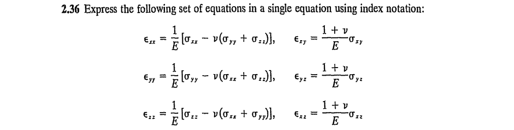

#+REVEAL: split
#+ATTR_HTML: :width 1600px

