#+TITLE:  Chapter 3: The Stress Hypothesis
#+AUTHOR: Fethi Okyar
#+DATE: 2026-03-19
#+SUBTITLE: Reading: [Fung/94] Chapter 3
#+STARTUP: overview
#+REVEAL_THEME: simple
#+REVEAL_INIT_OPTIONS: slideNumber:"c/t", width:1920, height:1080
#+REVEAL_TITLE_SLIDE: <h2>%t</h2> <h3>%s</h3> <h4>%d</h4>
#+OPTIONS: timestamp:nil toc:1 num:nil
#+REVEAL_EXTRA_CSS: ../style.css
#+REVEAL_ROOT: https://cdn.jsdelivr.net/npm/reveal.js
#+HTML_HEAD_EXTRA: 

* ($\S1.6$) The Stress/Traction Hypothesis
Consider a material $B$ occupying a spatial region $V$. The body is /transmitting/ a balanced load system shown with /surface forces/ in @@html:red@@ and /boundary constraints/ in @@html:blue@@. A *traction field* arises within the body during this transmission. The word *traction* roughly describes the flow of load per unit area. To /illuminate/ the traction field in a region /visualize/ an enclosing surface $S$ around it and /imagine/ the interaction between the /inside/ ($-$) and the /outside/ ($+$) of $S$. 
#+ATTR_HTML: :width 1600px
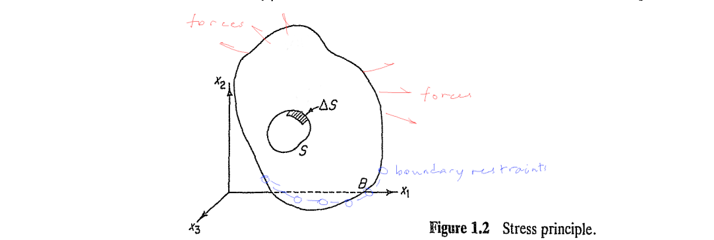

** The Stress/Traction Hypothesis
Let a neighborhood $\Delta S$ on $S$ have an /outward unit normal/ $\boldsymbol{\nu}$, with its direction pointing outward from the interior. Let the  /accumulation of load/ applied by the ($+$) side on the ($-$) side passing thru $\Delta S$ be represented by $\Delta \mathbf{F}$. The *stress hypothesis* can be stated: /as/ $\Delta S$ /tends to a small but bounded size/ $\alpha$, /the ratio/ $\Delta \mathbf{F}/\Delta S$ /tends to a definite limit/ $d\mathbf{F}/dS$, /and the moment of the force acting on the surface/ $\Delta S$ /about any point within the area vanishes/. This limiting vector, called as the *traction* or the *stress vector* can be written as
$$ \overset{\nu}{\mathbf{T}} = \frac{d\mathbf{F}}{dS}. $$
#+ATTR_HTML: :width 1600px
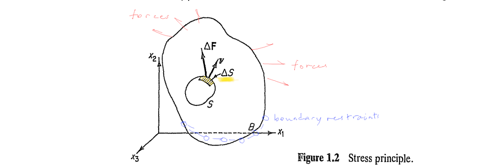

*** Tractions on Cartesian Planes
- At an internal point, the standard procedure is to calculate the tractions $\overset{1}{\mathbf{T}}, \overset{2}{\mathbf{T}}, \overset{3}{\mathbf{T}}$ that arise on the planes cornered by a Cartesian triad $\boldsymbol{e}_1, \boldsymbol{e}_2, \boldsymbol{e}_3$. 
  #+ATTR_HTML: :width 1600px
  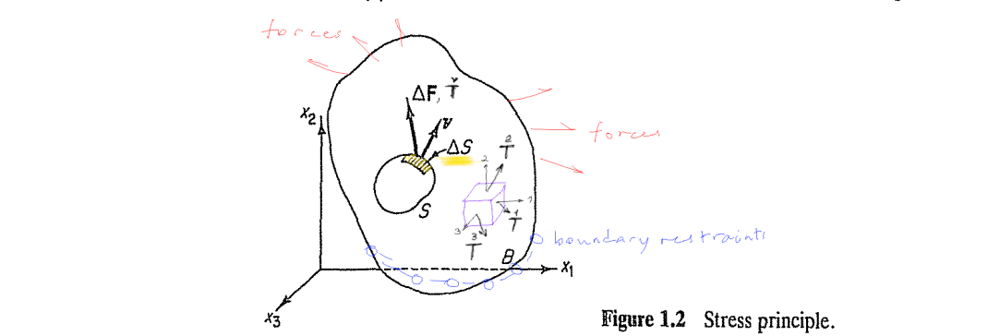
#+ATTR_REVEAL: :frag (appear appear appear ...)
- We combine the three Cartesian tractions as the columns of the transpose of a tensor $\boldsymbol{\tau}$ as
  $$ \left[ \overset{1}{\mathbf{T}}, \overset{2}{\mathbf{T}}, \overset{3}{\mathbf{T}} \right] \triangleq [\tau]^\mathsf{T}  $$

*** The Stress Tensor
- The tensor, $\boldsymbol{\tau}$, constructed by stacking the three Cartesian internal traction vectors in rows is called as the *stress tensor*. The stress tensor components read
  $$ \begin{bmatrix} \tau_{11} & \tau_{12} & \tau_{13} \\ \tau_{21} & \tau_{22} & \tau_{23} \\ \tau_{31} & \tau_{32} & \tau_{33} \end{bmatrix} = \begin{bmatrix} \overset{1}{T_1} & \overset{1}{T_2} & \overset{1}{T_3} \\ \overset{2}{T_1} & \overset{2}{T_2} & \overset{2}{T_3} \\ \overset{3}{T_1} & \overset{3}{T_2} & \overset{3}{T_3} \end{bmatrix} \hspace{2em} \mathrm{or} \hspace{2em} \tau_{ij} = \overset{i}{T_j} $$
  #+ATTR_HTML: :width 1400px
  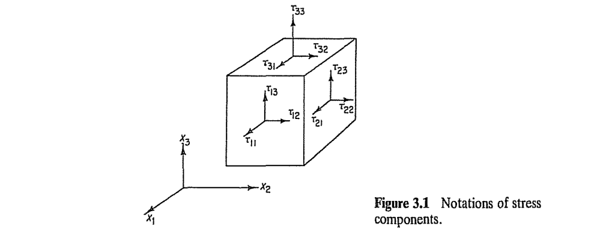

*** Properties of Internal Traction Vectors
- The state of stress at a point in a material is described by internal traction vectors on a differential cube element.
  
  @@html:Freehand depiction of traction vectors on the cube@@
#+ATTR_REVEAL: :frag (appear appear appear ...)
- The differential cube has six faces, three of which have ($+$) normals and the other three have ($-$) normals.
- The three traction vectors corresponding to ($+$) faces are  $\overset{1}{\mathbf{T}}, \overset{2}{\mathbf{T}}, \overset{3}{\mathbf{T}}$, and the other three associated with the ($-$) faces are $\overset{-1}{\mathbf{T}}, \overset{-2}{\mathbf{T}}, \overset{-3}{\mathbf{T}}$.
- The action-reaction principle of Newton can be used to relate the traction vectors on opposite cube faces as
   $$ \overset{i}{\mathbf{T}} = -\overset{-i}{\mathbf{T}} \hspace{2em} \mathrm{or} \hspace{2em} \overset{i}{T_j} = -\overset{-i}{T_j} $$
- It is standard convention to decompose the traction vector, $\overset{\nu}{\mathbf{T}}$, into it's *normal* part, $(\boldsymbol{\nu} \cdot \overset{\nu}{\mathbf{T}}) \boldsymbol{\nu}$, and it's remaining part, $\overset{\nu}{\mathbf{T}} - (\boldsymbol{\nu} \cdot \overset{\nu}{\mathbf{T}}) \boldsymbol{\nu}$, which is *in-plane* of the surface.

*** Properties of Stress Components
- In parallel with the parts of the internal traction vectors, the stress components that are normal to the plane are called as *normal stress* while those components which are in-plane are known as *shear stress*.
  $$ \mathrm{normal} \left\{ \begin{array}{c} \tau_{11} \\ \tau_{22} \\ \tau_{33} \end{array} \right. \hspace{2em} \mathrm{shear}  \left\{ \begin{array}{c} \tau_{12}, \tau_{13} \\ \tau_{21}, \tau_{23} \\ \tau_{31}, \tau_{32} \end{array} \right. $$
  
  @@html:Freehand depiction of traction vectors on the cube@@
#+ATTR_REVEAL: :frag (appear appear appear ...)
- The normal stresses are given a ($+$) sign if they point away from the surface (in *tension*) and a ($-$) sign if they point towards the surface (in *compression*).
- The shear component (e.g. $\tau_{ij}$) is considered as positive if it is acting in the $+j$ direction on a plane that has a normal in $+i$ direction, or is in the $-j$ direction on a plane that has a normal in $-i$ direction.
*** Examples
- Show the following stress components on a differential cube element $\tau_{11} = 12$ MPa, $\tau_{21} = -6$ MPa, $\tau_{31} = 5$ MPa, and $\tau_{33} = -8$ MPa, with all the remaining stress components identically equan to zero.
#+ATTR_REVEAL: :frag (appear appear appear ...)
- Write the components shown on the stress cube in matrix form.
  #+ATTR_HTML: :width 600px
  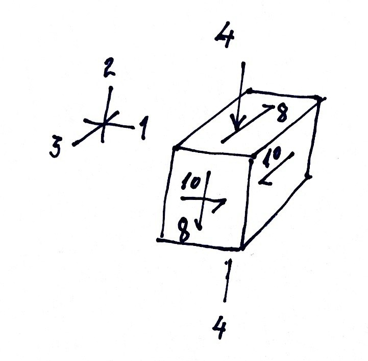
  
* ($\S1.11$) Examples to Elementary Traction Fields
** Slender Cylindrical (Axial) Members 
A /member/ (independent part of a structure) is said to be */slender/*, if it has a great length to thickness ratio, i.e., $L/T>>1$, and a constant or slightly-varying cross section swept along the *normal* to the cross-section plane (a.k.a. member's /longitudinal/ or /axial/ direction). Such objects in geometry are known as /cylinders/.
#+ATTR_HTML: :width 1200px
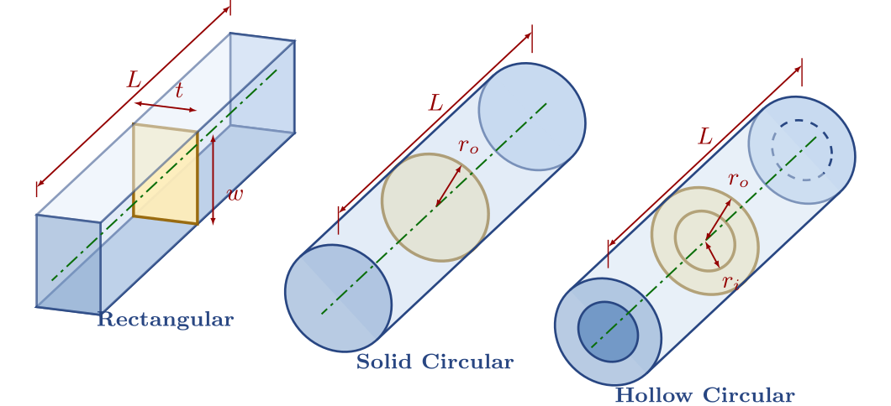

*** Axially Loaded Cylindrical Members
- Consider a member under a *compressive* force $W$. We say that the beam is axially loaded without shear. Applying the stress  hypothesis, we will obtain the relevant *traction vector*. 
  #+ATTR_HTML: :width 1000px
  [[./images/FU94_1.11figure9a-uniaxial.png]]
#+ATTR_REVEAL: :frag (appear appear appear ...)
- Relabel coordinates ($x\to x_1$, $y\to x_2$, $z\to x_3$).
- Take a section of the member using the  $x_3$ plane from the /mid-span/ (region)

  The mapping $\boldsymbol{\nu} \to \boldsymbol{e}_3$ yields $\overset{\nu}{\mathbf{T}} \to \overset{3}{\mathbf{T}}$

*** Derivation of Nominal Normal Stress (Assumptions and Conventions)
About the traction flow, we assume that:
- there is no reason that the load /would distribute non-uniformly/ over the cross-section!! (i.e., there is *uniform distribution*, $dW/dA = W/A$, leading to
  $$ \overset{3}{T_3} = \tau_{33} = \sigma = \frac{W}{A}. $$
  Here $\sigma$ denotes the *nominal* /normal/ stress. It has units of load per area (e.g. N/cm$^2$).
#+ATTR_REVEAL: :frag (appear appear appear ...)
- Under uniaxial loading, and in planes with normals parallel to the load axis, *only normal traction* arises (no shear tractions, i.e. $\overset{3}{T_1} = \overset{3}{T_2} = 0$).
- Over planes that contain the load axis (whose normal will not not have an $\boldsymbol{e}_3$ component), *zero traction* previals!! That means $\overset{1}{\mathbf{T}}=\mathbf{0}$ and $\overset{2}{\mathbf{T}}=\mathbf{0}$, which yield the state of stress
  $$ [\tau] = \begin{bmatrix} 0 & 0 & 0 \\ 0 & 0 & 0 \\ 0 & 0 & \tau_{33} \end{bmatrix} $$
- The given state of stress (having all shear terms identically zero) is also known as a state of *principal stress*. 
  
*** Example: [[https://openoregon.pressbooks.pub/bodyphysics2ed/chapter/stress-and-strain-on-the-body/][Loading of the Femur]]
#+ATTR_HTML: :width 500px
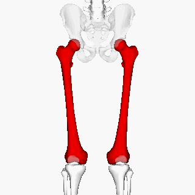

- Femur is the largest and most massive bone in the our body.
  1. Assume the load component in the axial-plane to be negligible?? (which is the same as saying the load is entirely axial and no shear component is taken)
  2. Using average values for a standard female, determine the normal compressive stress. (search keywords: CDC standard anthropometric measurements female data)
  3. Knowing the femur axis deviates from the vertical (gravity axis) on the average by some small angle (e.g. 9 degrees), what is a more realistic state of stress?
 
#+REVEAL: split
State of Stress on a Plane that is Not Normal to the Load.
#+ATTR_HTML: :width 1900px
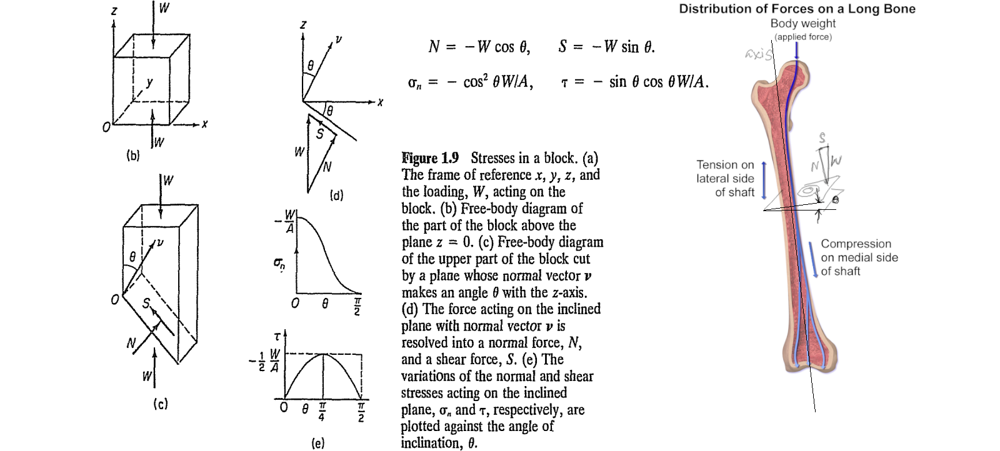
- Assume a deviation of 8 degrees between the axial load and the femoral axis, determine the shear stress to normal stress ratio observed on an axial plane.

** Plates under Plane Stress
*** Plane State of Stress
- thin flat plates or membranes stretched by in-plane load systems
  #+ATTR_HTML: :width 1600px
  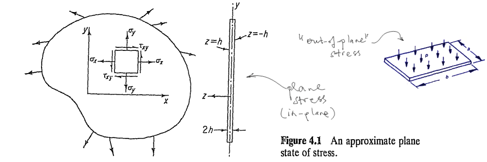
#+ATTR_REVEAL: :frag (appear appear appear ...)
- found in ship hulls, pressurized bodies, wings, panels
- under these conditions the /out-of-plane/ stress components vanish.
- if you choose a reference coordinate frame whose any two axes lie along the plate's plane, then you get a reduced stress tensor, such that (continue to next section)

*** Reduction of the Stress Tensor to 2-D
- We may choose the plate coordinate pair to be $(1,2)$, $(2,3)$, or $(1,3)$, in which cases the corresponding stress tensors would read:
  $$ \tau_{ij} = [\tau] = \begin{bmatrix}  \tau_{11} & \tau_{12} & 0 \\ \tau_{21} & \tau_{22} & 0 \\ 0 & 0 & 0 \end{bmatrix}, \, \{i,j=1,2\}, \quad \begin{bmatrix} 0 & 0 & 0 \\ 0 & \tau_{22} & \tau_{23} \\ 0 & \tau_{32} & \tau_{33} \end{bmatrix}, \, \{i,j=2,3\}, \quad  \mathrm{or}, \; \begin{bmatrix}  \tau_{11} & 0 & \tau_{13} \\ 0 & 0 & 0 \\ \tau_{31} & 0 & \tau_{33} \end{bmatrix}, \, \{i,j=1,3\} $$
#+ATTR_REVEAL: :frag (appear appear appear ...)
- The two non-zero coordinate components can be combined in a /reduced/ stress tensor, depicting the /state of plane stress/ as
  $$ \tau_{ij} = [\tau] = \begin{bmatrix}  \tau_{11} & \tau_{12} \\ \tau_{21} & \tau_{22} \end{bmatrix}, \, \{i,j=1,2\} $$
- There is no special symbol or indicator, whatsoever, that is used when the dimension of space is reduced from 3 to 2, $[\tau]$ prevails. The dimensionality is understood from the context.

*** The Scapula (A flat bone)
#+ATTR_HTML: :width 800px
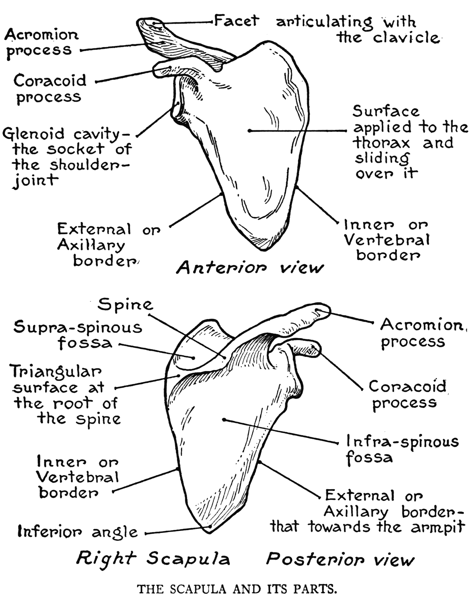

*** Loading and Fracture of Scapula
- The state of /in-plane loading/ of the scapula, and the most frequently observed *fracture modes* (according to [[https://orthoinfo.aaos.org/en/diseases--conditions/scapula-shoulder-blade-fractures/][OrthoInfo]])
  #+ATTR_HTML: :width 1300px
  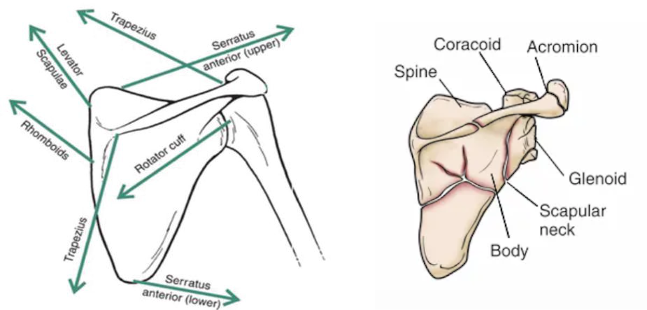
#+ATTR_REVEAL: :frag (appear appear ...)  
- A nominal stress calculation does not exist for this case (details about loading and boundary restraints should be provided to pose a proper /boundary-value problem/)
  
** Stresses in Pressurized Vessels
Many biological examples of pressurized biological tissue may be provided.
#+ATTR_REVEAL: :frag (appear appear ...)  
- Lung tissue: Maintains subatmospheric interstitial pressure (−2 to −9 mmHg) due to elastic recoil, crucial for alveolar expansion and gas exchange.
- Kidney: Encapsulated organ with positive interstitial pressure (up to +10 mmHg), aiding fluid filtration and urine formation.
- Vasculatory system components, veins are pressurized biological tissues, but they operate under much lower pressure compared to arteries. 
* ($\S3.2$) Laws of Motion
- Let the space occupied by a material body $B$ at time $t$, be denoted it's configuration $B(t)$.
- Let $\boldsymbol{r}$ denote the position vector of a material point $X$.
- Utilize cartesian coordinates $x_i,\,i=1,2,3$ for spatial meaurements.
- Consider a differential volume element $dv$ around $X$.
- Let $\rho$ denote the mass density field and $\boldsymbol{v}=\dot{\boldsymbol{r}}$ denote the velocity field in $B$. 

** Balance of Mass
#+ATTR_REVEAL: :frag (appear)  
- The total mass of the material configuration $B(t)$ can be expressed by integration.
- We can denote the mass enclosed in $dV$ by $\rho dV$.
- Then the total mass of $B$ at time $t$ becomes
  $$ \mathcal{M} = \int_{B(t)} \rho dV $$
- The rate of change of the total mass is shown by
  $$ \dot{\mathcal{M}} = \frac{D \mathcal{M}}{Dt} = \frac{D}{Dt} \int_{B(t)} \rho dV = \int_{B(t)} \frac{D}{Dt} (\rho dV) = \int_{B(t)} (\rho dV)^{\!\bullet}  $$
  where $\frac{D}{Dt}(\ldots)$ and $(\ldots)^{\!\bullet}$ denote the /material time derivative/ operator, taking the derivative with respect to configurational changes of the material body $B$ with time.
- The conservation of mass of a body is expressed by setting
  $$ \dot{\mathcal{M}} = 0 $$
  
#+REVEAL: split
**** Notes of Importance
#+ATTR_REVEAL: :frag (appear)  
1. the balance of mass states that the net change in mass is given by the material time rate of the mass integral, $\dot{\mathcal{M}}$.
2. the role of material time derivative to highlight the difference between $\int_B (\cdots)^{\!\bullet}$ and $\int_{B(t)} (\cdots)^{\!\bullet}$
3. Ask GPT:
   #+BEGIN_QUOTE
   How would you describe the difference between a time derivative in the usual (/partial/) sense and that for a body in motion in the *total* sense? If possible, supply an image of a traveling (material) window versus a fixed (spatial) window highlighting the difference between tracking the motion of a group of particles versus observing the flow through a control volume.
   #+END_QUOTE

** Balance of Linear Momentum
#+ATTR_REVEAL: :frag (appear)  
- The total linear momentum of the material configuration $B(t)$ can also be expressed by integration.
- We denote the linear momentum of the mass $\rho dV$ by multiplying it with its velocity as $\boldsymbol{v} \rho dV$.
- Then the total linear momentum of $B$ at time $t$ becomes
  $$ \mathcal{P} = \int_{B(t)} \boldsymbol{v} \rho dV $$
- Euler interpreted Newton's equation of motion of a particle for a body by stating that the rate of change of linear momentum is equal to the resultant of all external mechanical effects (loads) as
  $$ \dot{\mathcal{P}} = \mathcal{F} $$
  where $\dot{\mathcal{P}}$ denotes the material time derivative of the linear momentum and $\mathcal{F}$ denotes the net external force on $B$.

*** Classification of External Loads
#+ATTR_REVEAL: :frag (appear)  
- In the mechanics of continuous media, there are two types of external forces acting on material bodies.
  #+ATTR_REVEAL: :frag (appear)  
  1. Body forces, acting on volume elements (forces per unit volume).
     #+ATTR_REVEAL: :frag (appear)  
     - $\boldsymbol{X}$ or $\boldsymbol{b}$ 
     - gravitational loads ($\rho \boldsymbol{g}$ has units of force per volume)
       $$ \int_{B(t)} \boldsymbol{b} dV = \int_{B(t)} \boldsymbol{g} \rho dV$$
     - electromagnetic loads
  2. Surface forces, or surface tractions, acting on surface elements (forces per unit area).
     #+ATTR_REVEAL: :frag (appear)  
     - surface traction due to mechanical contact
       $$ \overset{\nu}{\boldsymbol{T}} \quad \mathbf{or} \quad \overset{\nu}{\boldsymbol{t}} \quad \to \quad \int_{\partial B(t)} \overset{\nu}{\boldsymbol{t}} dA $$
     - aerodynamic pressure (units of force per area), $-p\boldsymbol{n}$
       where $\boldsymbol{n}$ is the unit outward normal at the surface of $B$.
     - drag force in viscous flows

*** Balance of Linear Momentum (with forces)
Replacing the general expression of the resultant of external forces, $\mathcal{F}$ with the above force type definitions, we arrive at the terminal integral expression
$$ \int_{\partial B(t)} \overset{\nu}{\boldsymbol{t}} dA +  \int_{B(t)} \boldsymbol{b} dV =  \int_{B(t)} (\boldsymbol{v} \rho dV)^{\!\bullet} $$

** Balance of Moment of Momentum
#+ATTR_REVEAL: :frag (appear)  
- The integral of the moment of momentum of the differential mass element about the origin $O$, $\boldsymbol{r} \times \boldsymbol{v} \rho dV$, over the domain $B(t)$, i.e.,
  $$ \mathcal{H}^O = \int_{B(t)} \boldsymbol{r} \times \boldsymbol{v} \rho dV $$
  is the /moment of momentum/ of the configuration at $B(t)$.
- According to Euler, the law of motion for a continuum asserts that the /rate of change of the moment of momentum is equal to the net applied torque $\boldsymbol{r} \times \mathcal{F}$ about the origin/, i.e.,
  $$ \dot{\mathcal{H}}^O = \boldsymbol{r} \times \mathcal{F} $$
- Replacing $\mathcal{F}$ with the force definitions, we the second vector equation of motion
  $$ \int_{\partial B(t)} \boldsymbol{r} \times \overset{\nu}{\boldsymbol{t}} dA +  \int_{B(t)} \boldsymbol{r} \times \boldsymbol{b} dV =  \int_{B(t)} (\boldsymbol{r} \times \boldsymbol{v} \rho dV)^{\!\bullet} $$

* ($\S3.3$) Cauchy's Formula
Relates the components of the traction that resides over a plane with a normal $\nu$, with the unit normal and the stress tensor components.
$$ \overset{\nu}{t_j} = \nu_i \tau_{ij} $$
Note that similar relations between the traction vector components on cartesian planes, the base vector and stress tensor components exists:
\begin{align}
 \overset{1}{t_j} & = \boldsymbol{e}_{1i} \tau_{ij} \\
 \overset{2}{t_j} & = \boldsymbol{e}_{2i} \tau_{ij} \\
 \overset{3}{t_j} & = \boldsymbol{e}_{3i} \tau_{ij} \\
\end{align}
 
#+REVEAL: split
#+ATTR_HTML: :width 1600px
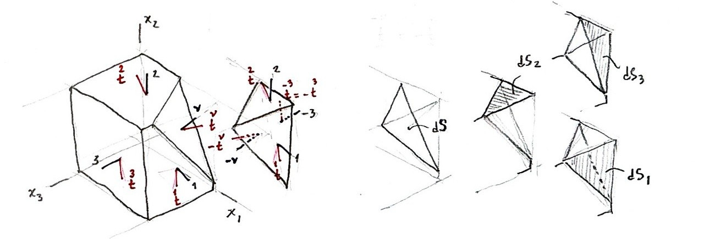
#+ATTR_REVEAL: :frag (appear)  
- The internal surface traction at a point $P$ over a plane with a normal $\nu$ was defined by $\overset{\nu}{\boldsymbol{T}}$ or $\overset{\nu}{\boldsymbol{t}}$. The traction over the opposite plane (with a normal $-\nu$) is equal in magnitude but opposite in direction, i.e. $\overset{-\nu}{\boldsymbol{t}} = -\overset{\nu}{\boldsymbol{t}}$.
- This is also true for the tractions that lie over cartesian planes, e.g.  $\overset{-1}{\boldsymbol{t}} = -\overset{1}{\boldsymbol{t}}$, etc.
- From geometry, we define the area formed by the intersection of an oblique plane with normal $\nu$, and the three other cartesian planes, as $dS$.
- The projection of $dS$ onto the cartesian plane $i$ (perpendicular to $x_i$) is given by $dS_i = \nu_i dS$.

** Motion Law Applied to a Tetrahedron Cut
#+ATTR_HTML: :width 1100px
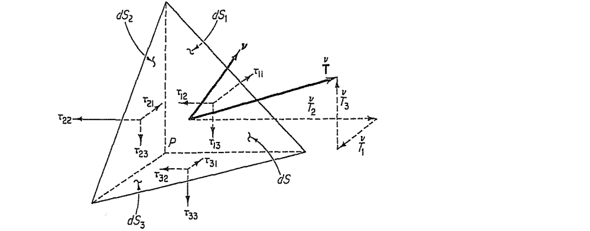
#+ATTR_REVEAL: :frag (appear)  
- For the tetrahedron cut with four surfaces ($dS_i, dS$) and volume $dV={{1}\over{3}}h dS$:
- Surface forces: $-\overset{1}{\boldsymbol{t}} dS_1$, $-\overset{2}{\boldsymbol{t}} dS_2$, $-\overset{3}{\boldsymbol{t}} dS_3$ on cartesian planes and $\overset{\nu}{\boldsymbol{t}} dS$ on the oblique plane
- Body force: $\boldsymbol{b} {{1}\over{3}}h dS$.
- Inertial term: $\dot{\boldsymbol{v}} {{1}\over{3}}h dS$.

#+REVEAL: split
#+ATTR_HTML: :width 1100px

#+ATTR_REVEAL: :frag (appear)  
- The balance of linear momentum for the tetrahedron cut reads:
  $$ -\overset{1}{\boldsymbol{t}} dS_1 - \overset{2}{\boldsymbol{t}} dS_2 - \overset{3}{\boldsymbol{t}} dS_3 + \overset{\nu}{\boldsymbol{t}} dS + \boldsymbol{b} {{1}\over{3}}h dS = \dot{\boldsymbol{v}} {{1}\over{3}}h dS $$
- Replacing $dS_i = \nu_i dS$, dividing by $dS$, and taking the limit as $h \to 0$, we obtain
  $$ \overset{\nu}{\boldsymbol{t}} = \nu_1 \overset{1}{\boldsymbol{t}} + \nu_2 \overset{2}{\boldsymbol{t}} + \nu_3 \overset{3}{\boldsymbol{t}} $$

#+REVEAL: split
#+ATTR_HTML: :width 1100px

#+ATTR_REVEAL: :frag (appear)  
- Arranging the components $\nu_i$ in a vector form and the vectors $\overset{i}{\boldsymbol{t}}$ in a matrix form yields
  $$ \overset{\nu}{\boldsymbol{t}} = \{\nu_1\; \nu_2\; \nu_3 \} \begin{bmatrix} -\; \overset{1}{\boldsymbol{t}} \to \\ -\; \overset{2}{\boldsymbol{t}} \to \\ -\; \overset{3}{\boldsymbol{t}} \to \end{bmatrix} $$
- and noting that the matrix components $\overset{i}{t}_j$ corresponds identically with the stress tensor components $\tau_{ij}$, we get the Cauchy's Formula $\overset{\nu}{t}_j = \nu_i \tau_{ij}$. 

* ($\S3.5$) Transformation of Stress Components
Remember how coordinates of a point, $x_j,\,j=1,2,3$, could be transformed from the basis $\boldsymbol{e}_j$ into another bases $\boldsymbol{e}_{i'}$?
- We the rotation tensor definition $\beta_{i'j} = \boldsymbol{e}_{i'} \cdot \boldsymbol{e}_j$ for this purpose, and write the transformed coordinates as
  $$ x_{i'} = \beta_{i'j} x_j $$
- Can this approach be used to transform the stress tensor components, $\tau_{ij} \to \tau_{i'j'}$?

** The Rotation Tensor Transforms a Second-Order Tensor
#+ATTR_HTML: :width 1100px
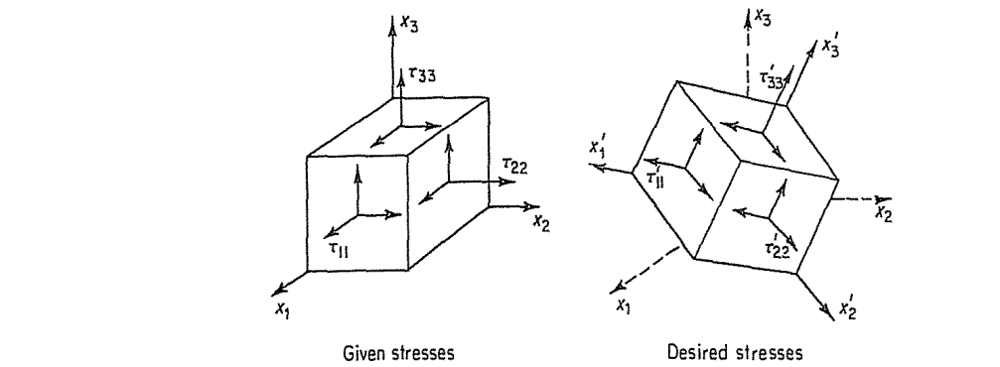
#+ATTR_REVEAL: :frag (appear)  
- Stress is a second-order tensor with two indices $\tau_{ij}$ where the components are expressed with respect to a particular coordinate frame using a set of basis vectors, $\boldsymbol{e}_i$.
- Consider an alternative coordinate frame using it's own set of basis vectors, $\boldsymbol{e}_{j'}$.
- How are the stress components in the two frames, $\tau_{ij}$ and $\tau_{i'j'}$ related?

educational application hub:
- [[https://eduapphub.com/apps/app.php?dir=2Dstresstransform]]
- https://eduapphub.com/apps/app.php?dir=3Dstresstransform
* ($\S3.7$) Boundary Conditions
