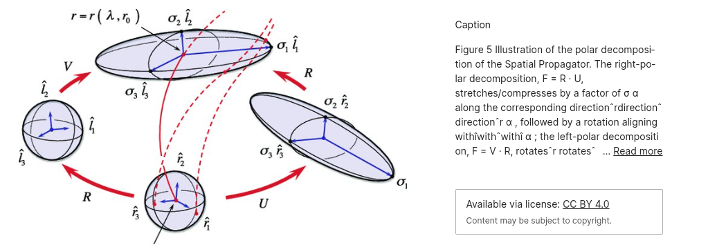
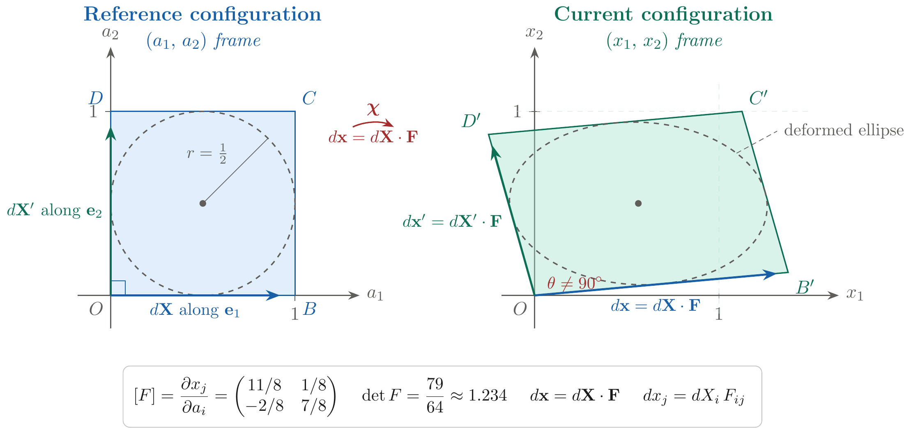

#+TITLE:  Chapter 5: Deformation and Strain
#+AUTHOR: Fethi Okyar
#+DATE: 2026-04-25
#+SUBTITLE: Reading: [Fung/94] Chapter 5
#+STARTUP: overview
#+REVEAL_THEME: simple
#+REVEAL_INIT_OPTIONS: slideNumber:"c/t", width:1920, height:1080
#+REVEAL_TITLE_SLIDE: <h2>%t</h2> <h3>%s</h3> <h4>%d</h4>
#+OPTIONS: timestamp:nil toc:1 num:nil
#+REVEAL_EXTRA_CSS: ../style.css
#+REVEAL_ROOT: https://cdn.jsdelivr.net/npm/reveal.js
#+HTML_HEAD_EXTRA: 

* ($\S5.1$) Deformation
#+ATTR_HTML: :width 1600px
[[./images/FU94_5.1heading.png]]

** Questions
- How can you picture/visualize deformation?
  #+ATTR_REVEAL: :frag (appear appear appear ...)
  + Scribing regularly spaced lines on a slender rod/bar or a rubber band and axially loading it in tension so as to induce a 2% deformation?
    #+ATTR_REVEAL: :frag (appear appear ...)
    - 10% strain? 100% strain??
    - the notion of relative deformation, leading to the definition of /strain/, $\epsilon_a$.
  + What happens when the axial load on the bar is reversed, what is the expected deformation mode(s) in compression?
    #+ATTR_REVEAL: :frag (appear appear ...)
    - Can the relation of the applied load versus axial displacement of the bar be predicted for a stiff bar?

*** Bending            
- A bar with a rectangular inscribed grid on it, bent by an equal and opposite pair of transverse couple moments at its two ends. What is the expected configurational change?
  #+ATTR_REVEAL: :frag (appear appear appear ...)
  + The initially straight longitudinal axis deforms into a nearly circular arc shape?
  + Transverse cross-sections remain plane?
  + Longitudinal fibers below the centrodial plane elongate, while the fibers above contract.
  #+ATTR_HTML: :width 1600px
  [[./images/FU94_5.1bend.png]]

*** Twisting
- A similar bar is twisted by an equal and opposite pair of axial couple moments at its two ends. How is it expected to deform?
  #+ATTR_REVEAL: :frag (appear appear appear ...)
  + The longitudinal axis stays straight, with a slight amount of contraction (shortening).
  + The transverse planes remain plane through the process.
  + An angle of twist results from the accumulation of relative rotation of sections from one end to the other.
  #+ATTR_HTML: :width 1600px
  [[./images/FU94_5.1twist.png]]
    
** Definitions
Configurations (undeformed, /initial/, reference, etc. and deformed, /current/, etc.)
#+ATTR_REVEAL: :frag (appear appear ...)
- Concepts related with deformation
  #+ATTR_REVEAL: :frag (appear appear appear ...)
  - Initial length, $L_0$.
  - Deformed length, $L$.
  - Stretch ratio, $L/L_0$.
  - Strain$^{(1)}$, $\epsilon = \frac{L-L_0}{L_0}$ or $\epsilon' = \frac{L-L_0}{L}$
  - These are also known as the /material/ and /spatial/ strain measures, respectively.
  - Strain$^{(2)}$, $E_{/} = \frac{L^2-L_0^2}{L_0^2}$ or $e_{/} = \frac{L^2-L_0^2}{L^2}$
  - $^{(1)}$ is known as /engineering/ strain measure, while $^{(2)}$ is known as the /finite/ strain measure.

*** Query AI:
#+ATTR_REVEAL: :code_attribs data-line-numbers
#+ATTR_HTML: :style "font-size: 2.5em;"
#+BEGIN_EXAMPLE
How can the difference between the configurational notions represented by
the words /initial/ and /current/ be explained to an undergraduate
biomedical engineering program cohort?
#+END_EXAMPLE
#+ATTR_REVEAL: :frag (appear appear ...)
#+ATTR_HTML: :width 1600px
[[./images/FU94_5.1figure2.png]]

** Deformation as a *Process* from Initial to Current
- We use the points of a body, $\mathcal{B}$, to describe the deformation process between the initial configuration (coordinates $a_1,\, a_2,\, a_3$) and current configuration (coordinates $x_1,\, x_2,\, x_3$).
  #+ATTR_HTML: :width 1600px
  [[./images/FU94_5.1figure2.png]]
#+ATTR_REVEAL: :frag (appear appear ...)
- Note the duality used in this description, the notions of "initial" and "current".
- The motion of a point, $P$, from its initial configuration to it's current configuration, $P'$, is called its /displacement/, $\boldsymbol{u} = \bar{PP'}$.

*** Mapping Functions
Mathematical definition of the body's motion from initial to current state.
#+BEGIN_EXPORT html

  
  

#+END_EXPORT
#+ATTR_REVEAL: :frag (appear appear ...)
- The deformation process can be simulated by mapping functions which take the initial coordinates, $a_i$, as arguments and yield the current coordinates, $x_i$, as output
  $$ x_i = \chi_i(a_1,\,a_2,\,a_3) $$
- There has to be a unique /inverse/ mapping of this motion, given by functions which take the current coordinates as arguments and yield the initial coordinates as output 
  $$ a_i = \chi^{-1}_i(x_1,\,x_2,\,x_3) $$
- $\chi(a_1,\,a_2,\,a_3)$ and $\chi^{-1}_i(x_1,\,x_2,\,x_3)$ can be called as the /forward/ and /backward/ mapping functions, respectively.

*** Displacement of a Point
- During deformation a point $P$ initally at $(a_1,\,a_2,\,a_3)$ moves to $P'$ at $(x_1,\,x_2,\,x_3)$. The /displacement/ of $P$ can be obtained in terms of the initial coordinates, by subtracting the initial coordinates from the current ones as
  $$ u_i (a_1,\,a_2,\,a_3) = \chi_i(a_1,\,a_2,\,a_3) - a_i $$
#+ATTR_REVEAL: :frag (appear appear ...)
- Alternatively, the displacement can also be computed in terms of the current coordinates as
  $$ u_i (x_1,\,x_2,\,x_3) = x_i - \chi^{-1}_i (x_1,\,x_2,\,x_3) $$
- In this course, the former definition will be used.

** Examples
*** 5.9
Consider the square plate of unit size shown below. Find the forward mapping functions from $a_i$ to $x_i$?
#+ATTR_HTML: :width 1600px
[[./images/FU94_5.1problem9.png]]
*** 5.12
A unit square $OABC$ is distorted to $OA'B'C'$ in three ways as shown below. In each of the cases write down the displacement field $u_1,\,u_2$ of every point in the square as a function of the location $(a_1,\,a_2)$.
#+ATTR_HTML: :width 1600px
[[./images/FU94_5.1problem12.png]]

** Python Snippets
*** wavy mapping function
a Python script using Matplotlib to visualize a trigonometric deformation mapping. It deforms a regular grid using a wavy, trigonometric function.

#+INCLUDE: "./snippets/deformation.py" src python

Consider using https://www.pythonanywhere.com/login/ to give this code a try!

*** shear animation
a Python script that creates a time-dependent simulation of a simple homogeneous deformation (pure shear) and saves it as a GIF.
#+INCLUDE: "./snippets/shear_animation.py" src python

* ($\S5.2$) Strain
- What is strain? A stress-like second-order tensor which carry deformational information.
- Why is it important? While stress and strain are related to each other through material behavior, it is only possible to directly measure strain. Stress can only be inferred from a strain measurement.
*** Seeing Strain via Photoelasticity
- What does strain look like? Strain is a second-order tensor field. When transparent parts (like glass) are deformed, their light transmitting behaviour is effected by the strain field. As a result we capture optical fringe patterns by photography, known as photoelasticity. [[[https://www.researchgate.net/publication/225195907_The_stress_intensity_near_a_stiffener_disclosed_by_photoelasticity/][1]]]
  #+ATTR_HTML: :width 1600px
  [[./images/fig5.2_photoelasticity.png]]
  
*** Measuring Strain
- There are various method to measure strain in a part. One of the most popular methods is by strain gage attachement on the outer surface of a part. More modern techniques involve observing parts by optical cameras and applying digital image correlation to convert the images to strain fields. [[[https://community.sw.siemens.com/s/article/Digital-Image-Correlation-for-Static-Testing][2]]]
  #+ATTR_HTML: :width 500px
  [[./images/animation_rtaImage.gif]]

** Strain Types
*** Normal Strains
The change in length of a directed fiber, e.g., $d\boldsymbol{X}_1$, $d\boldsymbol{X}_2$
   #+ATTR_REVEAL: :frag (appear appear ...)
   - This mode of deformation is known as dilatational, involving size changes.
   - Length changes are associated with the term *normal* strain.
   - In 3D space, normal strain readings need to be taken from _at least three_ non-parallel fiber directions in order to construct the strain tensor
#+ATTR_HTML: :width 1200px
[[./images/fig5.2_deformingFibers.png]]

*** Shear Strains
The change in the angle between a pair of directed fibers.
   #+ATTR_REVEAL: :frag (appear appear ...)
   - This mode of deformation is known as distortional, involving shape changes.
   - Angle changes are associated with the term *shear* strain.
   - In 3D space, shear strain readings need to be taken from _at least three_ pairs of non-parallel fibers in order to finalize the strain tensor.
#+ATTR_HTML: :width 1200px
[[./images/fig5.2_deformingFibers.png]]

** Mathematical Definition of Strain
#+ATTR_HTML: :width 800px
[[./images/FU94_5.2figure3.png]]
- Consider a short fiber connecting the points $P(a_1,\,a_2,\,a_3)$ and $P'(a_1+da_1,\, a_2+da_2,\, a_3+da_3)$. The square of the lengths $ds_0$ of $PP'$ in the initial configuration is
  $$ ds_0^2 = da_1^2 + da_2^2 + da_3^2 $$
#+ATTR_REVEAL: :frag (appear)
- As a result of the motion, $PP'$ is moved to $QQ'$ in the current configuration, where $Q(x_1, \,x_2, \,x_3)$ and $Q'(x_1+dx_1,\, x_2+dx_2,\, x_3+dx_3)$, and the square of the length, $ds$ of the deformed fiber $QQ'$ is
  $$ ds^2 = dx_1^2 + dx_2^2 + dx_3^2 $$

#+REVEAL: split  
#+ATTR_HTML: :width 800px
[[./images/FU94_5.2figure3.png]]
- The components of the current fiber, $dx_i$ can be related to the components of the initial fiber $da_i$ using the chain rule of differentiation on the mapping functions,
  $$ dx_i = \frac{\partial \chi_i}{\partial a_j} da_j $$
#+ATTR_REVEAL: :frag (appear)
- Making use of the indicial representation of the scalar (dot) product, the square of length of the fiber element in its initial and deformed cofiguration can be expressed as
  \begin{align}
  ds_0^2 & = \delta_{ij} da_i da_j \\
  ds^2  & = \delta_{ij} dx_i dx_j = \delta_{ij} \frac{\partial \chi_i}{\partial a_l} da_l \frac{\partial \chi_j}{\partial a_m} da_m = \delta_{ij} \frac{\partial \chi_i}{\partial a_l}  \frac{\partial \chi_j}{\partial a_m} da_l da_m
  \end{align}

#+REVEAL: split  
#+ATTR_HTML: :width 800px
[[./images/FU94_5.2figure3.png]]
- The difference between the squares of the length elements may be written, after appropriate changes in the dummy indices as
  $$ ds^2 - ds_0^2 = \left(\delta_{lm} \frac{\partial \chi_l}{\partial a_i}  \frac{\partial \chi_m}{\partial a_j} - \delta_{ij} \right) da_i da_j = 2 E_{ij} da_i da_j $$
#+ATTR_REVEAL: :frag (appear)
- The finite strain tensor $E_{ij}$ introduced above is
  $$ E_{ij} = \frac{1}{2} \left(\delta_{lm} \frac{\partial \chi_l}{\partial a_i}  \frac{\partial \chi_m}{\partial a_j} - \delta_{ij} \right) $$
- Also note that strain can be cast into a matrix form. It is symmetric. The diagonal terms are the normal strains while the off-diagonal ones are the shear strains.

** Examples
*** 5.9
Consider the square plate for which the forward mapping functions from $a_i$ to $x_i$ were determined. Compute the corresponding finite strain tensor.
#+ATTR_HTML: :width 1600px
[[./images/FU94_5.1problem9.png]]

*** 5.12
Consider the square plate for which the forward mapping functions from $a_i$ to $x_i$ were determined for the three cases. Compute the corresponding finite strain tensor for each case.
#+ATTR_HTML: :width 1600px
[[./images/FU94_5.1problem12.png]]

* Deformation Gradient, $\boldsymbol{F}$
Given the *mapping* from the initial to current configuration, $\chi_i(a_1,\, a_2,\, a_3)$, it's gradient can be taken by
 \begin{align}
   \boldsymbol{F} & = \nabla \boldsymbol{\chi} \\
                  & = \left(\boldsymbol{e}_i \frac{\partial}{\partial a_i}\right) \otimes (\chi_j \boldsymbol{e}_j) \\
                  & = \frac{\partial \chi_j}{\partial a_i} \boldsymbol{e}_i \otimes  \boldsymbol{e}_j \\
                  & = \chi_{j,i} \boldsymbol{e}_i \otimes  \boldsymbol{e}_j 
  \end{align}
  which is known as the *deformation gradient* tensor.
  
** Polar Decomposition
This is a process where a second-order tensor can be split into a product of two tensors, in two ways, as:
$$ \boldsymbol{F} = \boldsymbol{R} \boldsymbol{U} = \boldsymbol{V} \boldsymbol{R} $$
where $\boldsymbol{R}$ is a pure rotation and $\boldsymbol{U}$ and $\boldsymbol{V}$ are known as the *right* and *left* /stretch/ tensors.

#+ATTR_REVEAL: :frag (appear)
#+BEGIN_EXAMPLE
Octave (GNU Octave / MATLAB)
---------------------------
F = [1.2, 0.5; 0.2, 0.9];          % example deformation gradient
[U, R] = poldec(F);                 % right: F = R * U
[V, R] = poldec(F');                % left:  F = V * R  (using transpose trick)
V = V';                             % make V match definition
#+END_EXAMPLE

#+ATTR_REVEAL: :frag (appear)
#+BEGIN_EXAMPLE
Python (with SciPy)
-------------------
import numpy as np
from scipy.linalg import polar

F = np.array([[1.2, 0.5], [0.2, 0.9]])   # example F

R, U = polar(F, side='right')            # F = R @ U
R, V = polar(F, side='left')             # F = V @ R
#+END_EXAMPLE

#+REVEAL: split
#+ATTR_HTML: :width 1600px

*** Query AI:
#+ATTR_REVEAL: :code_attribs data-line-numbers
#+ATTR_HTML: :style "font-size: 2.5em;"
#+BEGIN_EXAMPLE
Provide a clear definition of the polar decomposition of the deformation gradient.
If possible, provide illustrations or suggest references or sources that point 
graphical illustrations depicting the nature of U and V.
#+END_EXAMPLE

* Coding, Analysis and Interpretation
:PROPERTIES:
:CUSTOM_ID: mappings
:END:
For every mapping listed in the sections below, a complete exercise
consists of the following tasks carried out in the student's programming
language of choice.  The tasks are listed here once and apply uniformly
to all cases.

*** Task 1 — Visualise the deformed grid
Map a regular rectangular grid of material points
$(a_1, a_2)$ through the deformation $x_j = \chi_j(a_i)$ and plot
the deformed configuration alongside the reference grid.  This is the
most immediate visual check: the student sees directly how straight
material lines curve, rotate, stretch or fold.

Use the python snippet [[./snippets/deformation.py]] for visualization.

*** Task 2 — Compute the deformation gradient F
Evaluate the deformation gradient component by component:
\[
  F_{ij} = \frac{\partial \chi_j}{\partial a_i} = \chi_{j,i}
\]
For inhomogeneous mappings $\boldsymbol{F}$ is a function of position; verify that $J = \det(F) > 0$ everywhere, or locate the points where this condition is violated and discuss their physical meaning (self-intersection, folding of the body, etc.).

*** Task 3 — Compute the polar decompositions of F
Evaluate U, V, and R.

*** Task 4 — Compute the finite strain tensor E
Form the previous derivation of the finite strain tensor, the finite strain tensor can be written in terms of the deformation gradient as 
\[
  E_{ij} = \frac{1}{2}(F_{ik} F_{jk} - \delta_{ij})
\]

** Homogeneous Deformations
In a homogeneous deformation the deformation gradient $F$ is
/constant/ throughout the body — every material neighbourhood deforms
identically.  The mapping is linear in the material coordinates $a_i$.
These cases are the natural starting point because $F$, $C$ and $E$
are uniform fields and can be evaluated by hand before being verified
numerically.

*** Case 1 — Pure dilatation
\[
  x_1 = \lambda\, a_1, \qquad x_2 = \lambda\, a_2
\]
$F$ is a scalar multiple of the identity.  All line elements stretch
equally in every direction. Determinant of the deformation gradient, $J = \lambda^2$.  Because $F_{ij} = \lambda\delta_{ij}$ the tensor $C_{ij} = \lambda^2 \delta_{ij}$ and the Green--Lagrange strain $E_{ij} = \tfrac{1}{2}(\lambda^2 - 1)\delta_{ij}$ is diagonal with no shear components.

#+ATTR_REVEAL: :frag (appear)
_Physical example_: a point on or in an expanding balloon.

*** Case 2 — Uniaxial extension with lateral contraction
\[
  x_1 = \lambda\, a_1, \qquad x_2 = \mu\, a_2, \qquad \lambda \neq \mu
\]
The case $\lambda\mu = 1$ yields an isochoric (volume-preserving) deformation.  This is the prototype for a uniaxial tension test.  

#+ATTR_REVEAL: :frag (appear)
_Physical example_: A rubber band stretched between two fingers. The band elongates along its axis and narrows in the transverse direction. If the rubber is nearly incompressible $\mu \lambda \approx 1$, making this also the natural place to introduce the concept of the Poisson ratio as the ratio of lateral strain response to an induced axial strain.

*** Case 3 — Pure shear
\[
  x_1 = \lambda\, a_1, \qquad x_2 = \frac{1}{\lambda}\, a_2
\]
Isochoric ($J = 1$) with no rotation.  Often confused with simple
shear by students; the comparison between Cases 3 and 4 is one of the
most instructive exercises in the catalogue.  The principal axes of
strain coincide with the coordinate axes, whereas in simple shear they
do not.

#+ATTR_REVEAL: :frag (appear)
_Physical example_: A thin-walled cylindrical pressure vessel under combined axial compression and internal pressure, tuned so that the two stresses are equal and opposite. In the material the principal axes of strain coincide with the vessel axes, and no shear appears on those faces — a state called pure shear in the stress sense. A square element cut at 45$^\circ$ to the axis experiences maximum shear with no normal strain, which is what students see when they rotate the strain tensor from the principal frame.

*** Case 4 — Simple shear
\[
  x_1 = a_1 + \kappa\, a_2, \qquad x_2 = a_2
\]
$\kappa$ is the shear parameter ($\kappa = \tan\theta$ for shear angle
$\theta$).  The deformation is isochoric ($J = 1$) and contains both
stretch and rotation.  The Green--Lagrange strain components are:
\[
  E_{12} = E_{21} = \frac{\kappa}{2}, \qquad
  E_{22} = \frac{\kappa^2}{2}, \qquad
  E_{11} = E_{33} = 0
\]
The diagonal component $E_{22} = \kappa^2/2$ is the key pedagogical
target: it is a purely nonlinear term representing the elongation of
material fibres along $\mathbf{e}_2$ caused by the shear, invisible to
the linearised theory.

#+ATTR_REVEAL: :frag (appear)
_Physical example_: A rectangular block of soft tissue or rubber bonded between two rigid plates, with one plate sliding parallel to the other — the standard lap-joint or elastomeric bearing geometry. The deformation is exactly simple shear. Engineering examples include rubber vibration isolators, bridge bearing pads, and the shear layer in a sandwich panel. The nonlinear term $E_{22} = \kappa^2/2$ has a measurable consequence in rubber: the normal stress difference that tends to push the plates apart, known as the Poynting effect.

*** Case 5 — General homogeneous deformation
\[
  x_1 = \alpha\, a_1 + \beta\, a_2, \qquad
  x_2 = \gamma\, a_1 + \delta\, a_2
\]

The deformation gradient is the $2\times 2$ matrix $[F] =
\bigl[\begin{smallmatrix}\alpha & \beta \\ \gamma &
\delta\end{smallmatrix}\bigr]$.  All previous homogeneous cases are
special instances.  Students perform the polar decomposition $F = RU$
numerically, extract the rotation $R$ and the right stretch tensor
$U$, and connect the kinematics to the spectral theory of symmetric
tensors.

#+ATTR_REVEAL: :frag (appear)
_Physical Example_: A sheet of metal passing through a rolling mill with misaligned rolls, so that the sheet is simultaneously compressed in thickness, stretched in the rolling direction, and subjected to an asymmetric shear across its width. Every small neighbourhood of the sheet undergoes the same general linear map, making this a textbook case of homogeneous deformation at the process scale.

#+REVEAL: split
#+ATTR_HTML: :width 1600px

*** Case 6 — Rigid body rotation
\[
  x_1 = a_1\cos\theta - a_2\sin\theta, \qquad
  x_2 = a_1\sin\theta + a_2\cos\theta
\]

$F = R$ is orthogonal, so $C = F^T F = I$ and $E = 0$ exactly.  This
is a crucial sanity check: students verify that a pure rotation
produces zero Green--Lagrange strain, confirming that $E$ correctly
filters out rigid motion.  The linearised strain $\varepsilon$ fails
this test for large $\theta$ — a vivid demonstration of the
restriction of the small-strain approximation to small rotations as
well as small stretches.

#+ATTR_REVEAL: :frag (appear)
_Physical Example_:A rigid flywheel or gear rotating about its axis. Every material point moves, the displacement field is non-trivial, yet no strain is developed anywhere in the body. This is the definitive physical argument for why engineering strain $\Delta L/L$ is insufficient as a strain measure for large rotations, and why a strain tensor that vanishes identically for rigid rotation — as $E$ does — is the correct kinematic objective.

-----

** Inhomogeneous Deformations

Here $F = F(a_i)$ varies from point to point.  The mappings remain
analytically tractable, bridging the gap between the uniform-field
homogeneous cases and full boundary-value problems.

*** Case 7 — Pure bending into a circular arc
\[
  x_1 = (R - a_2)\sin\!\left(\frac{a_1}{R}\right), \qquad
  x_2 = R - (R - a_2)\cos\!\left(\frac{a_1}{R}\right)
\]
$R$ is the radius of curvature of the neutral axis ($a_2 = 0$).  This
is the exact finite deformation of a beam bent into a circular arc.
Fibres at distance $a_2$ from the neutral axis undergo extension or
compression; in the linearised limit $E_{11} \approx -a_2/R$,
recovering the classical Euler--Bernoulli bending strain.  Students
visualise how straight material lines map to circular arcs and compute
$F$ and $E$ as functions of position, observing that the strain field
is inhomogeneous even though the curvature is uniform.

#+ATTR_REVEAL: :frag (appear)
_Physical Example_: A metal ruler or a thin steel strip bent by equal and opposite end moments until it takes a circular arc shape.

*** Case 8 — Radial expansion of a disk
Expressed in Cartesian material coordinates with $r_0 = \sqrt{a_1^2 + a_2^2}$:
\[
  x_1 = f(r_0)\,\frac{a_1}{r_0}, \qquad
  x_2 = f(r_0)\,\frac{a_2}{r_0}
\]
where $f(r_0)$ is a prescribed radial mapping (e.g.\ $f = \lambda r_0$
for uniform radial stretch).  The deformation gradient $F$ is most
naturally interpreted in polar coordinates; students benefit from
computing $F$ in Cartesian coordinates first and then transforming,
providing a natural lead-in to curvilinear coordinates and the strain
transformation exercise (Task 5).

#+ATTR_REVEAL: :frag (appear)
_Physical Example_: A gas turbine with its blades rotating at a high speed, expanding outwards.

*** Case 9 — Tapered uniaxial stretch
\[
  x_1 = \lambda(a_2)\, a_1, \qquad x_2 = a_2
\]
where $\lambda(a_2)$ varies with the transverse coordinate, for
example $\lambda = 1 + \varepsilon a_2$.  Models a body whose
cross-section varies along one direction, such as a tapered bar.  The
component $F_{21} = \lambda'(a_2)\,a_1$ introduces a shear term that
grows linearly with distance from the axis — a non-obvious result that
regularly surprises students encountering inhomogeneous deformations
for the first time.

#+ATTR_REVEAL: :frag (appear)
_Physical Example_: A flat tensile specimen (a dogbone coupon) loaded along its axis. In the gauge section the cross-sectional width varies smoothly with the transverse coordinate, so the local axial stretch $\lambda(a_2)$ is not uniform across the width. The shear component $F_{21} = \lambda'(a_2) a_1$​ that grows with distance from the centreline. 
-----

** Semi-Homogeneous Deformations Involving Waveforms

The displacement field in each case is a waveform modulated over the
domain.  $F$ varies smoothly from point to point, producing alternating
bands of tension, compression and shear that closely resemble
photoelastic fringe patterns and DIC full-field strain measurements.
These cases are the most visually compelling and most directly
connected to experimental observation.

*** Case 10 — Sinusoidal longitudinal wave
\[
  x_1 = a_1 + A\sin\!\left(\frac{2\pi a_1}{L}\right), \qquad
  x_2 = a_2
\]
$A$ is the amplitude, $L$ the wavelength.  The only non-trivial
component of $F$ is $F_{11} = 1 + (2\pi A/L)\cos(2\pi a_1/L)$; all
others are trivial.  The body alternately compresses and extends along
$\mathbf{e}_1$ with spatial period $L$.  Students locate the material
points where $J = F_{11} = 0$, giving the condition $2\pi A/L = 1$
for the onset of self-intersection — a physical interpretation of the
admissibility requirement $J > 0$.

#+ATTR_REVEAL: :frag (appear)
_Physical Example_: A one-dimensional compressive ultrasonic wave propagating through a metal bar. The instantaneous displacement pattern at a fixed time is a sinusoidal modulation of the axial position of each material plane. Regions where material planes are crowding together are in compression ($F_{11}<1$) and regions where they are spreading apart are in tension ($F_{11}>1$). The condition $J=0$ corresponds to the wave amplitude at which adjacent material planes would collide — the onset of shock formation.

*** Case 11 — Sinusoidal transverse wave
\[
  x_1 = a_1 + A\sin\!\left(\frac{2\pi a_2}{L}\right), \qquad
  x_2 = a_2
\]
The non-trivial gradient component is $F_{12} = (2\pi A/L)\cos(2\pi
a_2/L)$ — a spatially varying shear gradient.  A rectangular grid of
material lines deforms into a wavy pattern; the distortion of the
vertical material lines is directly proportional to the local shear
strain, making the connection to photoelastic fringe patterns
immediate.  This is arguably the most visually instructive case in the
entire catalogue.

#+ATTR_REVEAL: :frag (appear)
_Physical Example_: A transverse seismic S-wave propagating horizontally through the ground, or equivalently the snapshot of a vibrating string at a fixed instant. Each horizontal layer of material is displaced laterally by an amount that varies sinusoidally with depth, producing a spatially oscillating shear strain field. The fringe pattern produced in a photoelastic model under this deformation is visually almost identical to the actual isochromatic fringes observed in loaded transparent specimens, which is why this case makes the connection to photoelasticity so direct.

*** Case 12 — Biaxial sinusoidal deformation
\[
  x_1 = a_1 + A\sin\!\left(\frac{2\pi a_2}{L}\right), \qquad
  x_2 = a_2 + B\sin\!\left(\frac{2\pi a_1}{L}\right)
\]
$F$ is fully populated and varies over the entire domain.  The strain
field exhibits a checkerboard-like pattern of alternating shear and
normal strain concentrations.  Visually compelling and a natural
analogue of DIC-measured full-field strain maps on specimens with
surface texture; students practice identifying strain concentrations by
eye before computing (Task 6).

#+ATTR_REVEAL: :frag (appear)
_Physical Example_: A prominent physical example of biaxial sinusoidal deformation is the formation of surface wrinkles in thin-film structures attached to compliant substrates.  When a thin film bonded to a soft substrate is subjected to in-plane biaxial compression, it often develops sinusoidal waves (one-dimensional instability mode) or a square-checkerboard array as an initial instability pattern before potentially transforming into more localized folds or ridges.

*** Case 13 — Localised necking / shear band
\[
  x_1 = a_1 + A\,e^{-a_2^2/w^2}\,a_1, \qquad x_2 = a_2
\]
$w$ is the bandwidth parameter.  The stretch in the $\mathbf{e}_1$
direction is concentrated in a band centred on $a_2 = 0$ and decays
away from it with a Gaussian envelope.  Models the onset of a shear
band or a neck in a tensile specimen.  Students observe that $E_{11}$
is large near the band and negligible away from it, and that the
transition zone width is controlled by $w$ — a natural introduction to
the concept of a localisation length scale.

#+ATTR_REVEAL: :frag (appear)
_Physical Example_: The neck that forms in a ductile metal tensile specimen just before fracture — the classic Considère instability. The gauge section develops a localised reduction in cross-sectional area; material inside the neck is stretching rapidly while material outside is barely deforming. The Gaussian envelope $e^{-a_2^2/w^2}$ captures the smooth transition between the deforming zone and the essentially rigid shoulders on either side, and the bandwidth $w$ maps directly onto the observable neck width.

*** Case 14 — Surface wrinkling
 \[
  x_1 = a_1, \qquad
  x_2 = a_2 + A\sin\!\left(\frac{2\pi a_1}{L}\right) g(a_2)
\]
where $g(a_2)$ is an amplitude envelope: $g = 1$ for uniform
wrinkling, $g = e^{-a_2/h}$ for surface-confined wrinkling of
penetration depth $h$.  Models buckling of a thin film on a substrate
or wrinkling of a compressed membrane.  The component $F_{21} =
(2\pi A/L)\cos(2\pi a_1/L)\,g(a_2)$ oscillates in $a_1$ and decays
in $a_2$, producing wrinkle-like strain patterns visible in stretched
polymer sheets and biological membranes.

#+ATTR_REVEAL: :frag (appear)
_Physical Example_: The skin of a raisin drying from a grape, the surface of an ageing apple, or more precisely in engineering, the wrinkling of a thin metal or polymer film bonded to a much softer substrate and subjected to compression. The film buckles into a sinusoidal pattern whose wavelength and penetration depth into the substrate are controlled by the stiffness mismatch — exactly the role played by $L$ and $h$ in the mapping. The same geometry describes the mucosal folds of the gut wall and the cortical folding patterns of the brain, making this case a natural bridge toward biomechanics.

* ($\S5.3$) Strain/Displacement Relations (Not Included in BME252)
- The finite strain components, $E_{ij}$, were derived in terms of the deformation /mapping/ functions, $\chi_i$.
#+ATTR_REVEAL: :frag (appear)
- It is also possible to write $E_{ij}$ in terms of the displacements, $u_i$. For that, we introduce
  $$ u_l = \chi_l - a_l $$
- Take the derivative of the above with respect to the initial coordinates $a_l$, and solve for $\chi_l$ as
  $$ \frac{\partial \chi_l}{\partial a_i} = \frac{\partial u_l}{\partial a_i} + \delta_{li} $$
- Substitute this into the previous definition of $E_{ij}$
  \begin{align}
  E_{ij} & = \frac{1}{2} \left[ \delta_{lm} \left( \frac{\partial u_l}{\partial a_i} + \delta_{li} \right) \left( \frac{\partial u_m}{\partial a_j} + \delta_{mj} \right) - \delta_{ij} \right] \\
         & = \frac{1}{2} \left[ \frac{\partial u_j}{\partial a_i} + \frac{\partial u_i}{\partial a_j} + \frac{\partial u_l}{\partial a_i} \frac{\partial u_l}{\partial a_j} \right]
  \end{align}         

*** Unabridged (Classical) Notation
- To retrieve the expression of finite strain in the classical notation, we replace
  - $x_1,\,x_2,\,x_3$ with $x,\,y,\,z$,
  - $a_1,\,a_2,\,a_3$ with $a,\,b,\,c$,
  - $u_1,\,u_2,\,u_3$ with $u,\,v,\,w$.
#+ATTR_REVEAL: :frag (appear)
- This yields  
  $$  E_{aa} = \frac{\partial u}{\partial a} + \frac{1}{2} \left[ \left( \frac{\partial u}{\partial a} \right)^2 + \left( \frac{\partial v}{\partial a} \right)^2 + \left( \frac{\partial w}{\partial a} \right)^2 \right] $$
- and
  $$  E_{ab} = \frac{1}{2} \left[ \frac{\partial u}{\partial b} + \frac{\partial v}{\partial a} + \left( \frac{\partial u}{\partial a}\frac{\partial u}{\partial b} + \frac{\partial v}{\partial a}\frac{\partial v}{\partial b} + \frac{\partial w}{\partial a}\frac{\partial w}{\partial b}  \right)  \right] $$

** Infinitesimal Motion and Strain
- When the displacements $u_i \ll b$, (they are very small in comparison to the characteristic dimension of the body $\mathcal{B}$),
- Then the difference between the initial and deformed coordinated vanish and we may use
  + $a \to x$
  + $b \to y$
  + $c \to z$
#+ATTR_REVEAL: :frag (appear)
- and the second order terms such as $\frac{\partial w}{\partial a}\frac{\partial w}{\partial b}$ may be neglected
- Then the finite strain tensor reduces to the *engineering* or *small* strain tensor, $E_{ij} \to \epsilon_{ij}$  given by
  $$ \epsilon_{ij} = \frac{1}{2} \left( \frac{\partial u_j}{\partial x_i} + \frac{\partial u_i}{\partial x_j} \right) $$

*** Small Strains in Classical Notation
When the small strains are expressed in classical notation
- $x_1,\,x_2,\,x_3$ with $x,\,y,\,z$,
- $u_1,\,u_2,\,u_3$ with $u,\,v,\,w$.
#+ATTR_HTML: :width 1600px
[[./images/FU94_5.3equation7.png]]

