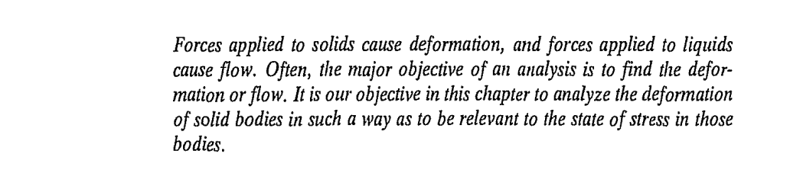
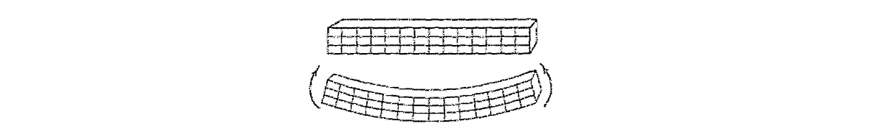
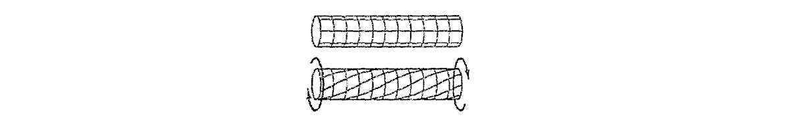
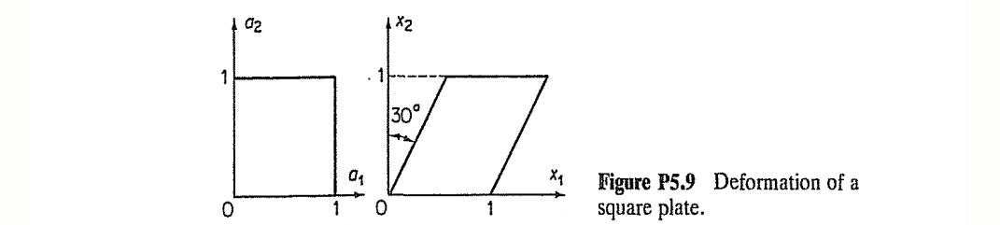
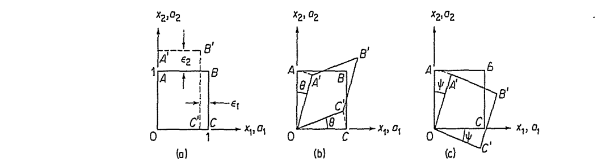
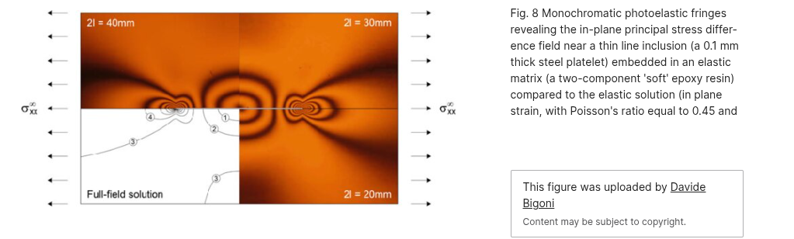
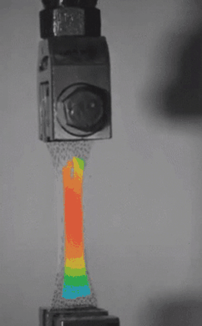
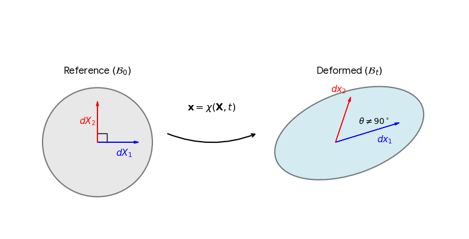
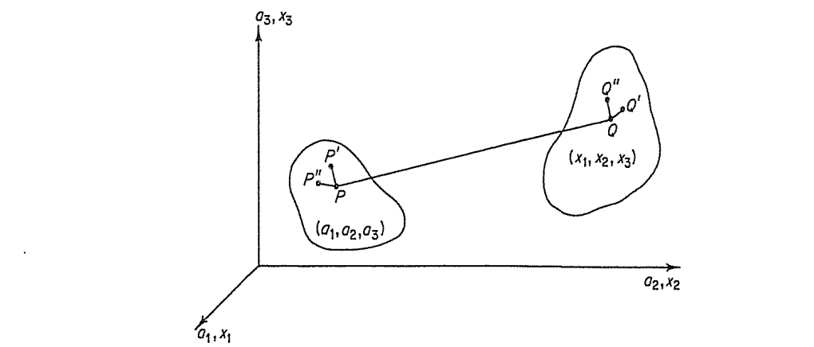
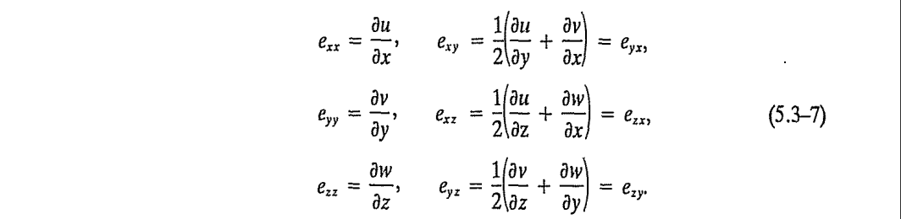

#+TITLE:  Chapter 5: Deformation and Strain
#+AUTHOR: Fethi Okyar
#+DATE: 2026-04-25
#+SUBTITLE: Reading: [Fung/94] Chapter 5
#+STARTUP: overview
#+REVEAL_THEME: simple
#+REVEAL_INIT_OPTIONS: slideNumber:"c/t", width:1920, height:1080
#+REVEAL_TITLE_SLIDE: <h2>%t</h2> <h3>%s</h3> <h4>%d</h4>
#+OPTIONS: timestamp:nil toc:1 num:nil
#+REVEAL_EXTRA_CSS: ../style.css
#+REVEAL_ROOT: https://cdn.jsdelivr.net/npm/reveal.js
#+HTML_HEAD_EXTRA: 

* ($\S5.1$) Deformation
#+ATTR_HTML: :width 1600px

** Questions
- How can you picture/visualize deformation?
  #+ATTR_REVEAL: :frag (appear appear appear ...)
  + Scribing regularly spaced lines on a slender rod/bar or a rubber band and axially loading it in tension so as to induce a 2% deformation?
    #+ATTR_REVEAL: :frag (appear appear ...)
    - 10% strain? 100% strain??
    - the notion of relative deformation, leading to the definition of /strain/, $\epsilon_a$.
  + What happens when the axial load on the bar is reversed, what is the expected deformation mode(s) in compression?
    #+ATTR_REVEAL: :frag (appear appear ...)
    - Can the relation of the applied load versus axial displacement of the bar be predicted for a stiff bar?

*** Bending            
- A bar with a rectangular inscribed grid on it, bent by an equal and opposite pair of transverse couple moments at its two ends. What is the expected configurational change?
  #+ATTR_REVEAL: :frag (appear appear appear ...)
  + The initially straight longitudinal axis deforms into a nearly circular arc shape?
  + Transverse cross-sections remain plane?
  + Longitudinal fibers below the centrodial plane elongate, while the fibers above contract.
  #+ATTR_HTML: :width 1600px
  

*** Twisting
- A similar bar is twisted by an equal and opposite pair of axial couple moments at its two ends. How is it expected to deform?
  #+ATTR_REVEAL: :frag (appear appear appear ...)
  + The longitudinal axis stays straight, with a slight amount of contraction (shortening).
  + The transverse planes remain plane through the process.
  + An angle of twist results from the accumulation of relative rotation of sections from one end to the other.
  #+ATTR_HTML: :width 1600px
  
    
** Definitions
Configurations (undeformed, /initial/, reference, etc. and deformed, /current/, etc.)
#+ATTR_REVEAL: :frag (appear appear ...)
- Concepts related with deformation
  #+ATTR_REVEAL: :frag (appear appear appear ...)
  - Initial length, $L_0$.
  - Deformed length, $L$.
  - Stretch ratio, $L/L_0$.
  - Strain$^{(1)}$, $\epsilon = \frac{L-L_0}{L_0}$ or $\epsilon' = \frac{L-L_0}{L}$
  - These are also known as the /material/ and /spatial/ strain measures, respectively.
  - Strain$^{(2)}$, $E_{/} = \frac{L^2-L_0^2}{L_0^2}$ or $e_{/} = \frac{L^2-L_0^2}{L^2}$
  - $^{(1)}$ is known as /engineering/ strain measure, while $^{(2)}$ is known as the /finite/ strain measure.

*** Query AI:
#+ATTR_REVEAL: :code_attribs data-line-numbers
#+ATTR_HTML: :style "font-size: 2.5em;"
#+BEGIN_EXAMPLE
How can the difference between the configurational notions represented by
the words /initial/ and /current/ be explained to an undergraduate
biomedical engineering program cohort?
#+END_EXAMPLE
#+ATTR_REVEAL: :frag (appear appear ...)
#+ATTR_HTML: :width 1600px

** Deformation as a *Process* from Initial to Current
- We use the points of a body, $\mathcal{B}$, to describe the deformation process between the initial configuration (coordinates $a_1,\, a_2,\, a_3$) and current configuration (coordinates $x_1,\, x_2,\, x_3$).
  #+ATTR_HTML: :width 1600px
  
#+ATTR_REVEAL: :frag (appear appear ...)
- Note the duality used in this description, the notions of "initial" and "current".
- The motion of a point, $P$, from its initial configuration to it's current configuration, $P'$, is called its /displacement/, $\boldsymbol{u} = \bar{PP'}$.

*** Mapping Functions
Mathematical definition of the body's motion from initial to current state.
#+BEGIN_EXPORT html

  
  

#+END_EXPORT
#+ATTR_REVEAL: :frag (appear appear ...)
- The deformation process can be simulated by mapping functions which take the initial coordinates, $a_i$, as arguments and yield the current coordinates, $x_i$, as output
  $$ x_i = \chi_i(a_1,\,a_2,\,a_3) $$
- There has to be a unique /inverse/ mapping of this motion, given by functions which take the current coordinates as arguments and yield the initial coordinates as output 
  $$ a_i = \chi^{-1}_i(x_1,\,x_2,\,x_3) $$
- $\chi(a_1,\,a_2,\,a_3)$ and $\chi^{-1}_i(x_1,\,x_2,\,x_3)$ can be called as the /forward/ and /backward/ mapping functions, respectively.

*** Displacement of a Point
- During deformation a point $P$ initally at $(a_1,\,a_2,\,a_3)$ moves to $P'$ at $(x_1,\,x_2,\,x_3)$. The /displacement/ of $P$ can be obtained in terms of the initial coordinates, by subtracting the initial coordinates from the current ones as
  $$ u_i (a_1,\,a_2,\,a_3) = \chi_i(a_1,\,a_2,\,a_3) - a_i $$
#+ATTR_REVEAL: :frag (appear appear ...)
- Alternatively, the displacement can also be computed in terms of the current coordinates as
  $$ u_i (x_1,\,x_2,\,x_3) = x_i - \chi^{-1}_i (x_1,\,x_2,\,x_3) $$
- In this course, the former definition will be used.

** Examples
*** 5.9
Consider the square plate of unit size shown below. Find the forward mapping functions from $a_i$ to $x_i$?
#+ATTR_HTML: :width 1600px

*** 5.12
A unit square $OABC$ is distorted to $OA'B'C'$ in three ways as shown below. In each of the cases write down the displacement field $u_1,\,u_2$ of every point in the square as a function of the location $(a_1,\,a_2)$.
#+ATTR_HTML: :width 1600px

** Python Snippets
*** wavy mapping function
a Python script using Matplotlib to visualize a trigonometric deformation mapping. It deforms a regular grid using a wavy, trigonometric function.

#+INCLUDE: "./snippets/deformation_wavy.py" src python

Consider using https://www.pythonanywhere.com/login/ to give this code a try!

*** shear animation
a Python script that creates a time-dependent simulation of a simple homogeneous deformation (pure shear) and saves it as a GIF.

#+INCLUDE: "./snippets/shear_animation.py" src python

* ($\S5.2$) Strain
- What is strain? A stress-like second-order tensor which carry deformational information.
- Why is it important? While stress and strain are related to each other through material behavior, it is only possible to directly measure strain. Stress can only be inferred from a strain measurement.
*** Seeing Strain via Photoelasticity
- What does strain look like? Strain is a second-order tensor field. When transparent parts (like glass) are deformed, their light transmitting behaviour is effected by the strain field. As a result we capture optical fringe patterns by photography, known as photoelasticity. [[[https://www.researchgate.net/publication/225195907_The_stress_intensity_near_a_stiffener_disclosed_by_photoelasticity/][1]]]
  #+ATTR_HTML: :width 1600px
  
  
*** Measuring Strain
- There are various method to measure strain in a part. One of the most popular methods is by strain gage attachement on the outer surface of a part. More modern techniques involve observing parts by optical cameras and applying digital image correlation to convert the images to strain fields. [[[https://community.sw.siemens.com/s/article/Digital-Image-Correlation-for-Static-Testing][2]]]
  #+ATTR_HTML: :width 500px
  

** Strain Types
*** Normal Strains
The change in length of a directed fiber, e.g., $d\boldsymbol{X}_1$, $d\boldsymbol{X}_2$
   #+ATTR_REVEAL: :frag (appear appear ...)
   - This mode of deformation is known as dilatational, involving size changes.
   - Length changes are associated with the term *normal* strain.
   - In 3D space, normal strain readings need to be taken from _at least three_ non-parallel fiber directions in order to construct the strain tensor
#+ATTR_HTML: :width 1200px

*** Shear Strains
The change in the angle between a pair of directed fibers.
   #+ATTR_REVEAL: :frag (appear appear ...)
   - This mode of deformation is known as distortional, involving shape changes.
   - Angle changes are associated with the term *shear* strain.
   - In 3D space, shear strain readings need to be taken from _at least three_ pairs of non-parallel fibers in order to finalize the strain tensor.
#+ATTR_HTML: :width 1200px

** Mathematical Definition of Strain
#+ATTR_HTML: :width 800px

- Consider a short fiber connecting the points $P(a_1,\,a_2,\,a_3)$ and $P'(a_1+da_1,\, a_2+da_2,\, a_3+da_3)$. The square of the lengths $ds_0$ of $PP'$ in the initial configuration is
  $$ ds_0^2 = da_1^2 + da_2^2 + da_3^2 $$
#+ATTR_REVEAL: :frag (appear)
- As a result of the motion, $PP'$ is moved to $QQ'$ in the current configuration, where $Q(x_1, \,x_2, \,x_3)$ and $Q'(x_1+dx_1,\, x_2+dx_2,\, x_3+dx_3)$, and the square of the length, $ds$ of the deformed fiber $QQ'$ is
  $$ ds^2 = dx_1^2 + dx_2^2 + dx_3^2 $$

#+REVEAL: split  
#+ATTR_HTML: :width 800px

- The components of the current fiber, $dx_i$ can be related to the components of the initial fiber $da_i$ using the chain rule of differentiation on the mapping functions,
  $$ dx_i = \frac{\partial \chi_i}{\partial a_j} da_j $$
#+ATTR_REVEAL: :frag (appear)
- Making use of the indicial representation of the scalar (dot) product, the square of length of the fiber element in its initial and deformed cofiguration can be expressed as
  \begin{align}
  ds_0^2 & = \delta_{ij} da_i da_j \\
  ds^2  & = \delta_{ij} dx_i dx_j = \delta_{ij} \frac{\partial \chi_i}{\partial a_l} da_l \frac{\partial \chi_j}{\partial a_m} da_m = \delta_{ij} \frac{\partial \chi_i}{\partial a_l}  \frac{\partial \chi_j}{\partial a_m} da_l da_m
  \end{align}

#+REVEAL: split  
#+ATTR_HTML: :width 800px

- The difference between the squares of the length elements may be written, after appropriate changes in the dummy indices as
  $$ ds^2 - ds_0^2 = \left(\delta_{lm} \frac{\partial \chi_l}{\partial a_i}  \frac{\partial \chi_m}{\partial a_j} - \delta_{ij} \right) da_i da_j = 2 E_{ij} da_i da_j $$
#+ATTR_REVEAL: :frag (appear)
- The finite strain tensor $E_{ij}$ introduced above is
  $$ E_{ij} = \frac{1}{2} \left(\delta_{lm} \frac{\partial \chi_l}{\partial a_i}  \frac{\partial \chi_m}{\partial a_j} - \delta_{ij} \right) $$
- Also note that strain can be cast into a matrix form. It is symmetric. The diagonal terms are the normal strains while the off-diagonal ones are the shear strains.

** Examples
*** 5.9
Consider the square plate for which the forward mapping functions from $a_i$ to $x_i$ were determined. Compute the corresponding finite strain tensor.
#+ATTR_HTML: :width 1600px

*** 5.12
Consider the square plate for which the forward mapping functions from $a_i$ to $x_i$ were determined for the three cases. Compute the corresponding finite strain tensor for each case.
#+ATTR_HTML: :width 1600px

* ($\S5.3$) Strain in terms of Displacements
- The finite strain components, $E_{ij}$, were derived in terms of the deformation /mapping/ functions, $\chi_i$.
#+ATTR_REVEAL: :frag (appear)
- It is also possible to write $E_{ij}$ in terms of the displacements, $u_i$. For that, we introduce
  $$ u_l = \chi_l - a_l $$
- Take the derivative of the above with respect to the initial coordinates $a_l$, and solve for $\chi_l$ as
  $$ \frac{\partial \chi_l}{\partial a_i} = \frac{\partial u_l}{\partial a_i} + \delta_{li} $$
- Substitute this into the previous definition of $E_{ij}$
  \begin{align}
  E_{ij} & = \frac{1}{2} \left[ \delta_{lm} \left( \frac{\partial u_l}{\partial a_i} + \delta_{li} \right) \left( \frac{\partial u_m}{\partial a_j} + \delta_{mj} \right) - \delta_{ij} \right] \\
         & = \frac{1}{2} \left[ \frac{\partial u_j}{\partial a_i} + \frac{\partial u_i}{\partial a_j} + \frac{\partial u_l}{\partial a_i} \frac{\partial u_l}{\partial a_j} \right]
  \end{align}         

*** Unabridged (Classical) Notation
- To retrieve the expression of finite strain in the classical notation, we replace
  - $x_1,\,x_2,\,x_3$ with $x,\,y,\,z$,
  - $a_1,\,a_2,\,a_3$ with $a,\,b,\,c$,
  - $u_1,\,u_2,\,u_3$ with $u,\,v,\,w$.
#+ATTR_REVEAL: :frag (appear)
- This yields  
  $$  E_{aa} = \frac{\partial u}{\partial a} + \frac{1}{2} \left[ \left( \frac{\partial u}{\partial a} \right)^2 + \left( \frac{\partial v}{\partial a} \right)^2 + \left( \frac{\partial w}{\partial a} \right)^2 \right] $$
- and
  $$  E_{ab} = \frac{1}{2} \left[ \frac{\partial u}{\partial b} + \frac{\partial v}{\partial a} + \left( \frac{\partial u}{\partial a}\frac{\partial u}{\partial b} + \frac{\partial v}{\partial a}\frac{\partial v}{\partial b} + \frac{\partial w}{\partial a}\frac{\partial w}{\partial b}  \right)  \right] $$

** Infinitesimal Motion and Strain
- When the displacements $u_i \ll b$, (they are very small in comparison to the characteristic dimension of the body $\mathcal{B}$),
- Then the difference between the initial and deformed coordinated vanish and we may use
  + $a \to x$
  + $b \to y$
  + $c \to z$
#+ATTR_REVEAL: :frag (appear)
- and the second order terms such as $\frac{\partial w}{\partial a}\frac{\partial w}{\partial b}$ may be neglected
- Then the finite strain tensor reduces to the *engineering* or *small* strain tensor, $E_{ij} \to \epsilon_{ij}$  given by
  $$ \epsilon_{ij} = \frac{1}{2} \left( \frac{\partial u_j}{\partial x_i} + \frac{\partial u_i}{\partial x_j} \right) $$

*** Small Strains in Classical Notation
When the small strains are expressed in classical notation
- $x_1,\,x_2,\,x_3$ with $x,\,y,\,z$,
- $u_1,\,u_2,\,u_3$ with $u,\,v,\,w$.
#+ATTR_HTML: :width 1600px

* ($\S5.4$) Geometric Interpretation of Strain
