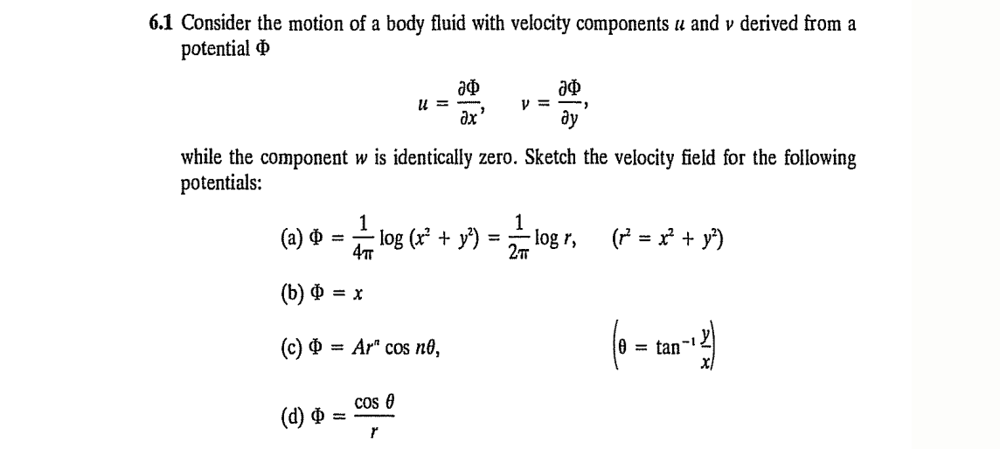

#+TITLE:  Chapter 6: Velocity Fields
#+AUTHOR: Fethi Okyar
#+DATE: 2026-05-06
#+SUBTITLE: Reading: [Fung/94] Chapter 6
#+STARTUP: overview
#+REVEAL_THEME: simple
#+REVEAL_INIT_OPTIONS: slideNumber:"c/t", width:1920, height:1080
#+REVEAL_TITLE_SLIDE: <h2>%t</h2> <h3>%s</h3> <h4>%d</h4>
#+OPTIONS: timestamp:nil toc:1 num:nil
#+REVEAL_EXTRA_CSS: ../style.css
#+REVEAL_ROOT: https://cdn.jsdelivr.net/npm/reveal.js
#+HTML_HEAD_EXTRA: 

* ($\S6.1$) Velocity Fields
#+BEGIN_EXPORT html
 

 <video width="700" controls>
   <source src="./images/windy.mp4" type="video/mp4">
 </video>
 

 #+END_EXPORT

** Fluids
- In the study if a fluid, we are generally concerned with the a flow, and it's velocity field. The field of flow is described by the time rate of change in the position vector $\dot{\boldsymbol{x}}$, called the velocity vector field.
#+ATTR_REVEAL: :frag (appear appear appear ...)
- The velocity components in indicial notation read, $v_i = v_i(x_1,\,x_2,\,x_3,t)$.
- The velocity difference between two adjacent points $P$ and $P'$ located at $x_i$ and $x_i + dx_i$ can be found by invoking the chain rule of differentiation as
  $$ dv_i = \frac{\partial v_i}{\partial x_j} dx_j. $$
- This also corresponds to the operation
  $$ d\boldsymbol{v} = d\boldsymbol{x} \cdot \nabla\boldsymbol{v} $$
  where $\nabla\boldsymbol{v}$ is known as the /velocity gradient/ tensor.
  
*** Cartan Decomposition of the Velocity Gradient
The /Cartan/ decomposition of the velocity gradient vector yields
  $$ \frac{\partial v_i}{\partial x_j} = \frac{1}{2} \left( \frac{\partial v_i}{\partial x_j} + \frac{\partial v_j}{\partial x_i} \right) +  \frac{1}{2} \left( \frac{\partial v_i}{\partial x_j} - \frac{\partial v_j}{\partial x_i} \right) $$
  where the left term on the right hand side is a symmetric tensor and the one on the right is a skew-symmetric tensor.

** Definitions
- The symmetric part of the velocity gradient is the rate of deformation tensor, (or the deformation rate tensor)
  $$ V_{ij} \equiv  \frac{1}{2} \left( \frac{\partial v_i}{\partial x_j} + \frac{\partial v_j}{\partial x_i} \right), $$
#+ATTR_REVEAL: :frag (appear appear appear ...)
- while the skew-symmetric part is called the spin tensor
  $$ \Omega_{ij} \equiv \frac{1}{2} \left( \frac{\partial v_i}{\partial x_j} - \frac{\partial v_j}{\partial x_i} \right). $$
- Then
  $$ \frac{\partial v_i}{\partial x_j} = V_{ij} + \Omega_{ij} $$
- Evidently, $V_{ij}$ is symmetric and $\Omega_{ij}$ is skew-symmetric
  $$ V_{ij} = V_{ji}, \hspace{2em} \Omega_{ij} = -\Omega_{ji}. $$

** Vorticity  
- The tensor $\Omega_{ij}$ has only three independent (non-zero) elements
  $$ [\Omega_{ij}] = \begin{bmatrix} 0 & \Omega_{12} & \Omega_{13} \\ -\Omega_{12} & 0 & \Omega_{23} \\ -\Omega_{13} & -\Omega_{23} & 0 \end{bmatrix} $$
#+ATTR_REVEAL: :frag (appear appear appear ...)
- There exists a vector $\boldsymbol{\omega}$ dual to $\boldsymbol{\Omega}$; that is
  $$ \omega_k \equiv \varepsilon_{kij} \Omega_{ij}; \hspace{2em} \mathrm{i.e.} \hspace{2em} \boldsymbol{\omega} = \nabla \times \boldsymbol{v} = \mathrm{curl}\,\boldsymbol{v} $$
  where $\varepsilon_{kij}$ is the permutation tensor, and the vector $\boldsymbol{\omega}$ is called the /vorticity/ vector.

*** Query AI:
#+ATTR_REVEAL: :code_attribs data-line-numbers
#+ATTR_HTML: :style "font-size: 2.5em;"
#+BEGIN_EXAMPLE
Provide a clear definition of vorticity in a flow field.
If possible, provide illustrations or suggest references or sources
that point graphical illustrations depicting vorticity.
#+END_EXAMPLE

** Problems
*** 6.1
#+ATTR_HTML: :width 1600px

 
