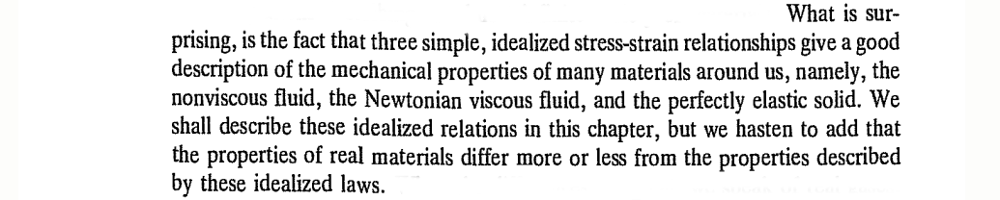
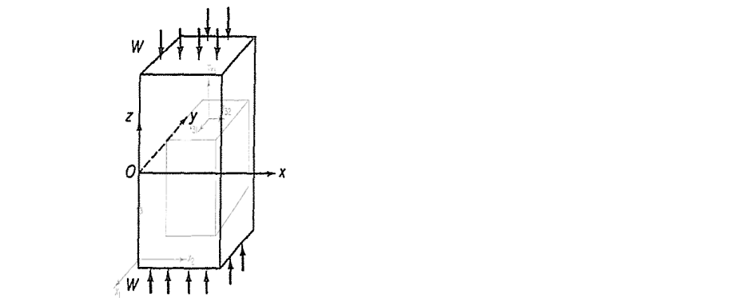
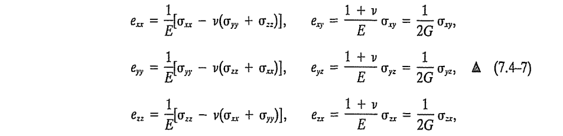

#+TITLE:  Chapter 7: Constitutive Relations
#+AUTHOR: Fethi Okyar
#+DATE: 2026-05-11
#+SUBTITLE: Reading: [Fung/94] Chapter 7
#+STARTUP: overview
#+REVEAL_THEME: simple
#+REVEAL_INIT_OPTIONS: slideNumber:"c/t", width:1920, height:1080
#+REVEAL_TITLE_SLIDE: <h2>%t</h2> <h3>%s</h3> <h4>%d</h4>
#+OPTIONS: timestamp:nil toc:1 num:nil
#+REVEAL_EXTRA_CSS: ../style.css
#+REVEAL_ROOT: https://cdn.jsdelivr.net/npm/reveal.js
#+HTML_HEAD_EXTRA: 

* ($\S7.1$) Definition
- Define: the dependent and independent variables of the mechanics of solids and fluid 
- Define: Constitution, constitutional, constitutive

#+REVEAL: split
#+ATTR_HTML: :width 1600px

* ($\S7.4$) Hookean Elastic Solids
** Example: Tensile Test
- How do materials respond to strain? or stress??
#+ATTR_HTML: :width 1000px

 
#+ATTR_REVEAL: :frag (appear appear appear ...)
- $\epsilon_{33} \to \epsilon$, the normal strain. $\tau_{33} \to \sigma$, the normal stress.
  $$ \epsilon = \kappa \sigma, \hspace{2em} \sigma = E \epsilon $$
- What is the /modulus of elasticity/, $E$, of the bar?

** Generalization
- $$ \begin{bmatrix} \tau_{11} & \tau_{12} & \tau_{13} \\ \tau_{21} & \tau_{22} & \tau_{23} \\ \tau_{31} & \tau_{32} & \tau_{33} \end{bmatrix} \hspace{2em} ?? \hspace{2em} \begin{bmatrix} \epsilon_{11} & \epsilon_{12} & \epsilon_{13} \\ \epsilon_{21} & \epsilon_{22} & \epsilon_{23} \\ \epsilon_{31} & \epsilon_{32} & \epsilon_{33} \end{bmatrix} $$
#+ATTR_REVEAL: :frag (appear appear appear ...)
- Connections between the stress and strain components? How many of them are there? $C_{ijkl}$ ??
- Write out one component, e.g.,
  $$ \tau_{23} = C_{2311} \epsilon_{11} + C_{2312} \epsilon_{12} + C_{2313} \epsilon_{13} \ldots + C_{2333} \epsilon_{33} $$
- There are eight other such components! $9\times 9 = 81$ components in $C_{ijkl}$ !!
- The general linear stress-strain relation is enclosed within a single indicial expression
  $$ \tau_{ij} = C_{ijkl} \epsilon_{kl} $$

** Reduction
- The actual number of independent material parameters? 81? certainly not!
#+ATTR_REVEAL: :frag (appear appear appear ...)
- *Important Note:* Stress is a symmetric tensor! Since $\tau_{ij} = \tau_{ji}$, we need
  $$ C_{ijkl} \epsilon_{kl} = C_{jikl} \epsilon_{kl} \; \forall \, k,l $$
- This requires that $C_{ijkl} = C_{jikl}$, and is known as the first *minor symmetry* in the $C$ tensor, reducing the number of coefficients, $81 \to 54$.
- *Another Note:* Strain is also symmetric!! By the freedom to arbitrarily assign dummy indices, we get
  $$ C_{ijkl} \epsilon_{kl} = C_{ijkl} \epsilon_{lk} = C_{ijlk} \epsilon_{kl} $$
- This means that $C_{ijkl} = C_{ijlk}$, and is known as the *second minor* symmetry, further reducing the number of coefficients, $54 \to 36$
- *Finally*, it can be shown that the coefficient tensor possesses *major symmetry* in the dual index pairs.
  $$ C_{ijkl} = C_{klij} $$
- Thus the most general elasticity tensor can be constructed in terms of a total of 21 elastic coefficients.

** The Voight Solid
- We reshape the three-by-three stress and strain tensors as one-by-six first order arrays.
  $$ \left\{ \begin{array}{c} \tau_{11} \\ \tau_{22} \\ \tau_{33} \\ \tau_{23} \\ \tau_{31} \\ \tau_{12} \end{array} \right\} = \begin{bmatrix} C_{1111} & C_{1122} & C_{1133} & C_{1123} & C_{1113} & C_{1112} \\
    & C_{2222} & C_{2233} & C_{2223} & C_{2213} & C_{2212} \\
    &  & C_{3333} & C_{3323} & C_{3313} & C_{3312} \\
    &  &  & C_{2323} & C_{2313} & C_{2312} \\
    &  \text{sym} &  &  & C_{1313} & C_{1312} \\
    &  &  &  &  & C_{1212}  \end{bmatrix}   \left\{ \begin{array}{c} \epsilon_{11} \\ \epsilon_{22} \\ \epsilon_{33} \\ \epsilon_{23} \\ \epsilon_{31} \\ \epsilon_{12} \end{array} \right\} $$

** Isotropy
#+ATTR_REVEAL: :frag (appear appear appear ...)
- Does material behavior change as a function of the stress traction vector?
- Are material properties a function of the orientation?
- If the answer is *no* or *almost no*, we call the material to be /isotropic/.
- In this case, the number of independent elasticity coefficients goes down, $21 \to 2$.
- For an isotropic material, exactly /two/ independent elastic constants are required to characterize the material
- The constitutive relation for a Hookean solid is called the /Hooke's law/ reading
  $$ \sigma_{ij} = \lambda \epsilon_{kk} \delta_{ij} + 2 \mu \epsilon_{ij} $$
  where $\lambda$ and $\mu$ are called /Lame's constants/.

*** in extenso
- It will be useful to expand the Hooke's law from indicial notation to an extensive form
  \begin{align}
  \sigma_{xx} & = \lambda (\epsilon_{xx} + \epsilon_{yy} + \epsilon_{zz}) + 2 G \epsilon_{xx} \\
  \sigma_{yy} & = \lambda (\epsilon_{xx} + \epsilon_{yy} + \epsilon_{zz}) + 2 G \epsilon_{yy} \\
  \sigma_{zz} & = \lambda (\epsilon_{xx} + \epsilon_{yy} + \epsilon_{zz}) + 2 G \epsilon_{zz} \end{align}
  $$ \sigma_{yz} = G \epsilon_{yz}, \hspace{2em} \sigma_{zx} = G \epsilon_{zx}, \hspace{2em} \sigma_{xy} = G \epsilon_{xy} $$
  where $G=\mu$ is a constant known as the /shear modulus/.

*** Inversion
#+ATTR_REVEAL: :frag (appear appear appear ...)
- These equations can be inverted to write the strains in terms of stresses.
- It is customary to introduce *another pair* of material parameters in writing the inverted form of constitutive relations: the elastic modulus, $E$, and the Poisson's ratio, $\nu$. These are related with $\lambda$ and $\mu$.
- The inverted form reads
  #+ATTR_HTML: :width 1600px
  

* Fluids
- The independent variable describing a fluid motion is the /velocity/.
#+ATTR_REVEAL: :frag (appear appear appear ...)
- 

